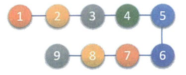
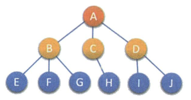
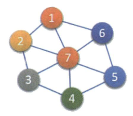
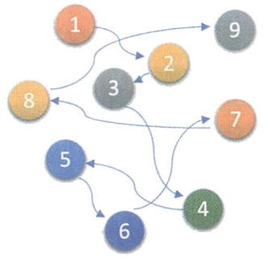

# 01. 数据结构绪论

# 1.4 基本概念和术语

* 数据

  是描述客观事物的符号，是计算机中可以操作的对象，是能被计算机识别并输入给计算机处理的符号集合。  
  数据不仅仅包括整型、实型等数值类型，还包括字符及声音、图像、视频等非数值类型。
* 数据元素

  组成数据的、有一定意义的基本单位。再计算机中通常作为整体处理，也被称为记录。（也许类似于结构体或者类的概念）
* 数据项

  一个数据元素可以由若干个数据项组成（类里面有多个成员）

  数据项是数据不可分割的最小单位
* 数据对象

  性质相同的数据元素的集合，是数据的子集
* 数据结构

  是相互之间存在一种或多种特定关系的数据元素的集合

# 1.5 逻辑结构与物理结构

## 1.5.1 逻辑结构

逻辑结构：数据对象中数据元素之间的相互关系

* 集合结构

  集合结构中的数据元素除了同属于一个集合之外，他们之间没有其他关系。  
  ​​
* 线性结构

  线性结构之间的数据原始是一对一的关系  
  ​​
* 树形结构

  树形结构中的数据元素之间存在一种一对多的层次关系  
  ​​
* 图形结构

  图形结构的数据元素是多对多的关系  
  ​​

### 1.5.2 物理结构

物理结构：数据的逻辑结构在计算机中的存储形式

* #### 顺序存储结构

  把数据元素放在**地址连续**的存储单元里，其数据间的逻辑关系和物理关系是一致的
* #### 链式存储结构

  把数据元素存放在任意的存储单元里，这组存储单元可以是连续的，也**可以是不连续的**  
  数据元素的存储关系不能反映其逻辑关系，因此需要**用一个指针存放数据元素的地址，** 这样通过地址就可以找到相关联数据元素的位置。  
  ​​

‍
