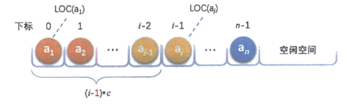
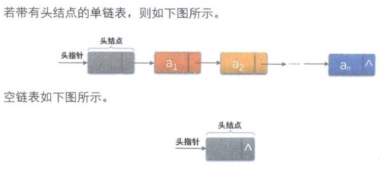
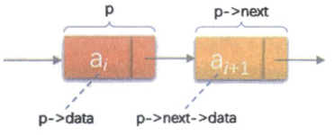
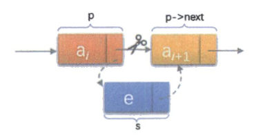
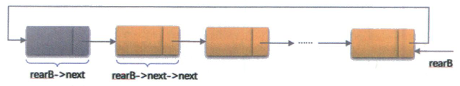
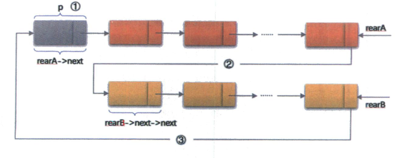

# 03. 线性表

# 3.1 线性表顺序存储

### 3.1.1 定义

线性表的顺序存储结构，指的是用一段**地址连续**的存储单元依次存储线性表的数据元素

‍

### 3.1.2 存储方式

用**一维数组**来实现顺序存储结构

```cpp
#define int ElemType      //ElemType类型根据实际情况而定
class SeqList
{
    int list[MAXSIZE];    //数组，存储数据元素
    int maxsize;          //最大表长
    int size = 0;         //线性表当前长度
};
```

可以看出，描述顺序结构需要<u>三个属性</u>：

* 存储空间的起始位置

  数组`list`​，他的存储位置就是存储空间的存储位置
* 线性表的最大存储容量

  数组最大长度`MAXSIZE`​
* 线性表的当前长度

  ​`size`​

### 3.1.3 数据长度与线性表长度的区别

在任意时刻，线性表的长度应该小于等于数组的长度

‍

### 3.1.4 地址计算方法

假设每个数据元素占用C个存储单元，那么线性表中第i + 1个数据元素的存储位置和第i个数据元素的存储位置满足下列关系（LOC是获取存储位置的函数）  
​`LOC(ai+1) = LOC(ai) + C`​

所以对于第i个数据元素a<sub>i</sub>的存储位置可以由a<sub>1</sub>推算得出  
​`LOC(ai) = LOC(ai) + (i - 1) * c`​

​​

这样的结构的存取时间性能为$O(1)$，我们通常把具有这一特点的存储结构称为**随机存储结构**

‍

### 3.1.5 获取元素

​`printItem`​

* 作用

  将第i个位置元素值返回
* 条件

  i的数值在数组下标范围内
* 操作

  返回数组第i - 1下标的返回值

```cpp
int printItem(int i)
{
    if (i > 0 && i <= size)        //判断获取的位置是否合法
    {   
        cout << list[i - 1] << endl;
    }
    else puts("不存在这个数据");
}
```

‍

### 3.1.5 插入元素

**思路**

1. 检查插入位置是否合法

    * 如果插入位置为负或者大于当前size+1，则抛出异常
    * 如果插入位置大于最大表长，则抛出异常或动态增加容量
2. 从（线性表的）最后一个元素开始向前遍历到第i个位置，分别将他们都向后移动一个位置
3. 将要插入的元素填入位置i处
4. 表长++

```cpp
void insertItem(int i, int item)
{
    if (i > 0 && i <= size + 1)        // 判断插入的位置是否正确：i > 数组的起始0 && i < 当前的表的大小 + 1（也就是在当前末尾插入）
    {
        for (int k = size; k >= i; k--)    // 首先把i，以及i后面的所有元素往后移一位（如果是在末尾插入，不用挪后面的位置，也就是不会进入循环
        {
            list[k] = list[k - 1];
        }
        list[i - 1] = item;    // 第i个位置即为数组中下标为i - 1，把item存入这个位置
        size++;
    }
    else puts("插入位置错误");
}
```

‍

### 3.1.6 删除元素

**思路**

1. 检查删除位置是否合法，抛出异常
2. 从删除元素位置开始遍历到最后一个元素位置，分别将它们都向前移动到一个位置
3. 表长--

```cpp
void deleteItem(int i)
{
    // 判断删除的地方是否合法（和上面插入判断条件有略微不同，因为i不是数组的下标，只需要在0 ~ size之内就行了）
    if (i > 0 && i <= size)
    {
        size--; // 因为删除了一个元素，就先把表的大小减一
        // 从i开始（也就是数组下标的i - 1），将i后面的所有元素向前挪一位（最后一位回被未初始化的数据覆盖掉，所以不用特判）
        for (int k = i - 1; k < size; k++)
        {
            list[k] = list[k + 1];
        }
    }
    else
        cout << "删除位置错误！" << endl;
}
```

顺序存储的插入与删除主要的时间都在与移动元素的循环中，简单分析可得，插入和删除的时间复杂度都是$O(n)$

这就说明：顺序存储比较适合元素个数不太变化，而是存取数据的应用

‍

### 3.1.7 线性表顺序存储的优缺点

**优点**

* 无需为表中元素之间的逻辑关系而增加额外的存储空间
* 可以快速地存取表中任一位置的元素

**缺点**

* 插入和删除操作需要移动大量元素
* 当线性表长度变化较大时，难以确定存储空间的容量
* 造成存储空间的碎片(?)

‍

### 3.1.8 完整实现

```cpp
#include <iostream>
#include <cstdio>
#include <algorithm>

using namespace std;

class SeqList
{
private:
    int *list;    // 顺序表存储的数组
    int maxsize;  // 最大表长
    int size = 0; // 当前表长

public:
    SeqList();                        // 构造函数
    ~SeqList();                       // 析构函数
    void list_int(int n);             // 输入n个数，并依次存入顺序表从0开始的位置
    int getSize();                    // 返回当前表长
    void insertItem(int i, int item); // 把item插入到顺序表的第i个位置
    void deleteItem(int i);           // 删除顺序表中的第i个数据
    void printItem(int i);            // 打印顺序表中的第i个数据
    void showList();                  // 打印整个顺序表

    void multiInsertItem(int i, int n, int *item); // 从i开始，连续插入来自item数组的n个数据
    void multiDeleteItem(int i, int n);            // 从i开始，将i及其之后的n个数据全部删除
    void sortList();                               // 为顺序表内元素排序
    int *getList();                                // 返回数组
    SeqList mergeList(SeqList &a, SeqList &b);     // 合并两个顺序表
    void circleMoveList(int d, int n);             // 循环排序，类似于abc往后移两位变成cba?
} seqlist;

// 构造函数
// 构造一个顺序表，最大的表长是maxsize，当前表的大小是0，内存中分配maxsize大小的空间
SeqList::SeqList()
{
    maxsize = 1000;
    size = 0;
    list = new int[maxsize];
}

// 析构函数
// 释放list数组的内存
SeqList::~SeqList()
{
    delete[] list;
}

// 初始化顺序表
// 输入n个数，并依次存入顺序表从0开始的位置
void SeqList::list_int(int n)
{
    for (int i = 0; i < n; i++)
    {
        cin >> list[i];
    }
    size = n; // 当前的表长是n
}

// 返回当前表长
int SeqList::getSize()
{
    for (int i = 0; i < 1000; i++)
    {
        // 遍历整个数组，直到找到一个没有被赋过值的，即为表的结尾
        if (list[i] == '\0')
        {
            size = i + 1; // 因为数组是从0开始的，所以size是索引值 + 1
            break;
        }
    }

    return size;
}

// 把item插入到顺序表的第i个位置
void SeqList::insertItem(int i, int item)
{
    // TODO: 加入链表是否已满的判断，已满就不能继续加了（也就是判断数组最后一位是否为空）

    if (i > 0 && i <= size + 1) // 判断插入的位置是否正确：i > 数组的起始0 && i < 当前的表的大小 + 1（也就是在当前末尾插入）
    {                           // 首先把i，以及i后面的所有元素往后移一位（如果是在末尾插入，不用挪后面的位置，也就是不会进入循环）
        for (int k = size; k >= i; k--)
        {
            list[k] = list[k - 1];
        }
        list[i - 1] = item; // 第i个位置即为数组中下标为i - 1，把item存入这个位置
        size++;
    }
    else
        cout << "插入位置错误！" << endl;
}

// 删除顺序表中的第i个数据
void SeqList::deleteItem(int i)
{
    // 判断删除的地方是否合法（和上面插入判断条件有略微不同，因为i不是数组的下标，只需要在0 ~ size之内就行了）
    if (i > 0 && i <= size)
    {
        size--; // 因为删除了一个元素，就先把表的大小减一
        // 从i开始（也就是数组下标的i - 1），将i后面的所有元素向前挪一位（最后一位回被未初始化的数据覆盖掉，所以不用特判）
        for (int k = i - 1; k < size; k++)
        {
            list[k] = list[k + 1];
        }
    }
    else
        cout << "删除位置错误！" << endl;
}

// 打印指定元素
void SeqList::printItem(int i)
{
    // 条件和删除类似
    if (i > 0 && i <= size)
    {
        cout << list[i - 1] << endl;
    }
    else
        puts("不存在这个数据！");
}

// 打印整个顺序表
void SeqList::showList()
{
    cout << "该顺序表的表长是：" << size << endl;
    for (int i = 0; i < size; i++)
    {
        cout << list[i] << " ";
    }
    puts("");
}

// 从i开始，连续插入来自item数组的n个数据
void SeqList::multiInsertItem(int i, int n, int *item)
{
    // TODO: 加入顺序表的空间是否还够n个元素插入的判断（也就是检查maxsize - n - 1是否未被初始化）

    // 检查插入条件类似插入一个元素
    if (i > 0 && i <= size + 1)
    {
        // 把i后面的n个元素都往后移n位，为要插入的空出位置
        for (int k = size + n - 1; k > i; k--)
        {
            list[k] = list[k - n];
        }
        for (int k = i - 1; k < i - 1 + n; k++)
        {
            list[k] = item[k - i + 1];
        }
        size += n; // 插入了n个元素，size += n
    }
    else
        cout << "插入位置错误！" << endl;
}

// 从i开始，将i及其之后的n个数据全部删除
void SeqList::multiDeleteItem(int i, int n)
{
    // TODO: 添加一个条件，i 之后的 n个元素是否会超出maxsize
    // 条件类似删除单个元素
    if (i > 0 && i <= size)
    {
        size -= n; // 删除了n个元素，size就要减n
        // 从第i个开始（数组下标的i - 1），依次将n个之后的数据向前挪n位
        for (int k = i - 1; k < size; k++)
        {
            list[k] = list[k + n];
        }
    }
    else
        puts("删除元素错误！");
}

// 为顺序表内元素排序（从小到大排）
void SeqList::sortList()
{ // TODO: 优化排序算法
    sort(list, list + size);
}

// 返回数组
int *SeqList::getList()
{
    return list; // 数组名相当于指针
}

// 合并两个顺序表
SeqList SeqList::mergeList(SeqList &a, SeqList &b)
{
    SeqList res;
    // 相当于把两个表分别插入res表
    res.multiInsertItem(0, a.getSize(), a.getList()); // 先插入a，从零开始，长度为a的长度，分别将a的元素插入res中
    res.multiInsertItem(a.getSize() + 1, b.getSize(), b.getList());
    // res.sortList();           //按需为新表排序
    return res;
}

// 顺序表循环移位
void SeqList::circleMoveList(int d, int n) // 每个向后移n位，d代表方向，0为左、1为右
{
    // 先创造一个临时的表，先把原表复制到临时表里，然后按照规律把临时表里的数据赋给原表，最后记得把临时表释放
    // 创建临时表
    int *temp = new int[size];
    // 原表复制给临时表
    temp = list;
    // 按照规律赋值
    if (d == 0) // 左移
    {
        for (int i = 0; i < size - n; i++)
        {
            list[i] = temp[i + n]; // 因为是往左移，所以是右边的把左边的给覆盖掉，直到size - n为止，因为temp的前n个被移到末尾去了
        }
        for (int i = size - n; i < size; i++)
        {
            list[i] = temp[i - (size - n)]; // 其实就是temp的前n个赋给list的后n个
        }
    }
    // 释放临时表
    delete[] temp;
}
```

# 3.2 线性表链式存储

为解决顺序存储插入与删除时间复杂度较高的问题，而提出链式存储

### 3.2.1 定义

在链式结构中，除了要存储数据元素的信息外，还要存储它的**后继元素的存储地址**

我们把存储数据元素信息的域称为**数据域**，把存储后记位置的域称为**指针域**，指针域存储的信息称作**指针**或**链**。  
两部分信息组成数据元素a<sub>i</sub>的存储映像，称为**结点**（Node）

n个结点（a<sub>i</sub>的存储映像）链接成一个**链表**，即为链式存储结构

每个结点只包含一个指针域的称为**单链表**

‍

### 3.2.2 头指针与头节点

**头指针**

我们把链表**第一个结点的**​**<u>存储位置</u>**叫做**头指针**，整个链表的存取必须从头指针开始进行。之后每一个结点，实际上就是上一个后继指针指向的位置。

线性链表的最后一个结点没有后继，那么**最后一个结点指针为“空”** （通常用NULL或“^”符号表示

**头节点**

为了更加方便对链表进行操作，会在单链表的第一个结点前附设一个结点，称为头节点。头节点可以不存储任何信息，也可以存储如线性表的长度等信息。**头节点的指针域存储指向第一个结点的指针**

‍

### 3.2.3 存储结构

​​

结点的组成：

* 存放数据（数据域）
* 存放后继结点的地址的指针（指针域）

```cpp
class ListNode
{
public:
    int data;        //结点存储的数据（数据域）
    ListNode* next;  //下一个结点的指针

    //构造函数
    ListNode()
    {
        next = NULL;
        data = 0;  
    }
}
```

假设p是指向线性表第i个元素的指针，则该结点a<sub>i</sub>的数据域用p->data表示，并且p->data是一个数据元素。p->next表示结点a<sub>i</sub>的指针域，p->next的值是一个指针，指向第i+1个元素。

​​

‍

### 3.2.4 单链表

#### 3.2.1.1 单链表的读取

链表中的第i个元素不能直接知道，只能从上一个来找到，所以得从头开始找。

**思路**

1. 判断要获取的数据的位置是否合法
2. 定义一个结点p作为迭代器，在链表里不断`p = p->next`​，直到找到需要查找的位置（**核心**）
3. 返回该位置的值

这里把这个功能分成了两个函数，方便之后操作的重用

```cpp
//查找并返回第i个结点的指针
ListNode* LinkList::getPointer(int i)
{
    if ((i <= 0) || (i > len))
    {
        puts("查询位置错误");
    }
    else
    {
        ListNode* p;        //p的作用和addNodeToEnd中的p类似
        p = head;
        for (int k = 1; k <= i; k++)
        {
            p = p->next;
        }
        return p;           //找到第i个结点的指针，并返回这个指针
    }
}

//打印第i个结点的数据
void LinkList::getData(int i)
{
    if ((i <= 0) || (i > len))
    {
        puts("输出位置错误");
    }
    else
    {
        int x;
        x = getPointer(i)->data;
        printf("第 %d 个结点存储的数据是：%d \n", i, x);
    }
}
```

~~遍历得到在链表中的位置已经在~~​~~​`getPointer`​~~​~~函数中实现，之后不在手动遍历~~

因为链表的特性，要从头开始遍历，所以最坏的时间复杂度是$O(n)$

‍

#### 3.2.5 单链表的插入

由于链表的特性，每个结点基本只与前驱和后继有关。假设要在p和p—>next之间插入s结点，则只需要把p的后继改成s，s的后继改成p原来的后继

```cpp
s->next = p->next;
p->next = s;
```

​​

**注意**：这两个语句一定不能改变顺序，如果先`p->next = s`​，那么p->next就已经是s了，`s->next = p->next`​就相当于s->next是next自己，形成了自环。

在单链表中第i个位置插入结点的思路：

1. 先检查插入位置是否合法
2. 声明一指针从头节点开始，一直遍历`p = p->next`​到i的位置
3. 把p的后继改成s，s的后继改成p原来的后继
4. 链表长度++

~~遍历得到在链表中的位置已经在~~​~~​`getPointer`​~~​~~函数中实现，之后不在手动遍历~~

```cpp
//在第i个位置插入一个data为item的结点
void LinkList::insertNode(int i, int item)
{
    if ((i <= 0) || (i > len))
    {
        puts("插入位置错误");
    }
    else
    {
        ListNode* l = new ListNode();       //为要插入的创建一个新节点；
        l->data = item;                     //新结点的data是要插入的数据
        l->next = getPointer(i);            //新节点的指针是原来第i个位置上的结点的指针
        getPointer(i - 1)->next = l;        //原来第i个结点的前一个结点，也就是第i - 1个结点的指针要指向新加入的结点
        len++;                              //新加了一个结点，链表长度++
    }
}

```

‍

#### 3.2.6 单链表的删除

世纪就是将它的前继结点的指针绕过要删除的结点，直接指向要删除的结点的后继结点

思路：

1. 判断删除的结点是否合法
2. ​`getPointer`​找到要删除的结点
3. 修改前继结点的指针

    * if 要删除的是第一个结点 头指针指向第二个结点
    * if 要删除的结点是尾结点 倒数第二个结点的指针指向NULL
    * else 前继结点的指针指向要删除结点的后继
4. 释放被删除的结点的内存
5. 链表长度--

```cpp
//删除第i个结点
void LinkList::deleteNode(int i)
{
    if ((i <= 0) || (i > len))
    {
        puts("删除位置错误");
    }
    else
    {
        ListNode* nodeToDelete = getPointer(i);
        if (i == 1)
        {
            head->next = getPointer(2);
        }
        else if (i == len)
        {
            getPointer(i - 1)->next = NULL;
        }
        else
        {   
            getPointer(i - 1)->next = getPointer(i + 1);        //把i的上一个结点点的指针指向i的下一个结点，就会在遍历中自动跳过第i个结点，相当于删除了第i个结点
        }
        delete nodeToDelete;        //释放被删除结点的内存
        len--;      //删除了一个结点，链表的长度--
    }
}
```

在单链表中，只要找到了第i个结点的位置（时间复杂度是$O(n)$），插入和删除的操作的时间复杂度都是$O(1)$（在知道位置的情况下）

所以，对于插入或删除书记处越频繁的操作，单链表的效率优势越明显

‍

#### 3.2.7 单链表的整表删除

思路：

1. 声明两个指针p、q
2. 将第一个结点赋给p
3. 遍历链表：

    1. 将p的后继赋给q
    2. 释放p
    3. 将q赋给p

```cpp
//单链表的整表删除
void LinkList::deleteLinkList(LinkList& L)
{
    ListNode* p;
    ListNode* q;
    p = head->next;     //p指向第一个结点
    while (p != NULL)
    {
        q = p->next;
        delete p;
        p = q;
    }
    head = NULL;        //头指针置为空
}
```

#### 3.2.8 单链表结构与顺序存储结构的优缺点

**时间复杂度上：**

* 查找

  链表：$O(n)$  

  顺序：$O(1)$
* 插入/删除 

  链表：$O(n)$    （但是如果知道位置的话是$O(1)$)

  顺序：$O(n)$

**经验性结论：**

* 如果线性表需要<u>频繁查找</u>，很少进行插入和删除操作时，宜采用<u>顺序存储结构</u>
* 当线性表的<u>元素个数变化较大或者根本不知道有多大时</u>，最好采用<u>链表结构</u>

#### 3.2.9单链表代码实现

```cpp
#include <iostream>
#include <cstdio>

using namespace std;

// 线性表-单链表的结点
class ListNode
{
public:
    int data;       // 存放结点数据（数据域）
    ListNode *next; // 下一个结点指针（指针域）

    // 构造函数
    ListNode()
    {
        next = NULL;
        data = 0;
    }
};

// 线性表-单链表
class LinkList
{
public:
    ListNode *head;                                      // 头节点指针
    int len;                                             // 链表长度
    LinkList();                                          // 构造函数
    ~LinkList();                                         // 析构函数
    void addNodeToEnd(int x);                            // 在链表的最后插入数据x
    ListNode *getPointer(int i);                         // 查找并返回第i个结点的指针
    void getData(int i);                                 // 打印第i个结点的数据
    void insertNode(int i, int item);                    // 在第i个位置插入一个data为item的结点
    void deleteNode(int i);                              // 删除第i个结点
    void displayAllNodes();                              // 打印单链表中的所有结点
    void swapNodes(int pa, int pb);                      // 将单链表中第pa、pb个两个结点互换
    void sortForLinkList();                              // 单链表的排序
    LinkList mergeLinkLists(LinkList &La, LinkList &Lb); // 合并两个单链表，生成一个新的单链表并返回
    void deleteLinkList(LinkList &L);                    // 单链表的整表删除
};

// 构造函数
LinkList::LinkList()
{
    head = new ListNode(); // 在构造函数中创造头节点
    len = 0;               // 只有头节点，长度为零（头节点不算长度）
}

// 析构函数
LinkList::~LinkList()
{
    head = NULL; // 头指针指向空即为把这个表置空
}

// 在链表的最后插入数据x
void LinkList::addNodeToEnd(int x)
{
    ListNode *l = new ListNode(); // 创建一个新节点
    l->data = x;                  // 该节点的数据域存入数据
    if (head->next == NULL)       // 如果还没有一个结点，把新增的结点作为头指针指向的下一个结点
    {
        head->next = l;
    }
    else
    {
        ListNode *p; // 新建一个p作为迭代器，从头指针开始沿着链表找，直到找到结尾（NULL）为止
        p = head;
        for (int k = 1; k <= len; k++)
        {
            p = p->next; // 把p的下一个结点中的指针赋给p
        }
        p->next = l; // 找到最末尾，把最后一个结点的指针指向新加入的指针（新建的指针自带一个指向NULL的指针）
    }

    len++; // 插入一个结点之后，链表的长度++
}

// 查找并返回第i个结点的指针
ListNode *LinkList::getPointer(int i)
{
    if ((i <= 0) || (i > len))
    {
        puts("查询位置错误");
    }
    else
    {
        ListNode *p; // p的作用和addNodeToEnd中的p类似
        p = head;
        for (int k = 1; k <= i; k++)
        {
            p = p->next;
        }
        return p; // 找到第i个结点的指针，并返回这个指针
    }
}

// 打印第i个结点的数据
void LinkList::getData(int i)
{
    if ((i <= 0) || (i > len))
    {
        puts("输出位置错误");
    }
    else
    {
        int x;
        x = getPointer(i)->data;
        printf("第 %d 个结点存储的数据是：%d \n", i, x);
    }
}

// 在第i个位置插入一个data为item的结点
void LinkList::insertNode(int i, int item)
{
    if ((i <= 0) || (i > len))
    {
        puts("插入位置错误");
    }
    else
    {
        ListNode *l = new ListNode(); // 为要插入的创建一个新节点；
        l->data = item;               // 新结点的data是要插入的数据
        l->next = getPointer(i);      // 新节点的指针是原来第i个位置上的结点的指针
        getPointer(i - 1)->next = l;  // 原来第i个结点的前一个结点，也就是第i - 1个结点的指针要指向新加入的结点
        len++;                        // 新加了一个结点，链表长度++
    }
}

// 删除第i个结点
void LinkList::deleteNode(int i)
{
    if ((i <= 0) || (i > len))
    {
        puts("删除位置错误");
    }
    else
    {
        ListNode *nodeToDelete = getPointer(i);
        if (i == 1)
        {
            head->next = getPointer(2);
        }
        else if (i == len)
        {
            getPointer(i - 1)->next = NULL;
        }
        else
        {
            getPointer(i - 1)->next = getPointer(i + 1); // 把i的上一个结点点的指针指向i的下一个结点，就会在遍历中自动跳过第i个结点，相当于删除了第i个结点
        }
        delete nodeToDelete; // 释放被删除结点的内存
        len--;               // 删除了一个结点，链表的长度--
    }
}

// 打印单链表中的所有结点
void LinkList::displayAllNodes()
{
    ListNode *p;
    p = head;
    while (p->next != NULL)
    {
        p = p->next;
        cout << p->data << " ";
    }
    puts("");
}

// 将单链表中第pa、pb个两个结点互换
void LinkList::swapNodes(int pa, int pb)
{
    if (pa != pb && pa > 0 && pa <= len && pb > 0 && pb <= len) // 当两个结点的位置都合法时
    {
        // 获取pa、pb两个结点
        ListNode *p = getPointer(pa);
        ListNode *q = getPointer(pb);

        // 获取pa、pb的前驱结点（因为要改变交换结点和前一个结点的指针，所以需要前驱结点
        // GPT优化之后的代码，挺简洁的就抄了过来，把大量的ifelse判断转化成了三目的运算，之后可以借鉴
        ListNode *p_before = (pa == 1) ? NULL : getPointer(pa - 1); // 如果pa是第一个结点，p的前驱结点就是NULL，不是第一个的话，前驱是pa - 1
        ListNode *q_before = (pb == 1) ? NULL : getPointer(pb - 1);

        // 更新前驱结点的指针（指向交换后的结点）
        if (p_before)
            p_before->next = q; // if (p_before) 等价于 if (p_before != NULL)
        else
            head = q;
        if (q_before)
            q_before->next = p;
        else
            head = p;

        // 交换结点的指针
        ListNode *temp = p->next;
        p->next = q->next;
        q->next = temp;
    }
    else
        puts("结点不合法");
}

// 单链表的排序
void LinkList::sortForLinkList()
{
    // TODO: 把冒泡排序能否替换为更高效的排序
    for (int i = 1; i <= len; i++)
        for (int j = i; j <= len; j++)
            if (getPointer(i)->data > getPointer(j)->data)
                swapNodes(i, j);
}

// 合并两个单链表，生成一个新的单链表并返回
LinkList LinkList::mergeLinkLists(LinkList &La, LinkList &Lb)
{
    LinkList L; // 结果数组

    // 将La里的结点逐个插入L中
    ListNode *p;
    p = La.head;
    for (int i = 1; i <= La.len; i++)
    {
        p = p->next;
        L.insertNode(i, p->data);
    }

    // 将Lb里的结点逐个插入L中（采用了类似的头插法，Lb的第一个插入L的第一个位置，之后继续插入，Lb的最后一个的下一个是La的第一个）
    p = Lb.head;
    for (int i = 1; i <= Lb.len; i++)
    {
        p = p->next;
        L.insertNode(i, p->data);
    }

    // 给L排序
    L.sortForLinkList();

    return L;
}

// 单链表的整表删除
void LinkList::deleteLinkList(LinkList &L)
{
    ListNode *p;
    ListNode *q;
    p = head->next; // p指向第一个结点
    while (p != NULL)
    {
        q = p->next;
        delete p;
        p = q;
    }
    head = NULL; // 头指针置为空
}
```

### 3.2.5 静态链表

> [C++静态链表的实现（包括各操作的成员函数）](https://www.cnblogs.com/saw96x/p/12407857.html)

如果不能使用指针，那么就用数组来模拟指针。

用数组描述的链表叫做静态链表。

#### 3.2.5.1 存储结构

让类/结构体的数组的元素由两个数据域组成：

* ​`data`​

  用来存储数据元素，也就是通常我们要处理的数据
* ​`cur`​

  相当于单链表的`next`​指针存放该元素的<u>后继</u>在数组中的<u>下标</u>

```cpp
const int MAXSIZE = 1000;       //存储空间初始分配量

class node
{
public:
    int cur;        //游标（cursor），为零时表示无指向（类似于空指针）
    int data;
};

class staticLinkList
{
private:
    node space[MAXSIZE];
    int len = 0;
public:
    void initList();                              //初始化静态链表状态
    int getBackupListCur();                       //获取备用链表的首个下标
    void insertItem(int i, int item);             //插入一共元素
};
```

**备用链表**：违背使用的数组元素称为备用链表

#### 3.2.5.2 初始化静态链表

数组的第一个[0]和最后一个[MAXSIZE - 1]作特殊处理，不存数据。

数组**下标为零**的元素的cur存放**备用链表**的第一个结点的下标。

数组的**最后一个元素**的cur则存放第一个插入元素的下标（**相当于头节点**），当整个链表为空时，这个cur指向0。

```cpp
void staticLinkList::initList()
{
    int i;
    for (int i = 0; i < MAXSIZE - 1; i++)   //把数组第一个到倒数第一个的指针都赋为后继结点的数组下标
    {
        space[i].cur = i + 1;               //每个结点的指针都指向后继结点的数组下标
    }
    space[MAXSIZE - 1].cur = 0;             //最后一个结点的指针指向NULL
}
```

#### 3.2.5.1 静态链表的插入

用静态模拟动态链表结构的存储空间的分配，需要时申请，无用时释放。

###### 模拟存储空间的分配

模拟动态链表中的结点的存储空间的申请（`new`​）

new返回的是地址，用指针接收，自己实现的newnode也是返回一个数组下标，二者是类似的

需要一个空的结点来存储 ——> 从备用链表中取出一个空的 ——> 需要返回备用链表的第一个结点的下标

```cpp
//获取备用链表的首个下标（申请内存空间new）
int staticLinkList::newNode()
{
    int i = space[0].cur;       //获取备用链表的首个下标
    if (space[0].cur != 0)
    {
        space[0].cur = space[i].cur;
    }
    return i;
}
```

###### 实现插入

```cpp
//插入一个元素
void staticLinkList::insertItem(int i, int item)
{
    if (i < 0 || i > MAXSIZE) 
    {
        puts("插入位置错误");
        return;
    }
    int pnew = newNode();
    if (i == 1)         //头插需要特判，因为末尾的等效于头指针的cur指向第一个元素
    {
        space[pnew].cur = space[MAXSIZE - 1].cur;
        space[MAXSIZE - 1].cur = pnew;
        space[pnew].data = item;
        len++;
    }
    else
    {
        int temp = space[MAXSIZE - 1].cur;      //创建一个迭代器参与循环，因为末尾的指针指向第一个元素，所以将其赋给temp
        for (int k = 1; k < i - 1; k++)
        {
            temp = space[temp].cur;             //将temp移到插入位置的前一个元素的下标
        }
        space[pnew].cur = space[temp].cur;      //i的前一个位置元素的指针原来指向原来在i上的元素，在i位置上插入了一个新的元素之后就应该是新插入元素的指针指向原来在i这个位置上的元素
        space[temp].cur = pnew;                 //将新元素的下标赋给原来第i个位置的前一个的元素的cur
        space[pnew].data = item;
        len++;
    }
}
```

#### 3.2.5.2 静态链表的删除

###### 模拟存储空间的释放

模拟动态链表中的结点的存储空间的释放（`delete`​）

没必要真正把数组中的这个元素从内存中释放掉，只需要它还能在被利用就行了，所以我们可以把这个元素放入备用链表中

```cpp
//模拟实现delete一个node
void staticLinkList::deleteNode(int i)
{
    space[i].cur = space[0].cur;        //将当前备用链表的首个下标赋给将要释放的元素的游标，也就是说，这个被释放的元素将称为备用链表的首个元素。
    space[0].cur = i;                   //将被释放的元素的下标最为备用链表的首个下标
}
```

###### 实现删除

思路：

1. 特判删除位置是否为1（头删）
2. 创建迭代器找到要删除的位置
3. 将找到的要删除的位置赋给pos
4. pos的cur赋给pos上一个(space[temp].cur)的cur，也就是说从要删除的位置的上一个跳过要删除的位置
5. 释放要删除的位置的内存
6. 长度--

```cpp
//删除一个元素
void staticLinkList::deleteItem(int i)
{
    if (i < 0 || i > MAXSIZE - 2)
    {
        puts("插入位置错误");
        return;
    }
    if (i = 1)      //头删（删除第一个元素）需要特判，因为只需通过MAXSIZE - 1找到头就行了
    {
        int first = space[MAXSIZE - 1].cur;         //space[MAXSIZE - 1].cur存放的是静态链表第一个元素的下标，将其赋给first
        space[MAXSIZE - 1].cur = space[first].cur;  //将下标为first的指向的下标赋给MAXSIZE - 1的，相当于头指针指向了原来的第二个元素
        deleteNode(first);                          //释放被删除的元素
        len--;                                      //长度--
        return;
    }
    int temp = space[MAXSIZE - 1].cur;      //创建一个迭代器参与循环
    for (int k = 1; k < i - 1; k++)         //一直沿着链表找找到i为止
    {
        temp = space[temp].cur;
    }
    //删除方法和上面头删是一样的
    int pos = space[temp].cur;          //将要删除位置的下标赋给pos
    space[temp].cur = space[pos].cur;   //将要删除位置的指针指向的位置赋给前一个的cur（也就是说从前一个开始跳过了要删除的位置）
    deleteNode(pos);                    //释放删除位置的空间
    len--;                              //长度--
    return; 
}
```

#### 3.2.5.3 静态链表的优缺点

* 优点

  在插入和删除操作时只需要修改游标，不需要移动元素，从而  
  改进了在顺序存储结构中插入和删除操作需要移动大量元素的  
  缺点
* 缺点

  没有解决连续存储分配带来的表长难以确定的问题  
  失去了链式存储结构随机存取的特性

### 3.2.6 循环链表

###### 3.2.6.1 **由单链表到循环链表**

‍

将单链表中的**终端结点的指针**由空指针改为**指向头节点**，就能使整个单链表形成一个环，这种头尾相接的单链表称为单循环链表，简称循环链表

###### 3.2.6.2 **尾指针**

用**指向终端结点**的尾指针来表示循环链表，此时查找开始结点和终端结点都会比使用头指针更方便。

终端结点用尾指针`rear`​指示，那么开始结点就是`rear->next->next`​(`rear->next`​是头节点）

​​

###### 3.2.6.3 循环链表的合并

​​

```cpp
   p = rearA->next;                 //保存A表的头节点 
   rearA->next = rearB->next->next; //将本是指向b表的第一个结点（不是头节点）赋给rearA->next
   q = rearB->next;             
   rearB->next = p;                 //将原A表的头节点赋给rearB->next
   delete q;                        //把原来B表的头节点删除（一个环里只有一个头？）
```

### 3.2.7 双向链表

为了正反双向遍历，于是创造了循环链表

###### 3.2.7.1 从单链表到双向链表

在单链表的每个结点中，在设置一个**指向其前驱结点的指针**域。  
所以在双向链表中的结点都有两个指针域，一个指向前驱，一个指向后继。

```cpp
//循环链表的结点
class ListNode
{
public:
    int data;           //结点的存放的数据
    ListNode* prior;    //前驱结点的指针
    ListNode* next;     //后继结点的指针

    //构造函数
    ListNode()
    {
        prior = NULL;
        next = NULL;
        data = 0;
    }
};

//循环链表
class LinkList
{
public:
    ListNode* head;     //头节点指针
    int len;            //链表长度
    LinkList();         //构造函数

};
```

###### 3.2.7.2 双向链表的插入

在假设存储元素e的结点为s，要实现将结点s插入到结点p和p->next之间。

​​

**思路：**

1. ​`new`​一个s结点
2. 先把s的前驱指针指向p，s的后继指针指向`p->next`​
3. ​`p->next->prior`​指向s
4. ​`p->next`​指向s

2、3步一定不能替换顺序，否则p-&gt;next-&gt;prior会指向p

```cpp
//在双向链表末尾添加一个结点
void LinkList::add_to_end(int item)
{
    ListNode* nn = new ListNode();
    nn->data = item;
    nn->next = head;
    if (head->next == head)
    {
        nn->prior = head;
        head->next = nn;
        head->prior = nn;
    }
    else
    {
        nn->prior = getPointer(len);
        getPointer(len)->next = nn;
        head->prior = nn;           //这里是循环双向链表的特征
    }
    len++;
}

// 查找并返回第i个结点的指针
ListNode *LinkList::getPointer(int i)
{
    if ((i <= 0) || (i > len))
    {
        puts("查询位置错误");
    }
    else
    {
        ListNode *p; // p的作用和addNodeToEnd中的p类似
        p = head;
        for (int k = 1; k <= i; k++)
        {
            p = p->next;
        }
        return p; // 找到第i个结点的指针，并返回这个指针
  
    }
}

//在第i个位置插入一个结点
void LinkList::insert_node(int i, int item)
{
   if ((i <= 0) || (i > len))
    {
        puts("插入位置错误");
    }
    if (i == len)
    {
        add_to_end(item);
    }
    else if (i == 1)
    {
        if (len == 0)
		{
			add_to_end(item);
		}
		else
		{
			ListNode* l = new ListNode();
			l->data = item;
			l->prior = head;
			l->next = getPointer(1);
			getPointer(1)->prior = l;
			head->next = l;
			len++;
		}
    }
    else
    {
        ListNode *s = new ListNode(); //为要插入的创建一个新节点；
        s->data = item;               //新结点的data是要插入的数据
        s->next = getPointer(i);      //新节点的指针是原来第i个位置上的结点的指针
        getPointer(i)->prior = s;
        getPointer(i - 1)->next = s;
        s->prior = getPointer(i - 1);
        len++;
    }
}
```

###### 3.2.7.3 双向链表的删除

删除结点p

**思路**

1. 将p结点的前驱节点的next指针（`p->prior->next`​)指向p的后继结点`p->next`​
2. 将p结点的后继结点的prior指针（`p->next->prior`​）指向p的前驱结点`p->prior`​
3. ​`delete`​p结点

```cpp
//删除第i个位置的结点
void LinkList::delete_node(int i)
{
    if (i <= 0 || i > len)
    {
        puts("删除位置错误");
    }
    else
    {
        if (i == 1)
        {
            if (len == 1)
            {
                head->next = head;
                head->prior = head;     //相当于只有head一个结点，就把所有的指针指向head结点
            }
            else
            {
                head->next = getPointer(2);     //head的next指针绕过1号结点指向2号
                getPointer(2)->prior = head;    //二号的前驱结点指向head
            }
        }
        else if (i == len)
        {
            getPointer(i - 1)->next = head;
            head->prior = getPointer(i - 1);
        }
        else
        {
            getPointer(i - 1)->next = getPointer(i + 1);
            getPointer(i)->prior = getPointer(i - 1);
        }
    }
    len--;
    //TODO: 这样算不算彻底删除这个结点？如何完整删除这个结点？
    delete getPointer(i);
}
```
