# 04. 栈

# 4.1 栈的定义

**栈（stack）** ：限定仅在表尾进行插入和删除操作的线性表

栈又称为先进后出(Last In First Out)的线性表，简称LIFO结构

**栈顶（top）与栈底（bottom）** ：允许插入和删除的一端称为栈顶，另一端称为栈底。

不含任何数据元素的栈称为空栈。

**进栈与出栈**：栈的插入操作，叫做进栈；栈的删除操作，叫做出栈。

​​

**进栈出栈的变化形式**：最先进栈的元素不一定只能最后出栈。以1、2、3依次进栈，出栈的次序举例：  
第一种：1、2、3进，再3、2、1出。出栈次序为3、2、1。  
第二种：1进，1出，2进，2出，3进，3出。出栈次序为1、2、3。  
第三种：1进，2进，2出，1出，3进，3出。出栈次序为2、1、3。  
第四种：1进，1出，2进，3进，3出，2出。出栈次序为1、3、2。  
第五种：1进，2进，2出，3进，3出，1出。出栈次序为2、3、1。  
在这三个元素就有五种出栈次序，元素越多，出栈的变化也会更多。

# 4.2 栈的顺序存储结构

### 4.2.1 存储方式

以`top`​为栈顶指针，`size`​为预设大小

```cpp
template <typename T>
class ArrayStack
{
public:
    ArrayStack(int s = 10);     //默认的栈容量为10
    ~ArrayStack();

    T getTop();                 //获取栈顶元素
    void push(T t);             //入栈
    T pop();                    //出栈
    bool isEmpty();             //判断是否为空
    int getSize();              //获取栈的大小

private:
    int top = -1;               //栈顶指针，指向-1代表空栈
    int size = 0;               //栈的最大容量
    T* array;                   //用数组存储栈
};

template <typename T>
ArrayStack<T>::ArrayStack(int s) : size(s), top(-1)
{
    array = new T[size];
}
```

​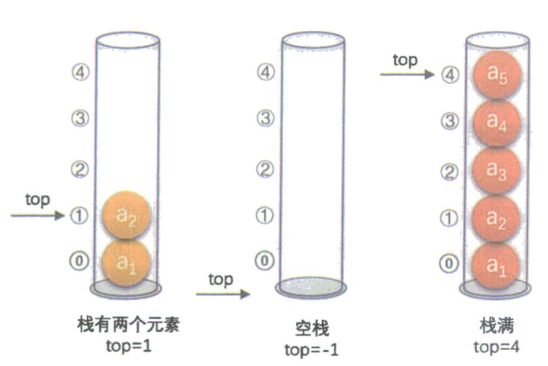​

‍

### 4.2.3 入栈

**思路：**

1. 首先判断栈是否满了，未满继续执行
2. ​`top`​指针++
3. 将值赋给`array[top]`​

```cpp
//入栈
template <typename T>
void ArrayStack<T>::push(T t)
{
    if (top + 1 != size)            //先判断是否栈满
    {
        array[top++] = t;       //先在数组中top的位置上赋予t，然后top++
    }
    else
    {
        puts("栈满！");
    }
}
```

‍

### 4.2.3 出栈

就是删除栈顶的值

**思路**：

1. 首先判断是否为空栈，非空才有得出
2. ​`top`​指针--（这样这个数据就相当于不在栈里面了，之后这个位置会被其他的数据覆盖掉）

```cpp
//出栈
template <typename T>
void ArrayStack<T>::pop()
{
    if (top + 1 != 0)               //先判断是否为空栈，如果是空就没有元素可以返回
    {
        top--;
    }
    else
    {
        puts("栈空！");
    }
}
```

‍

### 4.2.4 两栈共享空间

**核心**：

* 右边的栈顶指针`top1`​是从-1开始向右走，左边的`top2`​从size开始向左走
* 判断栈满的条件是`top1 + 1 == top2`​也就是两个指针相遇（不会重叠只是相邻）

### 4.2.5 完整实现

```cpp
#include <iostream>

using namespace std;

// TODO: 实现动态开辟数组的大小

template <typename T>
class ArrayStack
{
public:
    ArrayStack(int s = 10); // 默认的栈容量为10
    ~ArrayStack();

    T getTop();     // 获取栈顶元素
    void push(T t); // 入栈
    void pop();     // 出栈
    bool isEmpty(); // 判断是否为空
    int getSize();  // 获取栈的大小

private:
    int top = -1; // 栈顶指针，指向-1代表空栈
    int size = 0; // 栈的最大容量
    T *array;     // 用数组存储栈
};

template <typename T>
ArrayStack<T>::ArrayStack(int s) : size(s), top(-1)
{
    array = new T[size];
}

// 判断是否为空
template <typename T>
bool ArrayStack<T>::isEmpty()
{
    return top == -1; // tp[为-1时栈空，返回true
}

// 返回栈的大小
template <typename T>
int ArrayStack<T>::getSize()
{
    return top + 1; // 因为索引是从零开始，大小是索引 + 1
}

// 入栈
template <typename T>
void ArrayStack<T>::push(T t)
{
    if (top + 1 != size) // 先判断是否栈满
    {
        array[top++] = t; // 先在数组中top的位置上赋予t，然后top++
    }
    else
    {
        puts("栈满！");
    }
}

// 出栈
template <typename T>
void ArrayStack<T>::pop()
{
    if (top + 1 != 0) // 先判断是否为空栈，如果是空就没有元素可以返回
    {
        top--;
    }
    else
    {
        puts("栈空！");
    }
}

// 获取栈顶元素
template <typename T>
T ArrayStack<T>::getTop()
{
    if (top != -1)
    {
        return array[top];
    }
}
```

# 4.3 栈的链式存储结构

### 4.3.1 存储方式

‍

### 4.3.1 存储方式

把栈顶放在单链表的头部，也就是把`top`​指针放在栈顶元素上，那么就不需要头节点，有`top`​指针就行了。

​`top`​指向`NULL`​即为空栈

```cpp
template <typename T>
class Node
{
private:
    Node(T t): value(t), next(NULL){};
    Node() : next(NULL){};

public:
    T value;
    Node<T>* next;
};

template <typename T>
class LinkStack
{
public:
    LinkStack();
    ~LinkStack();
    bool isEmpty();
    int getSize();
    void push(T t);
    void pop();
    T getTop();

private:
    Node<T>* top;        //为了方便就还是使用了top头节点，但是实际上之用到了top指针
    int cnt;
};
```

​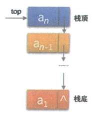​

### 4.3.2 入栈

**思路**：

1. ​`new`​一个新结点，新结点的指针指向原来的栈顶(`top->next`​)
2. ​`top`​指针指向新入栈的结点

```cpp
//入栈
template <typename T>
void LinkStack<T>::push(T t)
{
    Node<T>* pnode = new Node<T>(t);
    pnode->next = top->next;
    top->next = pnode;
    cnt++;
}
```

### 4.6.3 出栈

**思路**：

1. ​`top`​指针指向下一个结点(`top->next`​)
2. 删除原来的栈顶结点

```cpp
//出栈
template <typename T>
void LinkStack<T>::pop()
{
    if (top->next != NULL)  //只有栈非空才能出栈
    {
        Node<T>* pdel = top->next;
        top->next = top->next->next;        //top的指针指向栈顶的下一个，相当于top指针往下移
        delete pdel;                        //删除出栈的结点
        cnt--;                              //栈的长度--
    }
}
```

### 4.6.4 完整实现

```cpp
#include <iostream>

using namespace std;

template <typename T>
class Node
{
private:
    Node(T t) : value(t), next(NULL){};
    Node() : next(NULL){};

public:
    T value;
    Node<T> *next;
};

template <typename T>
class LinkStack
{
public:
    LinkStack();
    ~LinkStack();
    bool isEmpty();
    int getSize();
    void push(T t);
    void pop();
    T getTop();

private:
    Node<T> *top;
    int cnt;
};

// 获取栈的大小
template <typename T>
int LinkStack<T>::getSize()
{
    return cnt;
}

// 判断栈是否为空
template <typename T>
bool LinkStack<T>::isEmpty()
{
    return cnt == 0;
}

// 入栈
template <typename T>
void LinkStack<T>::push(T t)
{
    Node<T> *pnode = new Node<T>(t);
    pnode->next = top->next;
    top->next = pnode;
    cnt++;
}

// 出栈
template <typename T>
void LinkStack<T>::pop()
{
    if (top->next != NULL) // 只有栈非空才能出栈
    {
        Node<T> *pdel = top->next;
        top->next = top->next->next; // top的指针指向栈顶的下一个，相当于top指针往下移
        delete pdel;                 // 删除出栈的结点
        cnt--;                       // 栈的长度--
    }
}

// 获取栈顶元素
template <typename T>
T LinkStack<T>::getTop()
{
    if (top->next != NULL)
    {
        return top->next->value;
    }
}
```

# 4.4 栈的应用

### 4.4.1 递归

###### 4.4.1.1 斐波那契数列

```cpp
int fbi(int i)
{
    if (i < 2)
        return i == 0 ? 0 : 1;
    return fbi(i - 1) + fbi(i - 2);
}
```

​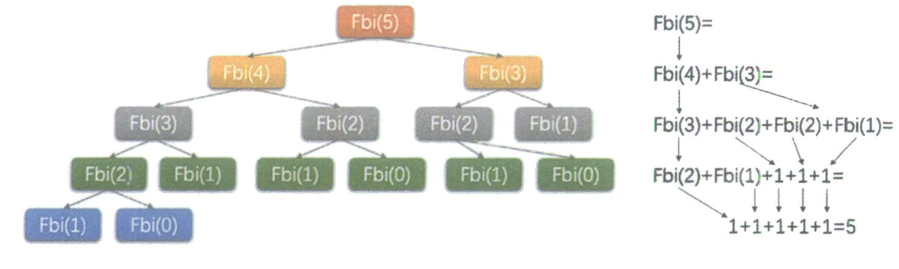​

###### 4.4.1.2 递归的定义

直接调用自己或通过一系列的调用语句间接地调用自己的函数，称做递归函数。

每个递归定义必须至少有一个条件，满足时递归不再进行，即不再引用自身而是返回值退出。即**必须要有一个结束递归的条件**

‍

### 4.4.2 四则运算表达式求值

###### 4.4.2.1 后缀表达式

对于9 + （3 - 1） * 3 + 10 / 2  
“9 3 1 -＊＋ 1 0 2 ／＋”,这样的表达式称为后缀表达式。  
叫后缀的原因在于所有的符号都是在要运算数字的后面出现

###### 4.4.2.2 后缀表达式的计算

[luogu P1449 后缀表达式](https://www.luogu.com.cn/problem/P1449)

**规则**：从左到右遍历表达式的每个数字和符号，遇到是数字就进栈，遇到是符号，就将处于栈顶的两个数字出栈，进行运算，运算结果进栈，一直到最终获得结果

以 9 3 1 -＊＋ 1 0 2 ／＋ 为例

1. 初始化一个空栈，此栈用来对要运算的数字进出使用。

    ​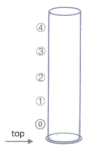​
2. 后缀表达式中前三个都是数字，所以9、3、1依次进栈。

    ​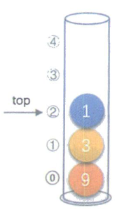​
3. 接下来是 “ - ”，所以将栈中的1出栈作为减数，3出栈作为被减数，并运算3-1得到2，在将2进栈

    ​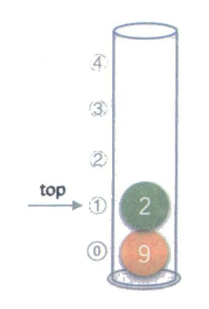​
4. 接着是数字3进栈

    ​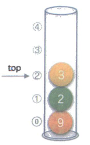​
5. 后面是“ * ”，也就意味着栈中3和2出栈，2与3相乘，得到6，并将6进栈。

    ​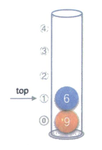​
6. 下面是“ + ”，所以栈中6 和 9 出栈，9与6相加，得到15，将15进栈。

    ​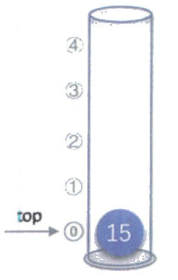​
7. 10、2依次进栈

    ​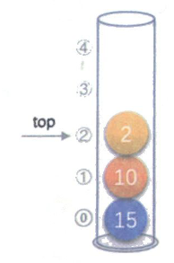​
8. 接下来是“ / ”，栈顶的2与10出栈，10与2相除，得5，将5进栈

    ​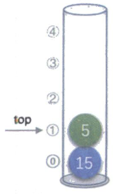​
9. 最后一个是符号“ + ”，15与5出栈并相加，得到20，20进栈

    ​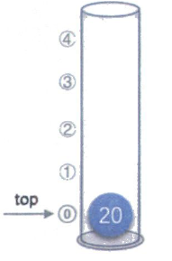​
10. 后缀表达式结尾了，20出栈，栈变为空

     ​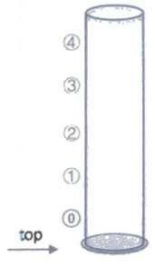​

###### 4.4.2.3 中缀转后缀表达式

我们把平时所用的标准四则运算表达式，即“9+（3—1）×3＋10÷2”叫做中缀表达式。

**规则**：从左到右遍历中缀表达式的每个数次和符号，如果是数字就输出，即成为后缀表达式的一部分；如果是符号，则判断其与栈顶符号的优先级，是右括号或优先级不高于栈顶符号则栈顶元素依次出栈并输出，并将当前符号进栈，一直到最后输出后缀表达式为止。

1. 初始化一空栈

    ​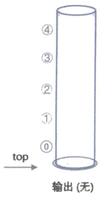​
2. 第一个字符是数字9，输出9，后面是符号“ + ”，进栈。

    ​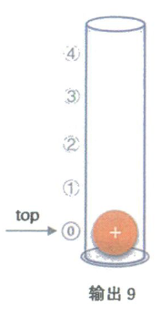​
3. 第三个字符是“ （ ”，依然是符号，因为是左括号，还没有配对的右括号，故进栈。

    ​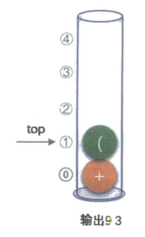​
4. 第四个字符是数字3，输出，接着是“ - ”，进栈。

    ​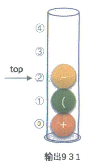​
5. 接下来是数字1，输出，总表达式是9 3 1，后面是符号“ ）”，此时需要去匹配之前的“ （ ”，所以栈顶依次出栈，并输出（“ **（ ”不会被输出）** ，直到“ ）”出栈为止。  
    此时左括号上方只有“ - ”，因此输出“ - ”。总输出表达式为9 3 1 -。

    ​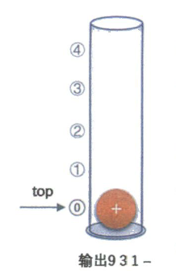​
6. 紧接着是符号“ * ”，因为此时的栈顶符号为“ + ”，优先级低于“ * ”，因此不输出，“ * ”进栈。接着是数字3，输出，总的表达式为9 3 1 - 3 。

    ​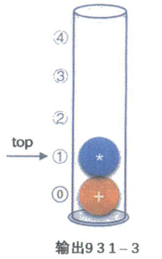​
7. 之后是符号“ + ”，此时当前栈顶元素“ * ” 比“ + ”的优先级高，因此栈中元素出栈并输出（没有比“ + ”更低的优先级，所以全部出栈），总输出表达式为9 3 1 - 3 * + 。然后将当前这个符号“ + ”进栈。

    ​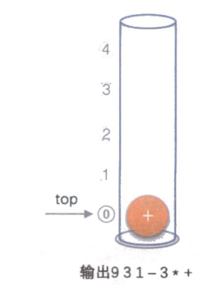​
8. 紧接着数字10，输出，总表达式变为9 3 1 - 3 * + 10 2 。后面是符号“ / ”，所以“ / ”进栈

    ​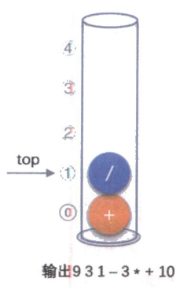​
9. 最后一个数字2，输出，总的表达式9 3 1 - 3 * + 10 2 。

    ​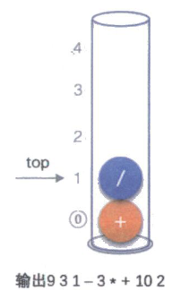​

    ‍
10. 因为已经到的末尾，所以将栈中的符号全部出栈并输出，最终输出的后缀表达式的结果为9 3 1 - 3 * + 10 2 / + 。

     ​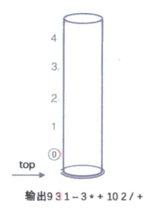​

‍
