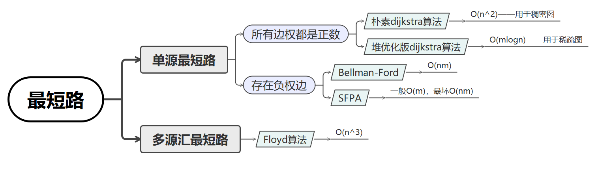

# 08. 图

# 8.1 图的定义

在线性表中, 数据元素之间仅有线性关系, 每个数据元素只有一个直接前驱和一个直接后继

在树形结构中, 数据元素之间有着明显的层次关系, 并且每一层上的数据元素可能和下一层中多个元素相关, 但只能和上一层中一个元素相关.

而图, 是一种较线性表和树更加复杂的数据结构. 在图形结构中, 结点之间的关系可以是任意的, 图中任意量数据元素之间都可能相关

图的定义如下:

> 图 (Graph) 是由**顶点的**​***有穷非空***​**集合** 和 **顶点之间边的集合**组成的, 通常表示为 $G(V,E)$, 其中, $G$ 表示一个图, $V$ 是图 $G$ ​中顶点的集合, E 是图 G 中边的集合

对于图的定义, 还有几点需要注意的地方:

* 线性表中我们把数据元素叫做元素, 树中将数据元素叫做结点, 在图中数据元素我们则称之**顶点 (Vertex)** .
* 线性表中可以没有数据元素, 称为空表. 树中可以没有结点, 叫做空树. 而图中**不允许没有顶点**, 在定义中强调了 $V$ 是顶点的**非空**集合
* 线性表中, 相邻的 数据元素之间具有线性关系. 树结构中, 相邻两层的结点具有层次关系. 而图中, 任意两个顶点之间都有可能有关系, 顶点之间的逻辑关系用边来表示, **边集可以是空的**

### 8.1.1 各种图的定义

**无向边**

> 若顶点 $v_i$ 到 $v_j$ 之间的边*没有方向*, 则称这条边为无向边 (Edge) , 用无序偶对 $(v_i,v_j)$ 表示
>
> 如果途中任意两个顶点之间的边都是无向边, 则称该图为**无向图**(undirected graphs).

下图就是一个无向图, 由于是无方向的, 链接顶点 A 与 D 的边可以表示成无序对(A,D), 也可以写成(D,A).

对于无向图 $G_1$​, $G_1 = (V_1, \{E_1\})$\, 其中顶点集合 $V_1=\{A,B,C,D\}$, 边集合 $E_1=\{(A,B),(B,C),(C,D),(D,A),(A,C)\}$

​​

**有向边**

> 若从顶点 $v_i$ 到 $v_j$ 之间*有方向*, 则称这条边为有向边, 也称为弧 (Arc), 用有序偶 $<v_i,v_j>$ 来表示, $v_i$ 称为弧尾(Tail), $v_j$ 称为弧头(Head).
>
> 如果图中任意两个点之间的边**都是有向边**, 则称该图为**有向图**(directed graphs).

下图就是一个有向图, 连接顶点 A 到 D 的有向边就是弧, A 是弧尾, D 是弧头, <A,D> 表示弧, *注意不能写成&lt;D,A&gt;*

对于下图的有向图 $G_2$ 来说, $G_2 = (V_2, \{E_2\})$, 其中顶点集合 $V_2=\{A,B,C,D\}$, 弧集合 $E_2=\{<A,D>,<B,A>,<C,A>,<B,C>\}$

​​

我们注意到无向边用小括号"()"表示, 有向边用尖括号"<>"表示

---

> 在图中, *若不存在顶点到其自身的边, 且同一条边不重复出现*, 则称这样的图为**简单图**​

本节中讨论的都是简单图, 下面两图就不属于本节讨论的范围

​​

> 在无向图中, 如果*任意两个顶点都存在边*, 则称该图为**无向完全图**
>
> 含有 n 个顶点的无向完全图有 $\frac {n * (n - 1)} {2} $ 条边

​​

> 在有向图中, 如果*任意两个顶点之间都存在方向相反的两条弧*, 则称该图为**有向完全图**
>
> 含有 n 个顶点的有向完全图有 $n*(n-1)$ 条边

​​

--> 可以得到结论, 对于具有 n 个顶点和 e 条边的图, 无向图 $0\le e\le\frac{n*(n-1)}{2}$, 有向图 $0\le e\le n*(n-1)$

---

> 有很少条边或弧的图称为稀疏图, 反之称为稠密图 (稀疏和稠密是模糊的相对概念, 基本没有具体定义)

> 有些图的边或弧具有与它相关的数字, 这总与图的边或弧相关的数叫做**权(Weight)** .
>
> 这种带权的图通常称为**网络(Network)**

这些权可以表示从一个顶点到另一个顶点的距离或耗费. 下图就是一张带权的图, 即标志中国四大城市的直线距离的网, 此图中的权就是两地的距离

​​

---

> 假设有两个图 $G=(V,\{E\})$ 和 $G\prime=(V\prime,\{E\prime\})$, 如果 $V\prime\subseteq V$ 且 $E\prime\subseteq E$, 则 $G\prime$ 为 $G$ 的**子图**(Subgraph)

例如下图带底纹的图均为左侧无向图与有向图的子图

​​

### 8.1.2 图的顶点与边之间的关系

##### 8.1.2.1 无向图的度

> 对于无向图 $G=(V,\{E\})$, 如果边 $(v,v\prime)\in E$, 则称顶点 $v$ 和 $v\prime$ 互为**邻接点**(Adjacent), 即顶点 $v$ 和 $v\prime$ 相邻接

> 边 $(v,v\prime)$ **依附**(incident)于顶点 $v$ 和 $v\prime$, 或者说 $(v,v\prime)$ 与顶点 $v$ 和 $v\prime$ 相关联

> 顶点 $v$ 的**度**(Degree)是和 $v$ 相关联的边的数目, 记为 $TD(v)$

例如上图左侧上方的无向图, 顶点 A 与 B 互为邻接点, 边(A,B)依附于顶点 A 与 B 上, 顶点 A 的度为 3. 而此图的边数为 5, 各个顶点度的和=3+2+3+2=10, 我们可以发现:

> *边数其实就是各顶点度数和的一半*, (多出的一半是因为重复计数)
> 即 $e=\frac12\sum ^{n}_{i=1} TD(v_i)$

---

##### 8.1.2.2 有向图的度

> 对于有向图 $G=(V,\{E\})$, 如果弧 $<v,v\prime>\in E$, 则称顶点 $v$ **邻接**​***到***顶点 $v\prime$, 顶点 $v\prime$ **邻接**​***自***顶点 $v$.

> 弧 $<v,v\prime>$ 相关联.

> 以顶点 $v$ 为头的弧的数目称为 $v$ 的**入度**(InDegree), 记为 $ID(v)$

> 以 $v$ 为尾的弧的数目称为 $v$ 的**出度**(OutDegree), 记为 $OD(v)$

> 顶点 $v$ 的**度**为 $TD(v) = ID(v) + OD(v)$

例如上图左侧下方的有向图, 顶点 A 的入度是 2(从 B 到 A 的弧, 从 C 到 A 的弧), 出度是 1(从 A 到 D 的弧), 所以顶点 A 的度为 2+1=3. 此有向图的弧有 4 条, 而各顶点的出度和=1+2+1+0=4, 各顶点的入度和=2+0+1+1=4. 所以得到-->:

> $e=\sum ^{n}_{i=1} ID(v_i) = \sum ^{n}_{i=1} OD(v_i)$,  即一张有向图中 **入度 = 出度**

---

##### 8.1.2.3 路径

> 无向图 $G=(V,\{E\})$ 中从顶点 $v$ 到顶点 $v\prime$ 的**路径**(Path)是一个顶点序列($v=v_i,0,v_i,1,...,v_i,m=v\prime)$, 其中 $(v_{i,j-1},v_{i,j})\in E,(1\le j\le m)$​

下图列举了顶点 B 到顶点 D 的四种不同路径

​​

> 如果 $G$ 是有向图, 则路径也是有向的, 顶点序列应满足 $<v_{i,j-1},v_{i,j}> \in E, 1 \le j \le m$

例如下图, 顶底 B 到 D 有两种路径, 而顶点 A 到 B 就不存在路径

​​

树中根节点到任意结点的路径是唯一的, 但是图中顶点与顶点之间的路径却是不唯一的

> **路径的长度**是路径上边或弧的数目

上面无向图的图中, 图 1 和图 2 两条路径长度为 2, 图 3 和图 4 的两条路径长度为 3
上面有向图的图中, 图 1 长度为 2, 图 2 长度为 3

> 第一个顶点和最后一个顶点相同的路径称为**回路**或**环**(Cycle).

> 序列中*顶点不重复出现*的路径称为**简单路径**​

> 除了第一个顶点和最后一个顶点之外, 其余顶点不重复出现的回路称为**简单回路**或**简单环**

下图中两个图的粗线都构成环, 左侧的环因第一个顶点和最后一个顶点都是 B, 且 C,D,A 没有重复出现, 因此是一个简单环. 而右侧的环由于顶点 C 的重复, 就不是一个简单环

​​

### 8.1.3 连通图的相关术语

##### 8.1.3.1 连通图

> 在无向图 $G$ 中, 如果从顶点 $v$ 到顶点 $v\prime$ 有路径, 则称 $v$ 和 $v\prime$ 是**联通**的
>
> 如果对于图中任意两个顶点 $v_i, v_j \in V$, $v$ 和 $v\prime$ 都是联通的, 则称 $G$ 是**连通图**(Connected Graph).

下图的图 1, 它的顶点 A 到顶点 B,C,D 都是联通的, 但显然顶点 A 与顶点 E 或 F 就无路径, 因此不能算你是联通图

​​

##### 8.1.3.2 联通分量

> *无向图*中的**极大联通子图**称为**联通分量**

联通分量强调:

* 要是子图
* 子图要是连续的
* 联通子图含有**极大顶点数**
* 具有极大顶点数的联通子图包含依附于这些顶点的所有边

上图中的图 1 就是一个无向非连通图, 但是它有两个联通分量, 即图 2 和图 3, 而图 4, 尽管是图 1 的子图, 但是它却不满足连通子图的极大顶点数(图 2 满足), 因此它不是图 1 的无向图的联通分量

> 在有向图 $G$ 中, 如果对于每一对 $v_i, v_j \in V$, $v_{i}\ne v_{j}$, 从 $v_i$ 到 $v_j$ 和从 $v_j$ 到 $v_i$ 都存在路径, 则称 $G$ 是**强连通图**

> 有向图中的**极大强连通子图**称为有向图的**强联通分量**

例如下图中图 1 并不是强连通图, 因为顶点 A 到顶点 D 存在路径, 而 D 到 A 不存在. 图二就是强连通图, 而且显然图 2 是图 1 的极大强连通子图, 即是它的强联通分量

​​

##### 8.1.3.3 联通生成树

现在我们再来看连通图生成树的定义

> 一个连通图的生成树是一个极小的连通图, 它含有图中全部的 n 个顶点, 但只有足以构成一棵树的 n-1 条边.

比如下面的图 1 是一个普通图, 显然它不是生成树, 当去掉两条构成环的边后, 比如图 2 或图 3, 就满足 **n 个顶点 n-1 条边且联通**的定义了, 它们都是一颗生成树. 从这里也可以知道, -->

> 如果一个图有 n 个顶点和小于 n-1 条边, 则数非连通图, 如果它多于 n-1 条边, 必定构成一个环, 因为这条边使得它依附的两个顶点之间有了第二条路径.

比如图 2 和图 3, 随便加哪两顶点的边都将构成环. 不过有 n-1 条边并不一定是生成树, 比如图 4

​​

> 如果有一个有向图*<u>恰有</u>*​*一个顶点的入度为 0*, *其余顶点的入度均为 1*, 则是一个**有向树**​

所谓入度为 0 就相当于树中的根节点, 其余顶点入度为 1 就是说树的非根节点的双亲只有一个.

> 一个有向树的**生成森林**由若干个有向树组成, 含有图中全部顶点, 但**只**有足以构成若干棵**不相交的有向树的弧**

如下图 1 是一个有向图, 去掉一些弧后, 它可以分解为两个棵有向树, 如图 2 和图 3, 这两颗就是图 1 有向图的生成森林

​​

### 8.1.4 图的定义与术语总结

**图**按照*有无方向*分为**有向图**和**无向图**. 有向图由**顶点**和**弧**构成, 无向图由**顶点**和**边**构成. 弧有**弧头**和**弧尾**之分

图按照*边或弧的多少*分为**稀疏图**和**稠密图**.

如果任意两个顶点之间都存在边叫**完全图**, 有向的叫**有向完全图.**  若无重复的边或顶点到自身的边则叫**简单图**

图中顶点之间有**邻接点**, **依附**的概念.

无向图顶点的边数叫做**度**, 有向图顶点分为**入度**和**出度**

图上的边或弧上带**权**则称为**网**

图中顶点间存在**路径**, 两顶点存在路径则说明是**连通**的, 如果路径最终回到其实点则称为**环**, 当中不重复的叫**简单路径.**  若*任意两点都是连通*的, 则图就是**连通图**, 有向则称为**强连通图**. 图中有子图, 若子图*极大连通*则就是**连通分量**, 有向的则称**强连通分量**

无向图中*连通且 n 个顶点 n-1 条边*叫**生成树.**  有向图中*一顶点入度为 0 其余顶点入度为 1* 的叫**有向树.**  一个有向图由若干个有向树构成**生成森林**​

```mindmap
- 图
  - 方向
    - 无向图
      - 顶点
        - 度
      - 边
      - 生成树
    - 有向图
      - 顶点 
        - 入度
        - 出度
      - 弧
      - 有向树
        - 生成森林 
  - 边分类
    - 稀疏图
    - 稠密图 
  - 完全图
    - 有向完全图
  - 简单图
  - 顶点
    - 邻接点
    - 依附
  - 网
    - 权
  - 路径
    - 连通
      - 连通图
        - 强连通图
      - 连通分量
        - 强连通分量
    - 环
      - 简单路径
```

# 8.2 图的存储结构

[图的存储结构(邻接矩阵与邻接表)及其 C++ 实现](https://www.cnblogs.com/smile233/p/8228073.html)

我们一般常说的"顶点的位置"或"邻接点的位置"只是一个相对的概念. 其实从图的逻辑结构定义来看, 图上任何一个顶点都可以被看成是第一个顶点, 任一顶点的邻接点之间也不存在次序关系.

比如下图的四张图, 实际上它们其实是同一个图, 只不过顶点的位置不同, 所以看上去就不太一样

​​

由于图的结构比较复杂, 任意两个顶点之间都可能存在联系, 因此无法用简单的顺序结构表示.

而多重链表的方式也会因为每个顶点的度可能会相差很大而造成很大的空间浪费

下面是五种前辈们提供的不同的存储结构

### 8.2.1 邻接矩阵

考虑到图是由顶点和边或弧两部分组成, 合在一起比较困难, 那么就会自然地考虑到两个结构分别存储.

顶点不分大小,主次, 所以用一个一维数组来存储.

而边或弧由于是顶点与顶点之间的关系, 一维搞不定, 那么就用一个二维数组来存储...

> 图的**邻接矩阵**(Adjacency Matrix)存储方式是用两个数组表示图. 一个一维数组存储顶点信息, 一个二维数组(称为邻接矩阵)存储图中的边或弧的信息.

设图 $G$ 有 n 个顶点, 则邻接矩阵是一个 n*n 的方阵, 定义为:

$arc[i][j]= \begin{cases}1,若(v_{i},v_{j})\in E或<v_{i},v_{j}>\in E\\0,其他\end{cases}  $

举个实例, 下图就是一个无向图

​​

有四个顶点, 我们这是顶点数组为 `vertex[4]={v0,v1,v2,v3}`​

边数组 `arc[4][4]` ​为右上的矩阵.

对于矩阵主对角线的值, 即 `arc[0][0], arc[1][1]` ​等, 全为 `0` ​是因为不存在顶点到自身的边, 比如 $v_0$ 到 $v_0$. `arc[0][1]=1` ​是因为 $v_0$ 到 $v_1$ 存在, 而 `arc[1][3]=0` ​是因为 $v_1$ 到 $v_3$ 的边不存在. 并且由于是无向图, $v_1$ 到 $v_3$ 的边不存在意味着 $v_3$ 到 $v_1$ 的边也不存在, 所以*无向图是一个对称矩阵*

--> 无向图一定是一个对称矩阵, 有向图一般不是对称矩阵

有了邻接矩阵, 我们可以知道:

* 任意两点之间**有边** or **无边**

  看 arc 数组中对应位置是 0 or 1
* 某个顶点的**度**

  这个顶点 $v_i$ 再邻接矩阵中第 i 行(或第 i 列)的元素之和

  比如顶点 $v_1$ 的度就是 1+0+1+0=2
* 顶点 $v_i$ 的**所有邻接点**​

  将矩阵中第 i 行元素扫一遍, `arc[i][j]==1` ​就是邻接点

‍

在图的术语中, 我们提到了网的概念, 也就是每条边上带有权的图叫做网. 那么这些权值就需要存下来, 如何处理矩阵来适应这样的要求呢?

设图 $G$ 是网图, 有 n 个顶点, 则邻接矩阵是一个 n*n 的方阵, 定义为

$arc[i][j]=\begin{cases}W_{ij},若(v_i,v_j,)\in E或<v_{i},v_{j}>\in E,\\ 0,若i=j,\\ \infty,其他\end{cases}$

这里 $w_{ij}$ 表示 $(v_i,v_j,)$ 或 $<v_{i},v_{j}>$ 上的权值. $\infty$ 表示一个计算机允许的, 大于所有边上权值的值, 也就是一个不可能的极限值. 如下图就是一个有向网图, 右边是它的邻接矩阵

​​

下面我们用代码定义一下邻接矩阵

```cpp
//graph
const int maxszie = 10;
int visited[maxszie] = { 0 };       //顶点是否被访问过的标记 (用于dfs/bfs)

template<class T>
class Graph
{
public:
    Graph(T a[], int n, int e);     //构造函数建立具有n个顶点e条边的图
    ~Graph() {} ;
    void DFS(int v);                //深度有限遍历图
    void BFS(int v);                //广度优先遍历图

private:
    T vertex[maxsize];              //存放图中顶点的数组
    int arc[maxsize];               //存放图中边的数组
    int vertexNum, arcNum;          //图中顶点数和边数
};

template<class T>
Graph<T>::Graph(T a[], int n, int e)
{
    vertexNum = n;
    arcNum = e;
    for (int i = 0; i< vertexNum; i++)  //顶点初始化
    {
        vertex[i] = a[i];
    }
    for (int i = 0; i < vertexNum; i++) //邻接矩阵初始化
    {
        for (int j = 0; i< vertexNum; j++)
        {
            a[i][j] = 0;
        }
    }
    for (int k = 0; k < arcNum; k++)
    {
        int i, j;
        cin >> i >> j;      //依次输入依附的顶点的编号
        arc[i][j] = 1;      //标记为两点之间有边
        arc[j][i] = 1;    
    }
}
```

从代码中很容易分析出, 邻接矩阵的初始化时间复杂度为 $O(n^2)$

### 8.2.2 邻接表

邻接矩阵确实是一个不错且符合直觉的图的存储结构, 但是就算是从我们上面举的两个例子也能轻易看出, 对于边数相对顶点较少的图, 邻接矩阵存在对存储空间极大的浪费. 举一个极端点的例子, 下图中有五个点, 但只有一条有向边, 这是一个**稀疏**有向图, 邻接矩阵中除了 `arc[1][0]` ​有权值外, 没有其他弧, 这些存储空间都被浪费了

​​

在线性表我们就提到过, 顺序存储机构存在预先分配内存可能造成存储空间浪费, 于是引出了链式存储结构. 同样, 我们也可以考虑对边或弧使用链式存储的方式来避免空间浪费的问题

在之间对链式存储的优化中, 提到了一种[孩子表示法](siyuan://blocks/20240713204004-rzf5mqi), 将结点存入数组, 并对结点的孩子进行链式存储, 不管有多少孩子, 也不会存在空间浪费的问题.

将这样的方法用于图的存储, 我们把这种数组与链表结合的存储方式称为**邻接表**(Adjacency List).

邻接表的处理方法如下:

1. 图中顶点用一个一维数组存储

   虽然也可以用单链表, 但是数组读取信息还是快一点.
   对于顶点数组中, 每个数据元素还要存储指向第一个邻接点的指针, 以便查找该点的边信息.
2. 图中每个顶点 $v_i$ 的所有邻接点构成一个线性表

   由于邻接点的个数不定, 所以用单链表存储, 无向图称为顶点 $v_i$ 的**边表**, 有向图则称为顶点 $v_i$ 作为弧尾的**出边表**

例如下图所示就是一个无向图的邻接表结构

​​

**顶点表**中:

* ​`data` ​存储顶点的信息,
* ​`fristedge` ​指向边表的第一个结点, 即此顶点的第一个邻接点.

**边表结点**中:

* ​`adjvex` ​存储某顶点的邻接点在顶点表中的下标,
* ​`next` ​则存储指向边表中下一个结点的指针

比如 $v_1$ 顶点与 $v_0$,$v_2$ 互为邻接点, 在 $v_1$ 的边表中, adjvex 分别为 $v_0$ 的 0 和 $v_2$ 的 2

这样的结构要获取图的相关信息也是很方便的:

* 想要知道某个顶点的**度**

  查找这个顶点的边表中*结点的个数*.
* 判断顶点 $v_i$ 到 $v_j$ **是否存在边**

  测试顶点 $v_i$ 的边表中 adjvex 是否存在结点 $v_j$ 的下标 j 就行了
* 求顶点**所有的邻接点**

  对此顶点的边表进行遍历, 得到的 adjvex 域对应的结点就是邻接点

对于有向图, 邻接表的结构是类似的, 但是要注意的是: 有向图由于有方向, 我们是**以顶点为弧尾**来存储表的, 这样很容易就可以得到每个顶点的**出度**.

​​

但又是为了便于确定顶点的**出度**或**以顶点为弧头的弧**, 我们可以建立一个有向图的**逆邻接表**, 即对每个顶点 $v_i$ 都建立一个链接为 $v_i$ 为弧头的表, 如下图所示

​​

此时我们就很容易算出某个顶点的**入度**是多少, 判断两顶点**是否存在弧**也很容易实现

对于带权值的网图, 只需要在边表结点中添加一个 `weight` ​数据域存储权值信息

​​

[Acwing中有更简洁的模板](siyuan://blocks/20240210173001-i2oiln5)

### 8.2.3 十字链表

从上面的例子我们可以看出, 对于有向图来说, 邻接表是有缺陷的: 想要方便地知道出度, 入度就得遍历整个图才能知道, 反之, 逆邻接表方便了解入度而获得出度效率低. 那么有没有可能把邻接表和逆邻接表结合起来呢?

将邻接表和逆邻接表整合起来的就是下面的一种有向图的存储方法: **十字链表**(Orthogonal List)

我们重新定义**顶点表结点**的结构, 其包含 `data`​,`firstin`​,`firstout`​. 其中:

* ​`firstin` ​表示入边表头指针, 指向该顶点的**入边表中的第一个结点**
* ​`firstout` ​表示出边表头指针, 指向该顶点的**出边表中的第一个结点**

重新定义**边表结点**的结构, 其包含 `taivex`​,`headvex`​,`headlink`​,`taillink`​. 其中:

* ​`tailvex` ​是指**弧起点在顶点表中的下标**,
* ​`headvex` ​是指**弧终点在顶点表中的下标**,
* ​`headlink` ​是指**入边表指针域**, 指向**终点相同的下一边**,
* ​`taillink` ​是指**边表指针域**, 指向**起点相同的下一条边**.

例如下图, 顶点存入一维数组中, *实线*箭头指针的图示与之前邻接表的图相似. 以顶点 $v_0$ 举例, `firstout` ​指向的是出边表中的第一个结点 $v_3$, 所以 $v_0$ 边表结点的 `headvex==3`​, 而 `tailvex` ​其实就是当前顶点 $v_0$ 的下标 0. 由于 $v_0$ 只有一个出边顶点, 所以 `headlink` ​和 `taillink` ​都是空.

​​

十字链表重点的改进就在于*虚线箭头*. 它其实就是此图的*逆邻接表*的表示.

1. 对于 $v_0$ 来说, 它有两个顶点 $v_1$ 和 $v_2$ 的入边, 因此 $v_0$ 的 `firstin` ​指向顶点 $v_1$ 的边表结点中 `headvex==0` ​的结点, 如上图中的 ①.
2. 接着由入边结点的 `headlink` ​指向顶点 $v_2$, 如图中的 ②.
3. 对于顶点 $v_1$, 它由一个入边顶点 $v_2$, 所以它的 `firstin` ​指向顶点 $v_2$ 的边表结点中 `headvex==1` ​的结点, 如图中的 ③
4. 顶点 $v_2$ 和顶点 $v_3$ 也是同样有一个入边顶点, 如图中 ④ 和 ⑤.

十字链表的好处就是因为把邻接表和逆邻接表整合到了一起, 这样既容易找到以 $v_i$ 为尾的弧, 也容易找到以 $v_i$ 尾头的弧, 因而容**易求得顶点的出度和入度.**

### 8.2.4 邻接多重表

十字链表是优化有向图的存储结构, 那么邻接多重表就是优化无向图的存储结构

如果在无向图的应用中, 关注的重点是顶点, 那么邻接表是不错的选择, 但如果我们更关注**边的操作**, 比如对已访问过的边做标记, 删除某一条边的操作, 那就意味着, 需要找到这条边的两个边表结点进行操作, 这样就麻烦了.

如下图, 如果需要删除下图的 $(v_0,v_2)$ 这条边, 需要对邻接表结构中两个被黑框框起的结点进行删除操作, 显然比较繁琐

​​

因此, 我们也仿照[十字链表](siyuan://blocks/20240810201301-ewd01ef)的方式, 对边表结点的结构进行改造:

重新定义边表结点结构, 其包含:`ivex`​,`ilink`​,`jvex`​,`jlink`​

* ​`ivex` ​和 `jvex` ​是与某条边依附的两个顶点在顶点表中的下标
* ​`ilink` ​指向依附顶点 `ivex` ​的下一条边
* ​`jlink` ​指向依附顶点 `jvex` ​的下一条边

这就是**邻接多重表**结构

让我们从绘制过程来理解邻接多重表的构造原理

如下图所示, 这是一个有四个顶点五条边的图, 显然我们应该先画出四个顶点和五条边的边表结点. 由于是无向图, 所以 `ivex==0`​,`jvex==1` ​还是反过来都是无所谓的, 不过为了绘图方便, 都将 `ivex` ​值设置得与一旁的顶点下标相同

​​

1. 首先连线的 ①②③④ 就是将顶点的 `firstedge` ​指向一条边, 下标要与 `ivex` ​的值相同
2. 由于顶点 $v_0$ 的 $(v_0,v_1)$ 边的领边有 $(v_0,v_3)$ 和 $(v_0,v_2)$. 因此 ⑤⑥ 的连线就是满足指向下一条依附于点 $v_0$ 边的目标, 注意 `ilink` ​指向的结点的 `jvex` ​一定要和它本身的 `ivex` ​相同
3. 连线 ⑦ 就是指 $(v_1,v_0)$ 这条边, 它是相当于顶点 $v_1$ 指向 $(v_1,v_2)$ 边后的下一条
4. $v_2$ 有三条边依附, 所以在 ③ 之后就有了 ⑧⑨
5. 连线 ⑩ 就是顶点 $v_3$ 在连线 ④ 之后的下一条边

左图一共五条边, 所以右图一用十条线, 完全符合预期

所以我们可以看出邻接多重表于邻接表的差别: 仅仅是在于同一条边在邻接表中用两个结点表示, 而在邻接多重表中只有一个结点. 这样对边的操作就方便多了, 若要删除左图的 $(v_0,v_2)$ 这条边, 只需要将右图 ⑥⑨ 的链接指向改为 `NULL` ​即可.

### 8.2.5 边集数组

> **边集数组**是由两个一维数组构成的.  一个是存储**顶点的信息**, 另一个是存储**边的信息**, 这个边数组每个数据元素由一条边的起点下标(`begin`​),终点下标(`end`​)和权(`weight`​)组成.

如下图所示, 显然边集数组关注的是边的集合, 在边集数组中要查找一个顶点的度需要扫描整个边数组, 效率并不高. 因此它更适合对边以西进行处理的操作, 而不适合对顶点相关的操作.

关于边集数组的应用我们会在之后的*克鲁斯卡尔(Kruskal)算法*中有介绍, 这里不在赘述

​​

# 8.3 图的遍历

图的遍历和[树的遍历](siyuan://blocks/20240803205026-orutobp)类似, 我们希望从某一顶点出发访问图中其余顶点, 且使每一个顶点**仅被访问一次**, 这一过程就叫**图的遍历**(Traversing Graph)

在树的遍历中, 我们大概提出了四种方案, 总体上大同小异, 因为根节点只有一个, 遍历都是从根节点开始, 其余结点都只有一个父节点. 而图就复杂的多, 因为它的任一结点都可能和其余的所有顶点相邻接, 极有可能存在沿着某条路径搜索后又回到原顶点, 而有些顶点还没访问到的情况. 因此我们要在遍历的过程中把访问过的结点打上标记, 也就是设置一个访问数组 `visited[n]`​, n 是图中顶点的个数, 初值为 0, 访问后设为 1, 来避免多次访问.

对于图的遍历来说, 如何避免因回路陷入死循环, 就需要科学地涉及遍历方案, 通常由两种遍历次序方案: 深度优先遍历 和 广度优先遍历

### 8.3.1 深度优先遍历

**深度优先遍历**(Depth First Search), 也成为深度优先搜索, 简称 **DFS**

用一个探索迷宫的例子来更好地了解 DFS

假设你需要完成一个任务，要求你在如左下图这样的一个迷宫中，从顶点 A 开始要走遍所有的图顶点并作上标记

​​

首先我们从顶点 A 开始，做上表示走过的记号后，面前有两条路，通向 B 和 F，我们给自己定一个原则， 在*没有碰到重复顶点的情况下，始终是向右手边走*， 于是走到了 B 顶点。整个行路过程，可参看右上图。此时发现有三条分支，分别通向顶点 C、I、G，右手通行原则，使得我们走到了 C 顶点。就这样，我们一直顺着右手通道走，一直走到 F 顶点。当我们依然选择右手通道走过去后，发现走回到顶点 A 了，因为在这里做了记号表示已经走过。此时我们退回到顶点 F，走向从右数的第二条通道，到了 G 顶点，它有三条通道，发现 B 和 D 已经是走过的，于是走到 H，当我们面对通向 H 的两条通道 D 和 E 时，会发现都已经走过了。

此时我们是否已经遍历了所有顶点呢？没有。可能还有很多分支的顶点没有走到，所以我们按原路返回。在顶点 H 处，再无通道没走过，返回到 G，也无未走过通道，返回到 F，没有通道，返回到 E，有一条通往 H 的通道，验证后也是走过的，再返回到顶点 D，此时还有三条道未走过，一条条来，H 走过了，G 走过了，I，哦，这是一个新顶点，没有标记，赶快记下来。继续返回，直到返回顶点 A，确认你已经完成遍历任务，找到了所有的 9 个顶点。

其实从过程中我们可以感觉到, *深度优先遍历其实就是一个*​***递归***​*的过程.*  再将图的遍历转换成右上图, 我们又可以发现, 就像是一棵**树的**​[前序遍历](siyuan://blocks/20240724200343-tg4jtlw)​**(( "."))**

它从图中某个顶点 v 出发, 访问此顶点, 然后从 v 的未被访问的邻接点出发深度优先遍历图, 直至图中所有和 v 有路径相连通的顶点都被访问到.

实际上, 我们这里讲到的是**连通图**, 对于非连通图, 只要对于它的连通分量分别进行深度优先遍历, 即在先前的一个顶点进行一次深度优先遍历后, 若图中尚有顶点未被访问, 则另选图中一个尚未访问的顶点作起始点, 重复上述过程, 直至图中所有顶点都被访问为止

##### 算法流程

1. **初始化：**

   * 创建一个 `visited`​ 数组，用于记录图中的顶点是否已被访问，初始时所有元素都为 `0`​（未访问）。
2. **起始点处理：**

   * 从指定的起始顶点 `v`​ 开始，输出该顶点的值（由 `adjlist[v].vertex`​ 表示）。
   * 标记顶点 `v`​ 为已访问，将 `visited[v]`​ 设置为 `1`​。
3. **递归处理邻接节点：**

   * 获取顶点 `v`​ 的邻接链表头指针 `p`​，遍历与 `v`​ 相邻的所有顶点。
   * 对于顶点 `v`​ 的每个邻接节点 `j`​，如果 `j`​ 未被访问（即 `visited[j] == 0`​），执行以下操作：

     * 输出顶点 `j`​ 的值。
     * 将顶点 `j`​ 标记为已访问。
     * 递归调用 DFS 方法，继续从顶点 `j`​ 开始深度优先搜索。
   * 继续处理顶点 `v`​ 的下一个邻接节点，将指针 `p`​ 移动到下一个邻接节点（`p = p->next`​），直到 `p`​ 为 `nullptr`​，表示顶点 `v`​ 的所有邻接节点都已处理完毕。
4. **回溯：**

   * 如果顶点 `v`​ 的所有邻接节点都已经被访问或处理完毕，DFS 回溯到上一个递归层级，继续处理之前未处理的节点。
   * 回溯过程继续进行，直到所有递归调用都结束，即图中的所有节点都被访问过。
5. **结束：**

   * 当所有递归调用结束，DFS 完成整个图的遍历，所有节点都已被访问。

##### 代码实现

**邻接矩阵中的 DFS**

```cpp
template<class T>
void AMGraph<T>::DFS(int v)
{
    cout << vertex[v] << " ";   //访问这个点
    visited[v] = 1;             //标记这个点已经被访问
    //按照编号从小到大的规则一直遍历走下去
    for (int j = 0; j < vertexNum; j++)
    {
        if (arc[v][j] == 1 && visited[j] == 0)      //如果v到j有边 && j没有被访问到过
        {
            DFS(j);     //对j进行递归地搜索(也就是从小到大一直走下去)
        }
    }
}
```

**邻接表中的 DFS**

```cpp
template<class T>
void ALGraph<T>::DFS(int v)
{
    cout << adjlist[v].vertex;      //访问下标为v的结点
    visited[v] = 1;                 //标记下标为v的结点已经访问过
    ArcNode* p = adjlist[v].firstedge;  //准备访问下一个结点的指针
    while (p != nullptr)
    {
        int j = p->adjvex;          //这个指针指向的是j结点
        if (visited[j] == 0)        //如果下标编号为j的结点没有被访问过
        {
            DFS(j);                 //从j结点开始递归地访问
        }
        p = p->next;                //让指针p移动到当前节点的下一个邻接节点。
    }
}
```

对比两个不同存储结构的 DFS, 对 n 个顶点 e 条边的图来说, 邻接矩阵由于是二维数组, 要查找每个顶点的邻接点需要访问矩阵中的所有元素, 因此都需要 $O(n^2)$ 的时间. 而邻接表作存储结构时, 找邻接点所需的时间取决于顶点和边的数量, 所以是 $O(n+e)$. 显然对于**点多边少的稀疏图**来说, **邻接表**结构使得 DFS 在时间效率上大大提高

在算法竞赛中, [Acwing提供了更好的模板](siyuan://blocks/20240210173233-z3ntt8c)

### 8.3.2 广度优先遍历

**广度优先遍历**(Breadth First Search), 又称为广度优先搜索, 简称 **BFS**

如果说图的深度优先遍历类似树的[前序遍历](siyuan://blocks/20240724200343-tg4jtlw), 那么图的广度优先遍历就类似于**树的层序遍历**.

我们将下图的第一幅图稍微变形，变形原则是顶点 A 放置在最上面第一层，让与它有边的顶点 B、F 为第二层，再让与 B 和 F 有边的顶点 C、I、G、E 为第三层，再将这四个顶点有边的 D、H 放在第四层，如下图的第二幅图和第三幅图所示。此时在视觉上感觉图的形状发生了变化，其实顶点和边的关系还是完全相同的。

​​

依次进队出队图示如下

​​

BFS 的核心就在于这个[队列](siyuan://blocks/20240604221226-wfjtbmc), 先把这一层给遍历完, 暂时用队列储存起来, 这一层遍历完了再去遍历下一层

而DFS的核心在于**递归**, 也就是可以用[栈](siyuan://blocks/20240531001756-03l516d)来模拟

##### **算法流程**

1. **初始化：**

   * 创建一个 `visited`​ 数组，用于记录图中的顶点是否已被访问，初始时所有元素都为 `0`​（未访问）。
   * 初始化一个队列 `Q`​，用于存储待访问的顶点。`Q.front`​ 和 `Q.rear`​ 都初始化为 `-1`​，表示队列为空。
2. **起始点处理：**

   * 输出当前访问的起始顶点 `v`​（由 `adjlist[v].vertex`​ 表示）。
   * 标记顶点 `v`​ 为已访问，将 `visited[v]`​ 设置为 `1`​。
   * 将顶点 `v`​ 入队，等待后续处理。
3. **BFS 主循环：**

   * 只要队列不为空（`Q.front != Q.rear`​），继续循环处理。
   * 从队列中取出队首元素 `v`​，表示当前正在处理的顶点。
   * 获取顶点 `v`​ 的邻接链表头指针 `p`​，遍历与 `v`​ 相邻的所有顶点。
4. **遍历邻接节点：**

   * 对于顶点 `v`​ 的每个邻接节点 `j`​，如果 `j`​ 未被访问（即 `visited[j] == 0`​），执行以下操作：

     * 输出顶点 `j`​ 的值。
     * 将顶点 `j`​ 标记为已访问。
     * 将顶点 `j`​ 入队，等待后续处理。
5. **继续处理下一个邻接节点：**

   * 将指针 `p`​ 移动到下一个邻接节点（`p = p->next`​），直到 `p`​ 为 `nullptr`​，表示顶点 `v`​ 的所有邻接节点都已处理完毕。
6. **继续处理下一个顶点：**

   * 循环返回队首的下一个顶点，继续上述过程，直到所有顶点都被访问过，队列为空。

##### 代码实现

**邻接矩阵中的 BFS**

```cpp
template<class T>
void AMGraph<T>::BFS(int v)
{
    int visited[maxsize] = { 0 };
    queue<T> Q;
    Q.front = Q.rear = -1;      //初始化队列
    cout << vertex[v] << " ";   //访问顶点
    visited[v] = 1;             //标记该顶点被访问过
    Q.data[++Q.rear] = v;       //被访问顶点入队
    while(Q.front != Q.rear)    //一直循环到队空
    {
        v = Q.data[++Q.front];  //头元素出队
        for (int j = 0; j < vertexNum; j++)
        {
            if (arc[v][j] == 1 && visited[j] == 0)
            {
                cout << vertex[j] << " ";
                visited[j] = 1;
                Q.data[++Q.rear] = j;               //邻接点入队,这样在后续的BFS遍历中，可以进一步访问顶点j及其邻接点。
            }
        }
    }
}
```

**邻接链表中的 BFS**

```cpp
template<class T>
void ALGraph<T>::BFS(int v)
{
    int visited[maxsize] = { 0 };     
    queue<T> Q;
    Q.front = Q.rear = -1;              //队列初始化
    cout << adjlist[v].vertex;          //访问顶点表中下标为v的顶点
    visited[v] = 1;                     //将被访问的结点标记
    Q.data[++Q.rear] = v;               //将被访问的顶点入队
    while (Q.front != Q.rear)           //一直循环到队空为止
    {
        v = Q.data[++Q.front];          //对头元素出队
        ArcNode* p = adjlist[v].firstedge;
        while (p != nullptr)
        {
            int j = p->adjvex;
            if (visited[j] == 0)
            {
                int j = p->adjvex;
                cout << adjlist[j].vertex;
                visited[j] = 1;
                Q.data[++Q.rear] = j;   //将顶点j入队，等待后续处理。
            }
            p = p->next;
        }
    }
}
```

在算法竞赛中, [Acwing提供了更好的模板](siyuan://blocks/20240210173926-i2sxgqo)

### 8.3.3 DFS 与 BFS 的对比与总结

在**时间复杂度**上, 我们可以发现, 其实二者的时间复杂度是一样的, 不同之处仅在于对顶点访问顺序不同. 所以二者在全图遍历上没有优劣之分.

不过如果图的*边和顶点非常多*, 不能在短时间内遍历完成, 为了不同目的就要斟酌选择那种算法比较好

* **深度优先**适合目标比较明确, 以**找到目标**为主要目的的情况
* **广度优先**适合在不断扩大遍历范围时找到**相对最优解**的情况

# 8.4 最小生成树

[最小生成树-Prim 算法与 Kruskal 算法](https://www.cnblogs.com/smile233/p/8287576.html)

​​

这是一个带权值的图, 即网结构, 如果要以最小的成本走完这个图, 应该选择什么样的遍历方案?

所谓最小成本, 即 n 个顶点, 用 n-1 条边把一个连通图链接起来, 并且使得权值的和最小.

在之前图的定义部分, 曾经提到过, 一个[连通图的生成树](siyuan://blocks/20240809204959-q7kzron)是一个极小的连通子图, 它含有图中全部的顶点, 但只有足以构成一棵树的 n-1 条边.

> 那么我们把构造连通网的**最小代价生成树**称为**最小生成树**(Minimun Cost Spanning Tree)

找连通网的最小生成树, 最经典的有两种算法, 普利姆(Prim)算法 和 克鲁斯卡尔(Kruskal)算法

### 8.4.1 普利姆(Prim)算法

以 [Acwing中的一道题](siyuan://blocks/20240215215613-653p1tc)来学习

##### 算法流程

1. **初始化：**

   * 定义并初始化邻接矩阵 `g`​，距离数组 `dt`​，标记数组 `st`​ 和前驱数组 `pre`​。
   * 将所有结点的初始距离设置为无穷大，选定一个起始结点（如 1 号结点）并将其距离设置为 0。
2. **寻找最短距离的结点：**

   * 在所有未加入生成树的结点中，选择到生成树距离最短的结点 `t`​。
   * 如果无法找到一个可行的结点（即 `dt[t]`​ 仍为无穷大），输出 "impossible" 并结束。
3. **更新生成树：**

   * 将选定的结点 `t`​ 加入生成树，并将 `t`​ 到生成树的最短距离累加到结果中。
   * 更新其他未加入生成树的结点到生成树的最短距离。
   * 记录每个更新结点的前驱结点 `pre[i]`​。
4. **重复上述步骤：**

   * 重复寻找最短距离结点并更新生成树，直到所有结点都被加入生成树。
5. **输出结果：**

   * 最终输出最小生成树的权值和，以及生成树中的各个边（由前驱结点 `pre`​ 记录）。

##### 代码实现

基本上各种细节和各种解释都写在每行的注释里了, 看看代码应该就能懂

```cpp
#include <iostream>
#include <cstring>
#include <algorithm>

using namespace std;

const int N = 510;
int g[N][N];            //存储图
int dt[N];              //存储各个结点好生成树的距离
int st[N];              //记录结点是否被加入生成树中
int pre[N];             //结点的前驱结点
int n, m;               //n个结点, m条边

void prim()
{
    memset(dt, 0x3f, sizeof(dt));           //初始化距离数组为一个很大的数(0x3f3f3f3f 在 10亿左右)
    int res = 0;
    dt[1] = 0;                              //从1号结点开始生成
    for (int i = 0; i < n; i++)             //每一次循环都选择一个点加入生成树, 一共n个点
    {
        int t = -1;

        for (int j = 1; j <= n; j++)        //对每个结点进行判断
        {
            if (!st[j] && (t == -1 || dt[j] < dt[t]))   //如果j这个点没有在生成树中, 且到树的距离最短
            {
                t = j;                      //将该点加入树中
            }
        }

        //判断孤立的点 : 如果存在孤立的点, 则不能生成整个图的最小生成树
        if (dt[t] == 0x3f3f3f3f)
        {
            cout << "impossible" << endl;
            return;
        }

        st[t] = 1;                          //标记该点已经加入树中
        res += dt[t];                       //统计最后最小生成树的权值和
        for (int i = 1; i <= n; i++)        //更新生成树外的点到生成树的距离
        {
            if(dt[i] > g[t][t] && !st[i])   //从t到i结点的距离小于原来的距离 且i结点不在树中, 则更新
            {
                dt[i] = g[t][i];            //更新距离
                pre[i] = t;                 //从t到i的距离更短, 所以i的前驱变成t
            }
        }
    }

    cout << res << endl;                    //得到生成树的最小权值
}

void getPath()                              //输出最小生成树中的各个边
{
    for (int i = n; i > 1; i--)             //n个结点, 所以有n-1条边
    {
        cout << i << "-" << pre[i] << endl; //i是结点编号, pre[i]是i结点的前驱结点, 两点链接构成一条边
    }
}

int main ()
{
    memset(g, 0x3f, sizeof(g));             //各个结点之间初始化为很大的数
    cin >> n >> m;                          //输入结点数和边数
    while (m--)
    {
        int a, b, w;
        cin >> a >> b >> w;                 //输入边的两个顶点和权重
        g[a][b] = g[b][a] = min(g[a][b], w);//存储权重      (无向图的存储方式: a->b == b->a 的权重)
    }

    prim();                                 //求最小生成树
    getPath();                              //输出最小生成树的路径

    return 0;
}
```

从 `prim` ​函数中的两层循环可以看出, 其时间复杂度是 $O(n^2)$

### 8.4.2 克鲁斯卡尔(Kruskal)算法

如果说 Prim 是以某点为起点, 逐步找各顶点上最小权值的边来构建最小生成树的, 那么 Kruskal 就是以边为目的去构建, 因为权值是在边上, 直接去找最小权值的边来构建生成树自然也是很自然的想法. 然而我们需要的是生成树, 自然不能有环, 这就是另一点在 Kruskal 算法中需要判断的地方.

> Kruskal 算法通过对边集的排序，从权值最小的边开始逐步构建最小生成树，利用并查集有效避免回路的生成。算法的核心是边的排序和并查集的合并操作，通过这两步实现了对整个图的高效处理。

还是用 [Acwing中的一道题](siyuan://blocks/20240215215940-24bki4o)来举例

##### 算法流程

1. **初始化：**

   * 输入图的顶点数 `n`​ 和边数 `m`​。
   * 初始化并查集数组 `p`​，最初每个顶点自成一个集合。
   * 输入所有边的信息，存储在 `edge[]`​ 数组中。
2. **边的排序：**

   * 将所有边按权值从小到大排序。使用重载的 `<`​ 操作符来实现。
3. **遍历边集，构建最小生成树：**

   * 初始化变量 `res`​ 为 0，用于记录最小生成树的权重和，`cnt`​ 为 0，用于记录当前加入生成树的边的数量。
   * 遍历排序后的所有边，对每一条边执行以下操作：

     1. 使用并查集的 `find()`​ 函数找到当前边两个顶点 `a`​ 和 `b`​ 所属的集合 `pa`​ 和 `pb`​。
     2. 如果 `pa`​ 和 `pb`​ 不在同一个集合中，说明加入这条边不会形成回路：

        * 将这条边的权重加到 `res`​ 中。
        * 将集合 `pa`​ 和 `pb`​ 合并（即将 `a`​ 的集合的祖宗设置为 `b`​ 的集合的祖宗）。
        * 将 `cnt`​ 加 1，表示生成树中又加入了一条边。
   * 如果遍历完所有边时，`cnt`​ 小于 `n-1`​，则输出 "impossible"，表示无法生成一棵包含所有顶点的最小生成树。
4. **输出结果：**

   * 如果成功生成了 `n-1`​ 条边，输出 `res`​，即最小生成树的权重和。

###### 通过[并查集](siyuan://blocks/20240207183600-8l9k0w5)来判断是否存在环

1. **并查集初始化：**

   * 将所有顶点初始化为各自独立的集合（`p[i] = i`​），用于后续判断是否形成回路。
2. **排序边集：**

   * 对边集按照权值进行升序排序，以确保每次选择的边都是当前未加入生成树中的最小权值边。
3. **判断是否形成回路：**

   * 使用并查集 `find()`​ 函数找到两个顶点 `a`​ 和 `b`​ 所在的集合，如果不在同一个集合中，合并这两个集合，并将这条边加入生成树。
   * 如果在同一集合中，则跳过这条边，避免形成回路。
4. **生成最小生成树：**

   * 遍历排序后的边集，逐一加入生成树，直到生成树包含 `n-1`​ 条边。
5. **最终输出：**

   * 成功生成最小生成树后，输出生成树的权值和 `res`​，否则输出 "impossible"。

##### 代码实现

```cpp
#include <iostream>
#include <cstring>
#include <algorithm>

using namespace std;

const int N = 100010;
int p[N];               //保存并查集

struct E
{
    int a;
    int b;
    int w;
    //重载小于号, 通过边进行排序
    bool operator < (const E& r)
    {
        return this->w < r.w;
    }
}edge[N * 2];

int res = 0;        //记录最小生成树的权重

int n, m;           //n个顶点, m条边
int cnt = 0;
//并查集找祖宗
int find(int a)
{
    if (p[a] != a) p[a] = find(a);      //祖宗的祖宗是自己, p[a]记录a结点的父节点, 从a结点开始一直网上找, 直到找到祖宗结点为止
    return p[a];
}

void kruskal()
{
    //依次尝试加入每条边
    for (int i = 1; i <= m; i++)
    {
        //我们是通过这个来判断是否存在回路的--并查集
        int pa = find(edge[i].a);       //a点所在集合
        int pb = find(edge[i].b);       //b点所在集合
        if (pa != pb)                   //如果a与b不在一个集合中
        {
            res += edge[i].w;           //ab间的边放入生成树中
            p[pa] = pb;                 //将ab放入同一个集合中
            cnt++;                      //生成树中的边++
        }
    }
}

int main ()
{
    cin >> n >> m;                      //输入点和边的个数

    //初始化并查集, 最初每个点自己就是一个不同的集合
    for (int i = 1; i <= n; i++)  
    {
        p[i] = i;                     
    }

    //读入每条边
    for (int i = 1; i <= m; i++)
    {
        int a, b, c;
        cin >> a >> b >> c;
        edge[i] = {a, b, c};
    }

    //将edge按边长排序, 从小到大
    sort(edge + 1, edge + m + 1);

    //kruskal算法建立最小生成树
    kruskal();

    //如果保留的边数小于n-1, 则这个图不能生成一棵最小生成树
    if (cnt < n - 1)
    {
        cout << "impossible" << endl;
        return 0;
    }

    cout << res;        //输出最小生成树的权重和

    return 0;


}
```

​`find` ​函数由边数 m 决定, 时间复杂度为 $O(\log m)$, 而 `kruskal` ​是一层 for 里面嵌套了 `find`​, 所以 `kruskal` ​的时间复杂度是 $O(m\log m)$​

### 8.4.3 Prim 和 Kruskal 的优劣

* Kruskal 主要针对**边**展开, 所以**边少时效率高**, 对于**稀疏图**有很大优势
* Prim 对于**稠密图,**  即**边数非常多**的情况效率略高

# 8.5 最短路径

在网图和非网图中, 最短路径的含义是不同的.

* 对于**非网图**而言

  由于非网图没有边上的权值, 所谓的最短路径, 其实就是指两顶点之间经过的**边数最少**的路径​
* 对于**网图**而说

  最短路径是指两顶点之间经过的边上**权值最少**的路径

  并且我们称路径上的第一个顶点是**源点**, 最后一个顶点是**终点**​

(不过非网图完全可以理解为*所有的边的权值为 1* 的网图)

[求解最短路的问题](siyuan://blocks/20240214140623-mbe97jm)也有两个经典的算法, 下面让我们分别看一下

​​

### 8.5.1 迪杰斯特拉(Dijkstra)算法

还是用[一道题目](siyuan://blocks/20240214190231-mcut2lr)来举例比较好

Dijkstra 算法通过**贪心**策略，每次选取与源点最近的未确定节点，然后用该节点更新其他相邻节点的最短路径，直到找到从源点到目标节点的最短路径。该算法非常适用于解决单源最短路径问题，尤其是在[边权非负](siyuan://blocks/20240214190531-xuvjruy)的情况下。

##### 算法流程

1. **初始化：**

   * 输入图的顶点数 `n`​ 和边数 `m`​。
   * 初始化邻接矩阵 `g`​，表示两点之间的距离，所有点之间的初始距离为无穷大 (`0x3f3f3f3f`​)。
   * 输入每条边的两个端点 `x`​、`y`​ 和权值 `z`​，存储到邻接矩阵中。对于多条重边，取最小权值。

   * 初始化 `dist[]`​ 数组，表示从源点（假设为 `1`​ 号节点）到其他所有节点的最短距离。最初将 `dist[1]`​ 设为 0（即源点到自身的距离为 0），其他节点的初始值为无穷大 (`0x3f3f3f3f`​)。
   * 初始化标记数组 `st[]`​，用于记录每个节点的最短路径是否已确定，最初所有节点的状态为 `false`​。
2. **主循环（逐个确定每个节点的最短路径）：**

   * **遍历所有节点**：算法执行 `n`​ 次迭代，每次寻找一个未确定最短路径的节点，并将其最短路径确定下来。

     1. **寻找当前未确定最短路径的节点**：

        * 初始化临时变量 `t`​ 为 `-1`​，表示未找到合适的节点。
        * 遍历所有节点 `j`​，寻找当前距离源点最近且未被确定最短路径的节点 `t`​。
     2. **更新标记**：

        * 找到最小的 `t`​ 后，将 `st[t]`​ 设为 `true`​，表示节点 `t`​ 的最短路径已确定。
     3. **更新其他节点的最短路径**：

        * 遍历所有节点 `j`​，如果 `j`​ 与 `t`​ 有边相连，则尝试使用 `t`​ 作为中间节点更新 `dist[j]`​，即比较 `dist[j]`​ 和 `dist[t] + g[t][j]`​ 的大小，取最小值更新 `dist[j]`​。
3. **检查和返回结果：**

   * 在每次迭代结束后，检查是否所有节点的最短路径都已确定：

     * 如果 `dist[n]`​ 仍为初始值 `0x3f3f3f3f`​，表示从源点无法到达目标节点 `n`​，则返回 `-1`​。
     * 否则，返回源点到目标节点 `n`​ 的最短路径 `dist[n]`​。

###### 关键步骤解释

1. **初始化与输入处理：**

   * 邻接矩阵 `g`​ 用于存储所有节点间的边权，初始时将所有点间距离设为无穷大，确保在求最小路径时不会受到初始值的干扰。
2. **寻找最近节点：**

   * 每次从未确定最短路径的节点中，选择与源点距离最短的节点 `t`​，并将其路径标记为已确定。这个步骤体现了 Dijkstra 算法的**贪心**思想。
3. **路径更新：**

   * 每确定一个节点的最短路径后，使用该节点更新其他相邻节点的最短路径，确保在下一次迭代时可以选择更新后的最近节点。
4. **结果判断与输出：**

   * 如果目标节点的最短路径未被更新，说明无法从源点到达目标节点，算法返回 `-1`​；否则返回计算出的最短路径。

##### 代码实现

```cpp
#include <iostream>
#include <cstdio>
#include <algorithm>
#include <cstring>

using namespace std;

const int N = 510;      //本题中点的个数范围 <= 500
int g[N][N];            //稠密图用邻接矩阵存储比较好, g[a][b]存储的是a到b的距离
int dist[N];            //存储i结点到源点的距离
bool st[N];             //用于标记到i节点的最短路径是否已经确定, 如果已经确定st[i] == true
int n, m;               //n为点的个数, m为边的个数


int dijkstra()
{
    memset(dist, 0x3f, sizeof(dist));               //将源点到每个点之间的距离初始化为无穷大
    dist[1] = 0;                                    //源点到自己的距离为0

    //每一次循环都能确定一个点的最短距离
    for (int i = 0; i < n; i++)                     //n次迭代，每次寻找不在st中距离最近的点t
    {
        int t = -1;                                 //便于更新第一个点, 不用特判
        //第一轮循环, 寻找与源点最近的点(且该点是没有找到最短路径的点)
        for (int j = 1; j <= n; j++)
        {
            //如果j结点还没有找到最短路径 且 (t是源点 或 j的路径比t小)
            if (!st[j] && (t == -1 || dist[j] < dist[t]))   
            {
                t = j;                              //更新当前最小的dist[t]
            }
        }
        st[t] = true;                               //标记t的最短路已经找到了

        //第二轮循环, 更新与t邻接的点的最短路
        for (int j = 1; j <= n; j++)
        {
            dist[j] = min(dist[j], dist[t] + g[t][j]);
            //dist[j]是j点到源点的最短路径, 就是要取 从源点直接到j 与 从源点到离源点最近的点t加上t到j的距离 这两者的最小值, 即为j到源点的最短路径
            //所谓dijstra算法使用了**贪心**的思想, 就贪心在这里
        }

        if (dist[n] == 0x3f3f3f3f) return -1;       //如果最后一个顶点n到起点的距离为初始值0x3f3f3f3f, 说明从源点走不到n点
        else return dist[n];                        //返回1号结点到n号结点的最短距离
    }
}

int main()
{
    cin >> n >> m;
    memset(g, 0x3f, sizeof(g));                     //两点间的距离初始化, 由于求的是最小值, 所以初始化为无穷大
  
    //输入邻接点之间的距离
    while(m--)
    {
        int x, y, z;
        scanf("%d%d%d", &x, &y, &z);
        g[x][y] = min(g[x][y], z);                  //题干中提到存在重边, 重边中取最小值
    }

    cout << dijkstra() << endl;

    return 0;
}
```

这里只是[朴素版的Dijkstra算法](siyuan://blocks/20240214190231-mcut2lr), 其时间复杂度为 $O(n^2)$, 还有一种[堆优化版的Dijstra算法](siyuan://blocks/20240214190400-pdxln19), 其时间复杂度为 $O(m\log (n))$, 这里不再赘述, 请看之前的堆优化模板.

### 8.5.2 弗洛伊德(Floyd)算法

正如[最短路](siyuan://blocks/20240214140623-mbe97jm)的分类里面提到, Dijkstra 算法是解决单个源点的最短路问题, 那么 Floyd 算法就是解决所有顶点到顶点的最短路问题, 也就是**多源点**

Floyd 算法是一种经典的**多源最短路径**算法，通过**三重循环**动态更新图中*任意两点*之间的最短路径。该算法适合处理所有节点间的最短路径问题，尤其适用于**稠密图**，但由于其时间复杂度为 $O(n^3)$，在节点数较多的情况下效率较低。

与 Dijkstra 算法的核心是贪心不同, Floyd 算法的核心是[动态规划](siyuan://blocks/20240216215137-6tmzhow)​

tip: Floyd 算法允许**边权为负**

也许还是用 [Acwing的一道题目](siyuan://blocks/20240214190914-sxnzk7w)来讲比较好

##### 算法流程

1. **初始化：**

   * 输入图的顶点数 `n`​、边数 `m`​、查询次数 `Q`​。
   * 初始化二维数组 `d[][]`​，用于存储每对顶点之间的最短路径距离。

     * 对于每个顶点 `i`​ 和 `j`​，若 `i == j`​，则 `d[i][j]`​ 设为 0（表示顶点到自身的距离为 0）。
     * 若 `i != j`​，初始时 `d[i][j]`​ 设为无穷大 (`INF`​，表示无法到达)。
   * 输入每条边的两个端点 `a`​ 和 `b`​ 以及权重 `c`​，更新 `d[a][b]`​ 的值，保留最小的边权（考虑可能存在重边）。
2. **执行 Floyd-Warshall 算法：**

   * **核心三重循环：**

     1. **外层循环**：对于每个中间节点 `k`​，依次考虑 `k`​ 从 1 到 `n`​。
     2. **中间循环**：对于每个起点 `i`​，依次考虑 `i`​ 从 1 到 `n`​。
     3. **内层循环**：对于每个终点 `j`​，依次考虑 `j`​ 从 1 到 `n`​。
     4. **状态转移方程**：

        * 使用中间节点 `k`​ 更新从 `i`​ 到 `j`​ 的最短路径，计算 `d[i][j] = min(d[i][j], d[i][k] + d[k][j])`​。
        * 如果通过中间节点 `k`​ 走，可以使从 `i`​ 到 `j`​ 的路径更短，则更新 `d[i][j]`​。
3. **查询并输出结果：**

   * **查询处理**：对于每次查询 `(a, b)`​，检查 `d[a][b]`​ 的值：

     * 如果 `d[a][b]`​ 大于 `INF / 2`​，说明从 `a`​ 到 `b`​ 不可达（可能因存在负权边导致值异常），输出 `"impossible"`​。
     * 否则，输出 `d[a][b]`​，即从 `a`​ 到 `b`​ 的最短路径长度。

###### 关键步骤解释

1. **初始化与输入处理：**

   * 初始时设置每对顶点间的距离为无穷大（表示不连通），只有直接相连的顶点间的距离根据边权进行更新。
2. **三重循环与动态规划：**

   * 使用三重循环依次考虑每个*中间节点* `k`​，通过它更新其他顶点对之间的最短路径。

     关于这个中间结点, 它是在计算从某个起点（例如 `i`​）到终点（例如 `j`​）的最短路径时，所考虑的可能位于路径上的一个节点（例如 `k`​）. **并不是 i 到 j 只有 k 这个结点, 只是 i 到 j 的路径上存在 k 这个点**​
   * 动态规划的核心在于通过 `k`​ 中间节点将两段路径合并，从而可能找到更短的路径。
3. **处理负权边：**

   * Floyd 算法可以处理负权边，但无法处理负环。如果路径值仍然接近无穷大，意味着节点 `a`​ 和 `b`​ 不连通或无法通过非负权路径连接。
4. **查询与输出：**

   * 在查询部分，检查两点间的最短路径是否有效，如果无效（即路径值仍然接近无穷大），则输出 `"impossible"`​。

##### 代码实现

```cpp
#include <iostream>

using namespace std;

const int N = 210, INF = 1e9;
int n, m, Q;                    //n是点的个数, m是边的个数, Q是询问最短路径的次数
int d[N][N];                    //存储i到j的距离, 本来应该是三维数组, 根据动态规划中的技巧优化到二维

void floyd()
{
    for (int k = 1; k <= n; k++)
    {
        for (int i = 1; i <= n; i++)
        {
            for (int j = 1; j <= n; j++)
            {
                //动态规划的思想
                d[i][j] = min(d[i][j], d[i][k] + d[k][j]);
            }
        }
    }
}

int main()
{
    cin >> n >> m >> Q;

    //初始化d数组
    for (int i = 1; i <= n; i++)
    {
        for (int j = 1; j <= n; j++)
        {
            if (i == j) d[i][j] = 0;
            else d[i][j] = INF;
        }
    }

    //存入邻接点之间的距离
    while (m--)
    {
        int a, b, c;
        scanf("%d%d%d", &a,&b,&c);
        d[a][b] = min(d[a][b], c);      //可能有重边, 保留最小的一条边
    }


    floyd();

    while (Q--)
    {
        int a, b;
        scanf("%d%d", &a,&b);
      
        int t = d[a][b];
        if (t > INF / 2) cout << "impossible" << endl;      //INF / 2 是因为有负权边的存在, 如果走不通也有可能走了点负权边而减小
        else cout << t << endl;
    }

    return 0;
}
```

由三重循环可以看出, Floyd 算法的时间复杂度是 $O(n^3)$ 的, 所以它对结点个数比较敏感, 在结点较多的状况下性能较低, 比较适用于点少边多的稠密图

### 8.5.3 Dijkstra 与 Floyd 的对比

* Dijkstra

  * 基于**贪心**的思想
  * 适用于**单个源点**, 求单个源点到图中其他点的最短路径
  * 必须为**边权为正**, 要不然会陷入死循环计算出-inf
  * 时间复杂度是 $O(n^2)$, 算是对顶点个数比较敏感, 适用于点少边多的**稠密图**​
* Floyd

  * 基于**动态规划**的思想
  * 适用于**多个源点**, 可以求图中*任意两点*的最短路径
  * 允许**边权为负**, 但是不能出现**负环**​
  * 时间复杂度是 $O(n^3)$, 对点的个数非常敏感, 适用于点少边多的**稠密图**​

# 8.6 拓扑排序

前面讲的最小生成树和最短路径都是有环图的应用, 现在我们来谈谈无环图的应用. 无环, 即是图中没有回路.

> 在一个*表示工程*的**有向图**中, 用顶点表示**活动,**  用弧表示活动之间的**优先关系**, 这样的有向图为**顶点表示活动的网**, 我们称为 **AOV 网**(Activity On Vertex Network)

> AOV 网中的弧表示活动之间存在的某种制约关系(如某个活动是某个活动的先决条件等)

> 设 $G=(V,E)$ 是一个具有 n 个顶点的**有向图**, $V$ 中的顶点序列 $v_1,v_2,...,v_n$, 满足若从顶点 $v_i$ 到 $v_j$ 有一条路径, 则在顶点序列中顶点 $v_i$​**$v_i$** **必在**顶点 $v_j$ **之前**. 则我们称这样的顶点序列为一个拓扑序列

所谓拓扑排序, 其实就是对一个有向图**构造拓扑序列**的过程.

构造时会有两个结果:

* 如果此网的全部顶点都被输出, 则说明它时不存在环(回路)的 AOV 网;
* 如果输出的顶点少了, 哪怕是少了一个, 也说明这个网存在环(回路), 不是 AOV 网

一个不存在回路的 AOV 网，我们可以将它应用在各种各样的工程或项目的流程图
中，满足各种应用场景的需要，所以实现拓扑排序的算法就很有价值了。

### 8.6.1 拓扑排序算法

对 AOV 网进行拓扑排序的基本思路是:

1. 从 AOV 网中选择一个**入度为 0** 的顶点输出,
2. 然后**删去此顶点**, 并**删除此顶点为尾的弧**, (也就是删除这个结点所连的边
3. 继续重复此步骤,
4. 直到**输出全部顶点**(所有点都能被删掉)或者 **AOV 网中不存在入度为 0 的顶点为止**

又双叒叕请出 [Acwing中的题目](siyuan://blocks/20240210174047-ib3qie5)来举例

##### 算法流程

1. **初始化：**

   * 输入图的顶点数 `n`​ 和边数 `m`​。
   * 初始化邻接表，用于存储有向图的结构。`h[]`​ 为邻接表的头结点数组，`e[]`​ 存储边的终点，`ne[]`​ 存储下一条边的索引,用于链接相同起点的边，`idx`​ 为**边**的索引。
   * 初始化数组 `d[]`​，用于存储每个顶点的入度。
   * 初始化队列 `q[]`​，用于存储所有入度为 0 的顶点，`hh`​ 和 `tt`​ 分别为队列的头部和尾部指针。
2. **读取图的边并构建邻接表：**

   * 通过 `m`​ 次输入，每次读取一条边 `a -> b`​。
   * 对于每条边：

     * 将边 `a -> b`​ 的信息添加到邻接表中，`e[idx] = b`​，`ne[idx] = h[a]`​，`h[a] = idx++`​。
     * 增加顶点 `b`​ 的入度 `d[b]++`​。
3. **初始化队列：**

   * 遍历所有顶点 `1`​ 到 `n`​，将所有入度为 0 的顶点加入队列 `q[]`​。
   * 如果顶点 `i`​ 的入度 `d[i] == 0`​，则将其加入队列，`q[++tt] = i`​。
4. **执行拓扑排序：**

   * 进入循环，直到队列为空（`hh > tt`​）。
   * 每次从队列中取出一个顶点 `a`​，将其输出（或标记为处理过）。
   * 对于顶点 `a`​ 的所有出边 `a -> b`​：

     * 将目标顶点 `b`​ 的入度 `d[b]`​ 减 1（表示移除了一条入边）。
     * 如果 `d[b] == 0`​，则将顶点 `b`​ 加入队列 `q[]`​（表示顶点 `b`​ 可以被处理）。
5. **判断并输出结果：**

   * 如果所有顶点都被处理（即队列中输出的顶点数等于 `n`​），则输出顶点的拓扑序列。
   * 如果有剩余顶点未被处理，说明图中存在环路，无法进行拓扑排序，输出 `-1`​。

###### 关键步骤解释

1. **邻接表的构建：**

   * 使用邻接表来存储图的结构，节省空间并方便处理每个顶点的出边。
2. **队列处理：**

   * 使用队列保存所有入度为 0 的顶点，在每次处理一个顶点后，将其所有出边的目标顶点入度减 1。
3. **拓扑序列的生成：**

   * 通过队列输出的顺序，得到拓扑排序的结果。如果所有顶点都能按顺序输出，说明图无环且能进行拓扑排序。
4. **环检测：**

   * 通过判断输出顶点的数量是否等于 `n`​，来检测图中是否存在环。如果存在环，则拓扑排序失败。

##### 代码实现

这里使用到了一个非常简洁的邻接表, 有点不好理解, 可以回顾一下 [Acwing的模板](siyuan://blocks/20240210173001-i2oiln5)

```cpp
#include <iostream>
#include <cstring>
#include <algorithm>

using namespace std;

const int N = 100010;
int e[N], ne[N], idx;           //邻接表存储图
int h[N];   
int q[N], hh = 0, tt = -1;      //用队列保存入度为0的点, 也就是能够输出的点
int n, m;                       //n为顶点个数, m为边的数目
int d[N];                       //保存各个顶点的入度

//把保存边的操作封装成一个函数
//相当于单链表的头插法? 
void add(int a, int b)
{
    e[idx] = b, ne[idx] = h[a], h[a] = idx++;
}

void toposort()
{
    //初始化队列
    for (int i = 1; i <= n; i++)            //遍历一遍每个点的入度
    {
        if (d[i] == 0)                      //如果入度为零, 进入待输出的队列
        {
            q[++tt] = i;
        }
    }

    //拓扑排序的核心
    //循环处理队列中的点
    while (tt >= hh)
    {
        int a = q[hh++];                    //取出队头元素
        for(int i = h[a]; i != -1; i= ne[i])//循环删除a点发出的边
        {
            int b = e[i];                   //a有一条边指向b
            d[b]--;                         //删除从a到b的边之后, b的入度--
            if (d[b] == 0)                  //如果b的入度减为零
            {
                q[++tt] = b;                //入度为0的点加入队列
            }
        }
    }

    //如果队列中的点的个数与图中点的个数相同, 则是这个AOV网可以进行拓扑排序
    if (tt == n - 1)
    {
        for (int i = 0; i < n; i++)         //队列中保存了所有入度为0的点, 依次输出
        {
            cout << q[i] << " ";
        }
    }
    else                                    //如果队列中点的个数与图中点的个数不相同, 则该AOV网不能进行拓扑排序
    {
        cout << -1;                         //输出-1, 代表不能进行拓扑排序
    }
}

int main ()
{
    cin >> n >> m;                          //保存点的个数和边的个数
    memset(h, -1, sizeof(h));               //初始化邻接矩阵
    while (m--)                             //依次读入m条边
    {
        int a, b;
        scanf("%d%d",&a,&b);
        d[b]++;                             //存入的是a到b的边, 所以b的入度++
        add(a,b);                           //构建邻接表
    }

    toposort();                             //进行拓扑排序

    return 0;
}
```

假定 n 为顶点个数, m 为边的个数. 在 `toposort` ​函数中, 初始化队列的 for 循环时间复杂度是 $O(n)$ 的. 后面循环出列队列中的点, 由于每个顶点最多被取出一次, 每条边最多被访问一次, 所以时间复杂度是 $O(n+m)$. 所以拓扑排序整体的时间复杂度是 $O(n+m)$ 的, 因为每个顶点和每条边在拓扑排序的过程中最多被处理一次

# 8.7 关键路径

拓扑排序主要是为解决一个工程**能否顺序进行**的问题，但有时我们还需要解决工程完成**需要的最短时间**问题。

因此, 我们如果要对一个流程图获得最短时间, 就必须分析他们的拓扑关系, 并且找到当中最关键的流程, 这个流程的时间就是最短时间

因此在前面 [AOV网](siyuan://blocks/20240813152853-tooj42g)的基础上, 我们来介绍一个新概念.

> 在表示工程的**带权有向图**中, 用顶点表示时间, 用有向边表示活动, 用边上的权值表示活动的持续时间, 这种有向图的边表示活动的网, 我们称之为 **AOE 网**(Activity On Edge Network)

我们把 AOE 网中*没有入边*的顶点称为**始点**或**源点**, 没有出边的顶点称为**汇点**或**终点.**  (通常情况下, AOE 网只有一个源点一个汇点) 下图就是一个 AOE 网

​​

既然 AOE 网是表示工程流程的，所以它就具有明显的工程的特性。如有在某顶点所代表的事件发生后，从该顶点出发的各活动才能开始。只有在进入某顶点的各活动都已经结束，该顶点所代表的事件才能发生。

尽管 AOE 网与 AOV 网都是用来对工程建模的，但它们还是有很大的不同的，

* AOV 网是**顶点表示活动**的网，它只描述**活动之间的制约关系**
* AOE 网是用**边表示活动**的网，**边上的权值表示活动持续的时间**，如下图所示两图的对比。

因此，AOE 网是要建立在*活动之间制约关系没有矛盾*的基础之上，再来分析完成整个工程至少需要多少时间，或者为缩短完成工程所需时间，应当加快哪些活动等问题。

​​

> 我们把*路径上各个活动所持续的时间之和*称为**路径长度**, *从源点到汇点具有最大长度的路径*叫做**关键路径**, 在关键路径上的活动叫**关键活动**

缩短工程整体工期就在于缩短关键路径的时间, 那么现在的问题就在于如何找出关键路径

(tip. 关键路径可能不止一条, 这样的话在工程中就要优化每条关键路径)

### 8.7.1 关键路径算法的原理

在工程流程中, 我们只需要找到所有活动的**最早开始时间**和**最晚开始时间**, 并且比较它们, 如果相等就意味此活动是关键活动, 活动间的路径为关键路径, 如果不等则就不是

为此, 我们需要定义以下几个参数

* 事件的**最早发生**时间 **ETV** (Earliest Time of Vertex)

  即**顶点** $v_k$ 的最早发生时间
* 事件的**最晚**发生时间 **LTV** (Latest Time of Vertex)

  即**顶点** $v_k$ 的最晚发生时间. 也就是每个顶点对应的事件最晚需要开始的时间, 超出此时间将会延误整个工期
* 活动的**最早开工**时间 **ETE** (Earliest Time of Edge)

  即**弧** $a_k$ 的最早发生时间
* 活动的**最晚**开工时间 **LTE** (Latest Time of Edge)

  即**弧** $a_k$ 的最晚发生时间, 也就是不推迟工期的最晚开工时间

当 `ETE == LTE`​ 时，这个活动被称为**关键活动**, 关键活动在**关键路径**上。关键活动必须在它的 `ETE`​ 时间点开始，否则会直接影响项目的完工时间。

### 8.7.2 关键路径算法

关键路径算法是在拓扑排序的基础上扩展，通过计算每个顶点的最早和最晚发生时间，识别出项目中关键活动组成的路径。这些活动是项目进度的瓶颈，延迟任何一个都会延误整个项目。算法通过拓扑排序和逆拓扑排序实现对活动时间的准确计算，并能有效检测图中的环路。

##### 算法流程

1. **初始化：**

   * 输入图的顶点数 `n`​ 和边数 `m`​。
   * 初始化邻接表，用于存储有向图的结构。`h[]`​ 为邻接表的头结点数组，`e[]`​ 存储边的终点，`ne[]`​ 存储下一条边的索引，`w[]`​ 存储边的权重（活动持续时间），`idx`​ 为边的索引。
   * 初始化数组 `d[]`​，用于存储每个顶点的入度。
   * 初始化数组 `etv[]`​，表示顶点的最早发生时间，初始值为 0。
   * 初始化队列 `q[]`​，用于存储所有入度为 0 的顶点，`hh`​ 和 `tt`​ 分别为队列的头部和尾部指针。
2. **读取图的边并构建邻接表：**

   * 通过 `m`​ 次输入，每次读取一条边 `a -> b`​ 及其权重 `c`​。
   * 对于每条边：

     * 将边 `a -> b`​ 的信息添加到邻接表中，`e[idx] = b`​，`ne[idx] = h[a]`​，`w[idx] = c`​，`h[a] = idx++`​。
     * 增加顶点 `b`​ 的入度 `d[b]++`​。
3. **拓扑排序：**

   * 遍历所有顶点 `1`​ 到 `n`​，将所有入度为 0 的顶点加入队列 `q[]`​。
   * 进入循环，直到队列为空（`hh > tt`​）。
   * 每次从队列中取出一个顶点 `a`​。
   * 对于顶点 `a`​ 的所有出边 `a -> b`​：

     * 计算顶点 `b`​ 的最早发生时间 `etv[b] = max(etv[b], etv[a] + w[i])`​。
     * 将目标顶点 `b`​ 的入度 `d[b]`​ 减 1。
     * 如果 `d[b] == 0`​，将顶点 `b`​ 加入队列 `q[]`​。
4. **逆拓扑排序计算最晚发生时间：**

   * 初始化数组 `ltv[]`​，表示顶点的最晚发生时间，初始值为 `INF`​（无穷大）。
   * 将终点的 `ltv`​ 初始化为其 `etv`​，即 `ltv[q[tt]] = etv[q[tt]]`​。
   * 逆序遍历拓扑排序的队列 `q[]`​。
   * 对于每个顶点 `a`​，遍历其出边 `a -> b`​，计算顶点 `a`​ 的最晚发生时间 `ltv[a] = min(ltv[a], ltv[b] - w[i])`​。
5. **计算活动的最早和最晚开始时间，识别关键路径：**

   * 遍历所有边 `a -> b`​：

     * 计算活动 `a -> b`​ 的最早开始时间 `ETE = etv[a]`​。
     * 计算活动 `a -> b`​ 的最晚开始时间 `LTE = ltv[b] - w[i]`​。
     * 如果 `ETE == LTE`​，说明该活动 `a -> b`​ 位于关键路径上，记录下来。
6. **输出关键路径：**

   * 如果队列中的顶点数量等于 `n`​，则说明图中不存在环路，关键路径计算成功，输出所有关键路径上的活动。
   * 如果顶点数量不等于 `n`​，则说明图中存在环路，无法计算关键路径。

###### 关键步骤解释

1. **邻接表的构建：**

   * 使用邻接表来存储图的结构，便于在计算 `ETV`​ 和 `LTV`​ 时高效遍历图的边。
2. **拓扑排序与逆拓扑排序：**

   * 通过拓扑排序计算每个顶点的最早发生时间 `ETV`​，然后逆拓扑排序计算每个顶点的最晚发生时间 `LTV`​。
3. **关键路径识别：**

   * 通过比较每条边的 `ETE`​ 和 `LTE`​，识别出所有关键路径上的活动。关键路径上的活动具有相同的最早和最晚开始时间。
4. **环检测：**

   * 通过拓扑排序输出的顶点数量是否等于 `n`​，来检测图中是否存在环路。如果存在环路，则无法进行关键路径计算。

##### 代码实现

```cpp
#include <iostream>
#include <cstring>
#include <algorithm>
#include <vector>

using namespace std;

const int N = 100010;
int e[N], ne[N], w[N], idx;             // 邻接表存储图，w[N]表示边的权重（持续时间）
int h[N], d[N], etv[N], ltv[N];         // etv[N]表示顶点的最早发生时间, ltv[N]表示顶点的最晚发生时间
int q[N], hh = 0, tt = -1;
int n, m;                               // n为顶点个数, m为边的数目
vector<pair<int, int>> critical_edges;  // 保存关键路径上的边

// 邻接表中添加边的函数, 相较于toposort中添加了权重w
void add(int a, int b, int c)
{
    e[idx] = b, ne[idx] = h[a], w[idx] = c, h[a] = idx++;
}

void toposort()
{
    //初始化队列
    for (int i = 1; i <= n; i++)                // 遍历一遍每个点的入度
    {
        if (d[i] == 0)                          // 如果入度为零, 进入待输出的队列
        {
            q[++tt] = i;
        }
    }

    //拓扑排序的核心
    // 循环处理队列中的点
    while (tt >= hh)
    {
        int a = q[hh++];                        // 取出对头元素
        for (int i = h[a]; i != -1; i = ne[i])  // 循环删除a点发出的边
        {
            int b = e[i];                       // a有一条边指向b
            d[b]--;                             // 删除从a到b的边之后, b的入度--
            etv[b] = max(etv[b], etv[a] + w[i]);// 计算顶点b的最早发生时间
            if (d[b] == 0)                      // 如果b的入度减为零
            {
                q[++tt] = b;                    // 入度为0的点加入队列
            }
        }
    }
}   

int find_critical_path()
{
    // 初始化ltv数组, 因为后面是min, 所以取0x3f3f3f3f
    memset(ltv, 0x3f, sizeof(ltv));
    ltv[q[tt]] = etv[q[tt]];                    // 设置终点的ltv等于etv, 项目的最后一个事件的最晚发生时间就是它的最早发生时间。

    // 逆向遍历之前拓扑排序出的队列, 计算ltv数组
    for (int i = tt; i >= 0; i--)
    {
        int a = q[i];
        for (int j = h[a]; j != -1; j = ne[j])
        {
            int b = e[j];
            ltv[a] = min(ltv[a], ltv[b] - w[j]);// 计算顶点a的最晚发生时间
            // ltv[b] - w[j] 是从顶点 b 的最晚开始时间减去从 a 到 b 的活动持续时间 w[j]，即活动 a -> b 开始的最晚时间。
        }
    }

    int critical_path_weight = 0;               // 关键路径的权值

    // 遍历所有边, 找出关键活动, 加入到关键路径中
    for (int i = 1; i <= n; i++)
    {
        for (int j = h[i]; j != -1; j = ne[j])
        {
            int b = e[j];
            int ete = etv[i];                   // 活动i-b的最早开始时间，它就是顶点 i 的最早发生时间 ETV。
            int lte = ltv[b] - w[j];            // 活动i-b的最晚开始时间, 即目标顶点 b 的最晚发生时间减去活动的持续时间 w[j]。

            if (ete == lte)                     // 如果ete == lte, 说明这是关键路径上的关键活动
            {
                critical_edges.push_back({i, b});
                critical_path_weight += w[j];   // 累加权值
            }
        }
    }

    // 如果队列中点的个数与图中点的个数相同, 则可以找到关键路径
    if (tt == n - 1)
    {
        return critical_path_weight;            // 返回关键路径的总权值
    }
    else return -1;                             // 返回-1表示图中有环, 无法进行拓扑排序, 也就无法找到关键路径
}

int main ()
{
    cin >> n >> m;
    memset(h, -1, sizeof(h));                   // 初始化邻接表
    // 读入边
    while (m--)
    {
        int a, b, c;
        scanf("%d%d%d",&a,&b,&c);
        d[b]++;                                 // 存入的是a到b的边, 所以b的入度++
        add(a, b, c);                           // 构建邻接表
    }

    // 进行拓扑排序
    toposort();

    // 得到关键路径及其权值
    int critical_path_weight = find_critical_path();
    if (critical_path_weight == -1)
    {
        cout << "No critical path found, the graph may have a cycle." << endl;
    }
    else
    {
        cout << "Critical path edges: " << endl;
        for (auto edge : critical_edges)
        {
            cout << edge.first << "->" << edge.second << endl;
        }
        cout << "Total weight of critical path: " << critical_path_weight << endl;

        return 0;
    }
}
```

分析整个关键路径的算法, 其中包含拓扑排序, 时间复杂度为 $O(n+m)$, 后面几个循环要么是 $O(n)$ 要么是 $O(n+m)$ 或者是常数, 所以关键路径算法的时间复杂度是 $O(n+m)$.

‍
