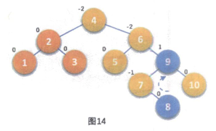

# 09. 查找

# 9.1 查找概论

只要有类似查找/搜索相关的操作, 就会涉及查找技术. 如炒股软件中查股票信息、硬盘文件中找照片，甚至玩游戏时在内存中查找攻击力、货币等数据修改用来作弊等，都要涉及查找。当然，在互联网上查找信息就更是家常便饭。所有这些需要被查的数据所在的集合，我们给它一个统称叫查找表。

> **查找表**(Search Table)是由*同一类型*的数据元素(或记录)构成的集合

如下图就是一个查找表

> **关键字**(Key)是数据元素中某个数据项的值, 又称为**键值**

它可以标记一个数据元素, 也可以标志一个记录的某个数据项(字段), 我们称为**关键码**, 如下图 ① 和 ② 所示

> 若此关键字可以**唯一**地标志一个记录, 则成此关键字为**主关键字**(Primary Key)

这也就意味着, 对于不同的记录, 其主关键字*均不相同*. 主关键字所在的数据项称为**主关键码**, 如下图 ③④ 所示

> 对于哪些可以识别多个数据元素(或记录)的关键字, 我们称为**次关键字**(Secondary Key)

如下图中 ⑤ 所示. 次关键字也可以理解为不是唯一标志一个数据元素(或记录)的关键字, 它对应的数据项就是**次关键码**

​​

> 查找就是根据*给定的某个值*, 在*查找表*中确定一个*其关键字等于给定值*的数据元素(或记录)

若表中存在这样的一个记录，则称查找是成功的，此时查找的结果给出整个记录的信息，或指示该记录在查找表中的位置。比如上图所示，在我们查找主关键码"代码"的主关键字为“sh601398”的记录时，就可以得到第 2 条唯一记录。如果我们查找次关键码“涨跌额”为“-0.11”的记录时，就可以得到两条记录。

若表中不存在关键字等于给定值的记录, 则称查找不成功, 此时查找的结果可给出一个 null 记录或者 null 指针

查找表按照操作方式来分有两大种:

* **静态查找表**(Static Search Table)

  **只**作**查找**操作的查找表

  主要操作有:

  * 查询某个"特定的"数据元素是否在查找表种
  * 检索某个"特定的"数据元素和各种属性
* **动态查找表**(Dynamic Search Table)

  在**查找**过程中, 同时**插入**查找表中不存在的数据元素, 或者从查找表中**删除**已经存在的某个数据元素

  主要操作有:

  * 查找时**插入**数据元素
  * 查找时**删除**数据元素

为了提高查找效率, 我们需要专门为查找操作设计数据结构, 这种面向查找操作的数据结构称为查找结构

从逻辑上来说，查找所基于的数据结构是集合，集合中的记录之间没有本质关系。可是要想获得较高的查找性能，我们就不能不改变数据元素之间的关系，在存储时可以将查找集合组织成表、树等结构。

例如，对于静态查找表来说，我们不妨应用线性表结构来组织数据，这样可以使用顺序查找算法，如果再对主关键字排序，则可以应用折半查找等技术进行高效的查找。

如果需要动态查找，则会复杂一些，可以考虑二叉排序树的查找技术。

另外，还可以用散列表结构来解决一些查找问题，这些技术都将在后面的讲解中  
说明。

# 9.2 顺序表查找

顺序表查找时针对一个**线性表**进行查找操作, 因此它就是**静态查找表**

> **顺序查找**(Sequential Search)又叫线性查找, 是最基本的查找技术, 它的查找过程是: 从表中第一个(或最后一个)记录开始, 逐个进行记录的关键字和给定值比较, 若某个记录的关键字和给定值相等, 则查找成功, 找到所查的记录; 如果直到最后一个(或第一个)记录, 其关键字和给定值比较都不等时, 则表中没有所查的记录, 查找不成功

### 9.2.1 顺序表查找算法

没什么好说的, 及其简单, 就是基础的遍历

​`a`​为数组, `n`​为要查找的数组长度, `key`​为要查找的关键字

注意这里数组`a`​的下标从1开始

```cpp
int sequential_search(int *a, int n, int key)
{
    int i;
    for (int i = 1; i <= n; i++)
    {
        if (a[i] == key)
        {
            return i;       // 如果查到了, 就返回下标
        }
    }

    return -1;              // 如果遍历完了还没查到, 就返回-1
}
```

当需要查找复杂表结构的记录时, 只需要把数组a与关键字key定义成所需要的结构和数据类型即可(如自定义了一个`student`​类, 现在有一个`students[]`​数组, 那么需要把`int *a`​改成`student *students`​. 其他参数同理)

### 9.2.2 顺序表查找优化

上面是非常常用的顺序表查找算法, 但是还能进行一点小小的优化

因为每次循环时都要对`i`​是否越界, 即是否小于等于`n`​作判断, 事实上在实践中有更好的办法, 设置一个*哨兵*, 可以解决不需要每次让`i`​与`n`​作比较

```cpp
// 有哨兵顺序查找
int sequential_search_2(int *a, int n, int key)
{
    int i;
    a[0] = key;             // 这里就把之前没用的a[0]利用起来了, 作为哨兵, 存储关键字值
    i = n;                  // 循环从最后一位开始
    while (a[i] != key)     // 直到找到key为止, 一旦找到key就跳出循环
    {
        i--;
    }
    return i;               // 如果找到key, i即为数组下标, 如果没找到会返回0
}
```

这种在*查找方向的尽头放置&quot;哨兵&quot;* 免去了在查找过程中每一次比较后都要判断查找位置是否越界的小技巧, 与原先看上去差别不是很大, 但在总数据较多时, 有一定的效率提高, 是不错的编码技巧.

当然"哨兵"不一定必须得在数组的开始, 也可以在数组的末端, 这样就是正序了

对于这样的顺序查找算法来说, 查找成功的最好情况就是在第一个位置就找到了, 时间复杂度是$O(1)$, 最坏情况是在最后一位找到, 时间复杂度是$O(n)$. 平均查找次数是(n+1)/2, 所以该算法时间复杂度是$O(n)$

显然, 当n很大时, 这个算法查找效率极为低下

# 9.3 有序表查找

从生活经验也可以学习到, 如果要找的东西乱成一团, 毫无秩序, 那么查找要花费大量时间. 倘若我们将要找的东西事先整理好, 有一定的顺序, 那么会对查找速度有一定的帮助

当我们对一个线性表排序, 使其变得有序时, 对于查找总是有帮助的

### 9.3.1 二分查找

一个很经典的问题, 给一个1~100的整数范围, 请你用最少的次数猜出正确的数字. 小学生都能想到折半来找

> [二分查找](siyuan://blocks/20240127214409-o7pi6b4)(Binary Search), 又称折半查找. 它的前提是线性表中的记录必须是**关键码有序**(通常是从大到小有序), 线性表必须采用**顺序存储**.

二分查找的基本思想是:

1. 在有序表中, 取**中间**记录作为比较对象
2. 若给定值与中间记录的关键字**相等**, 则查找**成功**.
3. 若给定值**小于**中间记录的关键字, 则在中间记录的**左半区**进行查找
4. 若给定值**大于**中间记录的关键字, 则在中间记录的**右半区**继续查找
5. 不断重复上述过程, 直到查找成功
6. 若所有查找区域均无记录, 查找失败

由于我们一般都是在离散非连续的线性表中查找, 那么二分如果是奇数怎么办呢? 我们还是用C++中除法向下取整的特性, 这样边界就变得敏感了, 于是就边界问题, 我们有了以下两种二分查找模板

```cpp
#include <iostream>

using namespace std;

bool check(int x) {/* ... */}           // 检查 x 是否满足某种性质

// 区间[l, r]被划分成 [l, mid] 和 [mid + 1, r] 时使用 
int binary_search_1(int l, int r)
{
    while (l < r)                       // 直到缩小到l == r
    {
        int mid = l + r >> 1;           // **两种二分模板的区别**
        // tip: a + b >> 1 等效于 (a + b) / 2
        if (check(mid)) r = mid;      
        else l = mid + 1;               // **两种二分模板的区别**
    }
    return l;                           // 因为最后l == r, 所以return二者中其一都没问题
}

// 区间[l, r]被划分成[l, mid - 1] 和[mid, r] 时使用
int binary_search_2(int l, int r)
{
    while (l < r)
    {
        int mid = l + r + 1 >> 1;       // **两种二分模板的区别**
        if (check(mid)) l = mid;
        else r = mid - 1;               // **两种二分模板的区别**
    }
    return l;
}
```

由于我们在每一次循环中, 都选择了其中的一半范围, 进行查找, 基本上我们可以将搜索的过程绘制出一颗二叉树

假如有这样一个有序表数组`{0,1,16,24,35,47,59,62,73,88,99}`​, 一共有10个数字, 如果要查找是否存在62这个数字, 查找过程的二叉树如下

​​

我们之前提到的[二叉树的性质四](siyuan://blocks/20240723194457-yfsn0m8)提到: 具有n个结点的**完全二叉树**的深度为$\lfloor log_2 n \rfloor + 1$. 尽管这里二分查找判定二叉树并不是完全二叉树, 但是对这条性质的推理方法仍然可以用于分析二分查找的时间复杂度, 所以我们可以推导出最坏情况下, 找到或者查找失败的次数是$\lfloor log_2 n \rfloor + 1$, 最好情况是1次

因此最终我们**二分查找的时间复杂度是**​**$O(\log n)$**, 它显然远远好于顺序查找的$O(n)$, 特别是数据量很大的情况下.

不过, 由于二分查找的前提条件是*有序表顺序存储*,

* 对于静态表, 一次排序后不再变化, 二分查找能发挥出不错的性能.
* 但是对于那些需要*频繁执行插入或删除*操作的数据集来说, *维护有序的排序*会带来一定的工作量, 不建议使用二分查找

### 9.3.2 插值查找

二分查找是不错, 但是它为什么不是三分四分甚至更多呢?

使用字典查单词是一个非常经典的查找例子, 在英文词典里查单词"apple"，你下意识里翻开词典是翻前面的书页还是后面的书页呢？如果再让你查"zoo"，你又怎么查？很显然，这里你绝对不会是从中间开始查起，而是有一定目的地往前或往后翻。

同样地，比如要在取值范围为0～10000的100个元素从小到大均匀分布的数组中查找5，我们自然会考虑从数组下标较小的开始查找。

此时二分查找的效率就不如这样符合直觉的查找了

很容易想到优化的点在二分查找中的`mid`​上, 它不必需要死板地==(l+r)/2

对于`mid`​我们稍加变形:$mid= \frac {low+high}{2} =low+ \frac {1}{2} (high-low)$

也就是`mid`​等于最低下标`low`​加上最高下标`high`​与`low`​的差的一半, 这个二分之一就是二分的核心所在, 要改进二分查找就要对这个二分之一作改进

前辈们给出了这样的计算方案:$mid =low+ \frac {key-a[low]}{a[high]-a[low]} (high-low)$​

将1/2改成了$\frac {key-a[low]}{a[high]-a[low]}$是为什么呢?

假设`a[11]={2,1,16,24,35,47,59,62,73,88,99}`​, `low=1`​, `high=10`​, 则`a[low]=1`​, `a[high]=99`​, 如果我们要找的`key=16`​, 按照二分的找法我们需要四次才能得到结果, 但是我们用优化后的公式$\frac {key-a[low]}{a[high]-a[low]} =(16-1)/(99-1) \approx 0.153$, 即$mid \approx 1+0.153*(10-1)=2.377$, 取整后得到`mid=2`​, 我们只需要两次就能查找到结果, 显然提高了查找效率

既然公式改动不大, 那么代码部分的改动也应该不大

```cpp
#include <iostream>

using namespace std;

int interpolation_search(int *a, int n, int key)
{
    int left, right, mid;
    left = 1;                    // 定义left下标为首位
    right = n;                   // 定义right下标为末尾
    while (left <= right)         // 一直循环, 相等则为key的下标
    {
        mid = left + (right - left) * (key - a[left]) / (a[right] - a[left]); // 公式优化的部分
        if (key < a[mid])       // 如果查找值比mid小
        {
            right = mid - 1;     // right下标调整到mid前一位
        }
        else if (key > a[mid])  // 如果查找值比mid大
        {
            left = mid + 1;      // left下标调整到mid后一位
        }
        else return mid;        // 相等则为找到了key, 下标为mid
    }

    return 0;
}
```

> 这样就得到了另一种有序表查找算法--**插值查找(** Interpolation Search). 就是要根据要查找的关键字key与查找表中最大最小记录的关键字比较后查找的方法, 其核心就在于插值的计算公式$\frac {key-a[low]}{a[high]-a[low]}$.

从时间复杂度来看, 由于只是改变了`mid`​的计算公式, 所以和二分查找一样是$O(\log n)$, 但对于**表长较大**, 而**关键字分布又比较均匀**的查找表来说, 插值查找算法的*平均*性能比二分查找高很多.  反之, 如果数组中分布类似`{0,1,2,2000,20001,...,999998,999999}`​这样**极端不均匀**的数据, 用插值查找不是特别好的选择

### 9.3.3 斐波那契查找

还有没有其他办法？我们折半查找是从中间分，也就是说，每一次查找总是一分为二，无论数据偏大还是偏小，很多时候这都未必就是最合理的做法。除了插值查找，我们再介绍一种有序查找，**斐波那契查找**（Fibonacci Search），它是利用了*黄金分割原理*来实现的。

##### 算法流程

1. **输入与初始化**:

    * 输入待查找的数组 `vec`​ 和目标值 `key`​。
    * 对数组 `vec`​ 进行排序，这是斐波那契查找的前提条件。
    * 计算数组大小 `n`​，并初始化查找范围：`left = 0`​ 和 `right = n - 1`​。
    * 初始化变量 `mid`​（中间位置），`i`​（斐波那契数列索引），`idx = -1`​（结果索引，默认值为-1表示未找到）。
2. **生成斐波那契数列**:

    * 创建一个长度为 `50`​ 的斐波那契数列 `fib[]`​。
    * 使用递归关系 `fib[i] = fib[i - 1] + fib[i - 2]`​ 生成斐波那契数列。
    * 在生成的过程中，找到一个大于数组长度 `n`​ 的最小斐波那契数 `fib[i]`​，用来决定扩展数组的大小。
3. **扩展待查找数组**:

    * 创建一个大小为 `fib[i] + 1`​ 的新数组 `tmp`​，用于将原数组 `vec`​ 扩展至斐波那契数列的长度。
    * 使用 `std::copy`​ 将原数组 `vec`​ 的内容复制到新数组 `tmp`​。
    * 使用 `std::fill`​ 将 `tmp`​ 数组中多余的部分（超出 `n`​ 的部分）用 `vec`​ 的最后一个元素填充。
4. **斐波那契查找过程**:

    * 进入循环，直到 `left`​ 指针超过 `right`​ 为止。
    * 在每次循环中，计算中间位置 `mid = left + fib[i - 1] - 1`​。
    * 比较 `tmp[mid]`​ 与目标值 `key`​：

      * 如果 `tmp[mid] > key`​，说明目标在左侧，将 `right`​ 更新为 `mid - 1`​，并将斐波那契数列索引 `i`​ 减少 2。
      * 如果 `tmp[mid] < key`​，说明目标在右侧，将 `left`​ 更新为 `mid + 1`​，并将斐波那契数列索引 `i`​ 减少 1。
      * 如果 `tmp[mid] == key`​，检查 `mid`​ 是否在原数组范围内：

        * 如果在范围内，则找到目标元素，将其索引保存到 `idx`​ 并跳出循环。
        * 如果不在范围内，继续在左侧查找，将 `right`​ 更新为 `mid - 1`​，并将斐波那契数列索引 `i`​ 减少 2。
5. **特殊情况处理**:

    * 如果目标值在循环外的检查位置 `right`​ 上，且 `tmp[right] == key`​，将 `idx`​ 设置为 `right`​。
    * 最后检查 `idx`​ 是否超出原数组范围 `n`​，如果超出，设置为 `-1`​，表示未找到目标元素。
6. **释放资源并返回结果**:

    * 释放临时扩展数组 `tmp`​ 的内存，防止内存泄漏。
    * 返回目标元素的索引 `idx`​。如果目标元素不存在，返回 `-1`​。

###### 核心步骤解释

* **斐波那契数列的使用**:

  * 通过斐波那契数列确定中间位置，使得查找过程可以更灵活地分割查找区间。
* **扩展数组的目的是**:

  * 为了避免越界，在计算中间位置时可能会访问到扩展部分，因此用原数组最后一个元素填充扩展部分。
* **查找范围的缩小**:

  * 根据 `tmp[mid]`​ 与 `key`​ 的比较结果，通过调整 `left`​、`right`​ 和 `i`​ 的值逐步缩小查找范围。
* **最终结果的判定**:

  * 确保找到的 `mid`​ 在原数组范围内，保证查找到的索引是有效的。

##### 代码实现

```cpp
#include <iostream>
#include <vector>
#include <algorithm>

using namespace std;

int fibonacci_search(vector<int> vec, int key)
{
    sort(vec.begin(), vec.end());                   // 先对待查找的数组进行排序, 因为斐波那契查找的前提是有序表
    int n = vec.size();                             // 数组大小
    int left = 0, right = n - 1;                    // 初始查找的范围
    int mid, i = 0, idx = -1;                       // mid为中间点, i为斐波那契数列的索引, idx为结果的索引

    // 生成斐波那契数列, 寻找大于数组长度的最小斐波那契数
    int fib[50];                                    // 斐波那契数列, 长度为50
    fib[0] = 0;
    fib[1] = 1;
    for (int i = 2; i < 50; i++)
    {
        fib[i] = fib[i - 1] + fib[i - 2];           // 生成斐波那契数列
        if (fib[i] > right)                         // 找到大于待查找数组长度的斐波那契数
        {
            break;
        }
    }

    // 扩展待查找的数组, 使其长度为刚好大于等于斐波那契数fib[i]
    int *tmp = new int[fib[i] + 1];
    copy(vec.begin(), vec.end(), tmp);              // 将原数组复制到扩展数组
    fill(tmp + n, tmp + fib[i], vec[n - 1]);        // 用最后一个元素填充拓展部分
    /*对于上面两行, 一个非常朴素的实现
    for (int j = 0; j < n; j++)
    {

    } for (int j = 0; j < n; j++) 
    {
        temp[j] = vec[j];  // 将原数组元素复制到扩展数组
    }
    for (int j = n; j < F[i]; j++) 
    {
        temp[j] = vec[n - 1];  // 用最后一个元素填充扩展部分
    }
    */

    // 斐波那契查找实现
    while (left <= right)
    {
        mid = left + fib[i - 1] - 1;                // 计算分界线

        if (tmp[mid] > key)
        {
            right = mid - 1;                        // 目标元素在左半部分
            i -= 2;                                 // 调整斐波那契数列索引
        }
        else if (tmp[mid] < key)
        {
            left = mid + 1;                         // 目标元素在右半部分
            i -= 1;                                 // 调整斐波那契数列索引
        }
        else
        {
            if (mid < n)                            // 找到目标元素并且确定在原数组范围内(不是拓展出来的)
            {
                idx = mid;
                break;
            }
            else
            {
                right = mid - 1;                    // 否则继续在左半部分查找
                i -= 2;
            }
        }

        // 检查最后一个可能的位置
        if (idx == -1 && tmp[right] == key)
        {
            idx = right;
        }

        // 如果结果超出原数组, 说明未找到目标
        if (idx >= n)
        {
            idx = -1;  
        }

        delete[] tmp;                               // 释放拓展数组
        tmp = nullptr;
        return idx;                                 // 返回目标元素的索引
    }


}
```

# 9.4 线性索引查找

我们前面讲的几种比较高效的查找方法都是基于有序的基础之上的，但事实上，很多数据集可能增长非常快，例如，某些社交网站或大型论坛的帖子和回复总数每天都是成百万上千万条，或者一些服务器的日志信息记录也可能是海量数据，要保证记录全部是按照当中的某个关键字有序，其时间代价是非常高昂的，所以这种数据通常都是按**先后顺序**存储。

那么对于这样的查找表, 容貌如何能够快速找到需要的数据呢? 办法就是**索引**

> **索引**是把一个关键字与它对应的记录相关联的过程, 一个索引由若干个**索引项**构成, 每个索引项至少应包含关键字和其对应的记录在存储器中的位置等信息

索引按照结构可以分为**线性索引**, **树形索引**, 和**多级索引**. 在这里我们只介绍线性索引.

> **线性索引**是将*索引项集合*组织为*线性结构*, 也称**索引表**

我们重点介绍三种线性索引: **稠密索引**, **分块索引**, **倒排索引**

### 9.4.1 稠密索引

> **稠密索引**是指在线性索引中, 将数据集中的每一个记录对应一个索引项.

​​

> 对于稠密索引的索引表来说, 索引项一定是**按照关键码有序排列**的

索引项有序排列也就意味着, 我们查找关键字时, 可以用折半,插值,斐波那契等有序查找法, 大大提高了效率    (比如上图中，我要查找关键字是18的记录，如果直接从右侧的数据表中查找，那只能顺序查找，需要查找6次才可以查到结果。而如果是从左侧的索引表中查找，只需两次折半查找就可以得到18对应的指针，最终查找到结果。)

然而, 当数据量非常大的时候, 也就意味着*索引也得有同样的数据集长度规模*, 对于内存有限的计算机来说, 可能就要反复访问磁盘, 查找性能反而大大下降了

### 9.4.2 分块索引

图书馆是一个非常经典的使用索引查找的场景. 图书馆的图书分类摆放是一门非常完整的科学体系，而它最重要的一个特点就是**分块**。

稠密索引因为索引项与数据集的记录个数相同，所以空间代价很大。为了减少  
索引项的个数，我们可以对数据集进行分块，使其**分块有序**，然后再**对每一块建立一个索引项**，从而减少索引项的个数。

> **分块有序**, 是把数据集的记录分成了若干块, 并且这些块需要满足以下条件
>
> * **块内无序**​
>
>   即每一块内的记录不需要有序
> * **块间有序**​
>
>   例如，要求第二块所有记录的关键字均要大于第一块中所有记录的关键字，第三块所有记录的关键字均要大于第二块所有记录的关键字. 因为  
>   只有块间有序，才有可能在查找时提高效率。

> 对于分块有序的数据集, 将每块对应一个索引项, 这种方法叫做**分块索引**

​​

我们定义的分块索引的索引项结构分为三个数据项

* **最大关键码**​

  它存储每一块中的最大关键字, 这样的 好处就是可以使得它之后的下一块中的最小关键字也能比这一块的最大关键字要大
* 块中的**记录个数**

  以便于循环时使用
* 用于**指向块首数据元素的指针**​

  便于开始对这一块中的记录开始遍历

‍

在分块索引表中查找, 分以下两步进行

1. 在**分块索引表**中查找要查关键字所在的块.

    由于分块索引表是**块间有序**的, 因此很容易利用折半,插值等算法得到结果.

    例如，在上图的数据集中查找62，我们可以很快从左上角的索引表中由57<62<96得到62在第三个块中。
2. 根据块首指针找到相应的块, 并在块中**顺序查找**关键码.

    因为块中是可以无序的, 因此只能顺序查找

‍

我们再来分析一下分块索引的平均查找长度

设$n$个记录的数据集被平均分为$m$块, 每块中有$i$条记录, 显然$n=m*t$. 再假设$L_b$为**查找索引表**的平均查找长度, 由于最好与最差的等概率原则, 所以$L_b$的平均长度为$\frac {m+1} {2}$. $L_w$为**块中**查找记录的平均查找长度, 同理可知它的平均查找长度为$\frac {t+1} {2}$. 这样分块索引表的平均查找长度为:

$ASL_ {w} = L_ {0} + L_ {w} = \frac {m+1}{2} + \frac {t+1}{2} = \frac {1}{2} (m+t)+1= \frac {1}{2} ( \frac {n}{t} +t)+1$  

注意上面这个式子的推导式为了让整个分块索引查找长度依赖$n$和$t$两个变量. 从这里我们也就得到, 平均长度不仅取决于数据集的总记录$n$, 还和每一个块的记录个数$t$相关. 最佳的情况就是分的块数$m$与块中的记录数$t$相同 (均值不等式) . 此时意味着 $n=m*t=t^2$, 即

$ASL_ {w} =\frac {1}{2} ( \frac {n}{t} +t)+1=t+1=\sqrt n + 1$

可见分块索引在最好的分块方法下, 时间复杂度为$O(\sqrt n)$, 比顺序查找的$O(n)$高了不少, 不过显然它与折半查找的$O(\log n)$相比还是有不小的差距. 因此*在确定所在块的过程中*, 由于块间有序, 所以可以应用折半,插值等手段来提高效率

总的来说，分块索引在兼顾了对细分块不需要有序的情况下，大大增加了整体查找的速度，所以普遍被用于数据库表查找等技术的应用当中。

### 9.4.3 倒排索引

倒排索引是在搜索引擎中最基础简单的技术

我们来看样例，现在有两段句子, 编号分别是1和2

1.Books and friends should be few but good.（读书如交友，应求少而精。）  
2.A good book is a good friend.（好书如挚友。）

假设我们忽略掉如“books”“friends”中的复数“s”以及如“A”这样的大小写差异。我们可以整理出这样一张单词表，如下表所示，并将单词做了排序，也就是表格显示了每个不同的单词分别出现在段句子中，比如“good”它在两个句子中都有出现而“is”只是在句2中才有。

​​

有了这样一张单词表，我们要搜索文章，就非常方便了。如果你在搜索框中填写“book”关键字。系统就先在这张单词表中有序查找“book”，找到后将它对应的文章编号1和2的文章地址（通常在搜索引擎中就是网页的标题和链接）返回，并告诉你，查找到两条记录，用时0.0001秒。由于单词表是有序的，查找效率很高，返回的又只是文章的编号，所以整体速度都非常快。

如果没有这张单词表，为了能证实所有的文章中有还是没有关键字“book”，则需  
要对每一篇文章每一个单词顺序查找。在文章数是海量的情况下，这样的做法只存在理论上的可行性，现实中是没有人愿意使用的。

在这里上面这张单词就是索引表, **索引项的通用结构是**:

* **次关键码**​

  例如上面的"英文单词"
* **记录号表**​

  例如上面的"文章编号"

> 其中记录号表存储具有相同关键字的所有记录的**记录号**(可以是*指向记录的指针*, 或者是*该记录的主关键字*). 这样的索引方法就是**倒排索引**(inverted index)

倒排索引源于实际应用中需要根据属性（或字段、次关键码）的值来查找记录。这种索引表中的每一项都包括一个属性值和具有该属性值的各记录的地址。由于不是由记录来确定属性值，而是由属性值来确定记录的位置，因而称为倒排索引。

倒排索引的**优缺点:**

* 优点

  查找记录非常快，基本等于生成索引表后，查找时都不用去读取记录，就可以得到结果。
* 缺点

  记录号不定长

  比如上例有7个单词的文章编号只有一个，而“book”“friend”“good”有两个文章编号，若是对多篇文章所有单词建立倒排索引1，那每个单词都将对应相当多的文章编号，维护比较困难，插入和删除操作都需要作相应的处理。

# 9.5 二叉排序树

[二叉查找树(二)之 C++的实现](https://www.cnblogs.com/skywang12345/p/3576373.html)

假设查找的数据集是普通的顺序存储，那么插入操作就是将记录放在表的末端，给表记录数加一即可，删除操作可以是删除后，后面的记录向前移，也可以是要删除的元素与最后一个元素互换，表记录数减一，反正整个数据集也没有什么顺序，这样的效率也不错。应该说，插入和删除对于顺序存储结构来说，效率是可以接受的，但这样的表由于*无序造成查找的效率很低*

如果查找的数据集是有序线性表，并且是顺序存储的，查找可以用折半、插值、斐波那契等查找算法来实现，可惜，*因为有序，在插入和删除操作上，就需要耗费大量的时间。*

那么有没有一种既可以使得插入和删除效率都不错, 又可以比较高效地实现查找算法呢?

我们在之前提到了, 把这种需要在查找时插入或删除的查找表称为动态查找表. 我们就来看看上面样的结构可以实现动态查找表的高效率

> **二叉排序树**(Binary Sort Tree), 又称为**二叉搜索树.**  它或者是一颗*空树*, 或者是具有以下性质的二叉树
>
> * 若它的左子树不为空, 则**左子树**上所有结点的值均**小于**它的根节点的值
> * 若它的右子树不为空, 则**右子树**上所有结点的值均**大于**它的根节点的值
> * 它的**左右子树**也分别是**二叉排序树**

从二叉排序树的定义也可以知道, 它的前提是一颗二叉树, 然后它采用了*递归*的定义方式, 再者, 它的结点间满足一定的*次序关系*, **左子树结点一定比其双亲结点小, 右子树结点一定比其双亲结点大**​

构造一颗二叉排序树的目的不是为了排序, 而是为了*提高查找和插入删除关键字的速度.*  不管怎么说，在一个有序数据集上的查找，速度总是要快于无序的数据  
集的，而二叉排序树这种非线性的结构，也有利于插入和删除的实现。

### 9.5.1 二叉排序树的查找操作

**递归版本的查找**

```cpp
template <class T>
BSTNode<T>* BSTree<T>::search(BSTNode<T>* x, T key)
{
    if (x == nullptr || x->key == key) return x;            // 如果找到了相等的值, 或者找到最后还是空则return

    // 使用了类似二分的方法来查找
    if (key < x->key) return search(x->left, key);
    else return search(x->right, key);
}
template <class T>
BSTNode<T>* BSTree<T>::search(T Key)
{
    search(root, key);
    // 这里是公有的接口, 只需要key一个参数更符合直觉, 二上面私有的函数中, 有子树的根节点这个参数更便于递归
}
```

**非递归版本的查找**

```cpp
template <class T>
BSTNode<T>*BSTree<T>::iterativeSearch(BSTNode<T>* x, T key)
{
    while ((x != nullptr) && (x->key != key))
    {
        if (key < x->key) x = x->left;
        else x = x->right;
    }
    return x;
}
template <class T>
BSTNode<T>* BSTree<T>::iterativeSearch(T key)
{
    iterativeSearch(root, key);
}
```

### 9.5.2 二叉排序树的插入操作

```cpp
// 将结点插入二叉树中
// 参数说明:
//      tree: 二叉树的根节点
//      z: 插入的结点
template <class T>
void BSTree<T>::insert(BSTNode<T>* &tree, BSTNode<T>* z)
{
    BSTNode<T>* y = nullptr;                // y用于追踪z的父节点
    BSTNode<T>* x = tree;                   // x用于遍历树

    // 查找z插入的位置
    // 类似上面的查找函数
    while (x != nullptr)
    {
        y = x;                              // y始终保持为x的父节点
        // 这样的判断是根据二叉搜索树的性质决定的, 左子树小, 右子树大
        if (z->key < x->key) x = x->left;
        else x = x->right;
    }

    // 循环结束后, y是z的父节点, 而x是z应该插入的位置
    z->parent = y;                          // 将z的父节点设置为y
    if (y == nullptr) tree = z;             // 如果y为null(即这是棵空树), 那么z就是根节点
    else if (z->key < y->key) y->left = z;  // 否则根据z与y的大小关系, 将z插入y的左子节点/右子节点
    else y->right = z;
}
template <class T>
void BSTree<T>::insert(T key)
{
    BSTNode<T>* z = nullptr;

    // 如果新建结点失败则返回(不过真的有创建失败的情况吗...?)
    if ((z = new BSTNode<T>(key,nullptr,nullptr,nullptr)) == nullptr) return;

    insert(root, z);
}
```

### 9.5.3 二叉排序树的删除操作

让我们从特殊到一般来考虑

* 如果删除的是树中的**叶子结点**

  那么只要将这个结点释放并将其父节点指向`null`​就行了

  ​​
* 如果是删除的结点**只有左子树或只有右子树**

  释放该结点后, 将它的左子树或右子树整个移动到删除结点的位置即可

  ​
* 如果删除的结点**既有左子树, 又有右子树**​

  这是最一般也是最麻烦的情况

  ​​

  首先一个最朴素的想法就是把这个结点下的子树解散, 再将每一个结点重新逐个插入二叉排序树. 但是这样的作法效率不高, 而且会导致整个二叉排序树结构发生很大的变化, 有可能会增加树的**高度**, 而*增加高度*不是一件非常好的事情, 我们一般想去避免它.

  那么我们就想到用这个结点的左右子树中的一个结点来代替被删除的结点

  在上图中, 也许37和48能够代替47, 这样整个二叉排序树没有什么本质的改变

  为什么时37和48呢? 因为它们正好时二叉排序树种比它小或比它大的最接近47的两个数. 也就是说, 如果我们对这棵二叉排序树进行[中序遍历](siyuan://blocks/20240725195038-az6e2n6), 得到的序列是{29,35,36,37,47,48,49,50,51,56,58,62,73,88,93,99}, 这两个数正好是47的*前驱*和*后继*

  因此, 比较好的办法是: 找到需要删除的结点p的直接前序(或直接后继)s, 用s来替换结点p, 然后再删除此结点s

  ​​

```cpp
// 查找最小值
template <class T>
BSTNode<T> *BSTree<T>::minimum(BSTNode<T> *tree)
{
    if (tree == nullptr)
        return nullptr;
    while (tree->left != nullptr)
        tree = tree->left;
    return tree;
}
template <class T>
T BSTree<T>::minimum()
{
    BSTNode<T> *p = minimum(root);
    if (p != nullptr)
        return p->key;
    return (T) nullptr;
}
// 查找最大值
template <class T>
BSTNode<T> *BSTree<T>::maximum(BSTNode<T> *tree)
{
    if (tree == NULL)
        return NULL;

    while (tree->right != NULL)
        tree = tree->right;
    return tree;
}

template <class T>
T BSTree<T>::maximum()
{
    BSTNode<T> *p = maximum(mRoot);
    if (p != NULL)
        return p->key;

    return (T)NULL;
}

// 找结点(x)的后继结点, 即查找"二叉树种数据值大于该结点的最小结点"
template <class T>
BSTNode<T> *BSTree<T>::successor(BSTNode<T> *x)
{
    // 如果x存在右子节点, 则x的后继结点为 以其右子节点为根的子树的最小结点
    if (x->right != nullptr)
        return minimum(x->right);

    // 如果x没有右子节点, 则x有以下两种可能
    // 1. x是一个左子节点,  则x的后继结点为它的父节点
    // 2. x是一个右子节点, 则查找x的最低父节点, 并且该父节点要有左子节点, 找到的这个最低父节点就是x的后继结点
    BSTNode<T> *y = x->parent;
    while (y != nullptr && x == y->right)
    {
        x = y;
        y = y->parent;
    }
    return y;
}

// 删除结点(z), 并返回被删除的结点
// 参数说明:
//      tree 二叉树的根节点
//      z 删除的结点
template <class T>
BSTNode<T> *BSTree<T>::remove(BSTNode<T> *&tree, BSTNode<T> *z)
{
    BSTNode *x = nullptr;
    BSTNode *y = nullptr;

    // 1. 确定要删除的结点 y
    if (z->left == nullptr && z->right == nullptr)
        y = z; // 如果z是叶子结点, 就直接删除z
    else
        y = successor(z); // 如果z不是叶子结点, 找到它的后继结点y

    // 2. 确定y的子节点x
    if (y->left != nullptr)
        x = y->left; // 如果y存在左子节点, 将x设为y的左子节点
    else
        x = y->right; // 如果y不存在左子节点, 将x设为y的右子节点

    // 3. 更新x的父节点指针
    if (x != nullptr)
        x->parent = y->parent; // 如果x不为空, 将x的父节点设为y的父节点

    // 4. 更新y的父节点指针(因为y是要被删除的结点, 我们用x来代替y)
    if (y->parent == nullptr)
        tree = x; // 如果y是根节点, 将树的根设为x
    else if (y == y->parent->left)
        y->parent->left = x; // 如果y是左子节点, 将y的父节点的左子节点设为x
    else
        y->parent->left = x; // 如果y是右子节点, 将y的父节点的右子节点设为x

    // 5. 更新z的键值
    if (y != z)
        z->key = y->key;

    return y; // 返回被删除的结点y
}
template <class T>
void BSTree<T>::remove(T key)
{
    BSTNode<T> *z, *node;
    // 1. 查找结点z
    if (z = search(root, key) != nullptr)
    { // 2. 删除结点z
        if (node = remove(root, z) != nullptr)
        { // 3. 释放内存
            delete node;
        }
    }
}
```

### 9.5.4 二叉排序树总结

总之，二叉排序树以链接的方式存储，保持了链接存储结构在执行插入或删除操  
作时不用移动元素的优点，只要找到合适的插入和删除位置后，仅需修改链接指针即可。插入删除的时间性能比较好。

而对于二叉排序树的查找，走的就是从根结点到要查找的结点的路径，其比较次数等于给定值的结点在二叉排序树中的层数。极端情况，最少为1次，即根结点就是要找的结点，最多也不会超过树的深度。也就是说，二叉排序树的查找性能取决于二叉排序树的形状。可问题就在于，*二叉排序树的形状是不确定的*。

例如{62，88,58,47,35,73,51,99,37,93}这样的数组，我们可以构建如左下图所示的二叉排序树。但如果数组元素的次序是从小到大有序，如{35,37,47,51,58,62,73,88,93,99}，则二叉排序树就成了极端的**右斜树**，注意它依然是一棵二叉排序树，如右下图。此时，同样是查找结点99，左下图只需要两次比较，而右下图就需要10次比较才可以得到结果，二者差异很大。

​​

也就是说, 我们希望二叉排序树是比较*平衡*的, 即**深度与完全二叉树相同,**  均为$\lfloor \log _2{n} \rfloor + 1$, 那么查找的时间复杂度就会是$O(\log n)$, 近似于二分查找 (实际上左上图也不够平衡, 明显左重右轻)

不平衡的最坏情况就是右上图的斜树, 查找时间复杂度为$O(n)$, 这等同于顺序查找

因此, 如果我们希望对一个集合按二叉排序树查找, 最好是把它构建成一颗**平衡的**二叉排序树, 这样就引出另一个问题, 如何让二叉排序树平衡的问题

# 9.6 平衡二叉树(AVL树)

接着前面二叉搜索树引出的问题, 可以想象得到平衡二叉树的存在

> **平衡二叉树**(Self-Balancing Binary Search Tree 或 Height-Balanced Binary Search Tree), 是一种二叉排序树, 其中*每一个结点的左子树和右子树的*​***高度差至多***​*等于1*

从名字也可以看出, 平衡二叉树是一种**高度平衡的二叉排序树**, 那么什么叫做高度平衡呢? 就是说, 它要么是一颗空树, 要么它的*左子树和右子树都是平衡二叉树,*  且*左子树和右子树的*​***高度之差的绝对值不超过1***

我们将二叉树上结点的*左子树高度减去右子树高度的值*称为**平衡因子**BF(Balance Factor), 那么平衡二叉树上所有结点的平衡因子只可能是-1,0和1. 只要二叉树上有一个结点的平衡因子的绝对值大于1, 则二叉树就不可能是平衡的.

下图中, 为什么图1是平衡二叉树，而图2却不是呢？因为所谓平衡二叉树, 它的前提首先是一棵二叉排序树，图2的59比58大，却是58的左子树，这是不符合二叉排序树的定义的。    图3不是平衡二叉树的原因就在于，结点58的左子树高度为3，而右子树为空，二者差大于了绝对值1，因此它也不是平衡的。而经过适当的调整后的图4，它就符合了定义，因此它是平衡二叉树。

​​

> 距离*插入结点*最近的, 且*平衡因子的绝对值大于1*的结点为根的子树, 我们称为**最小不平衡树**

下图中，当新插入结点37时，距离它最近的平衡因子绝对值超过1的结点是58（即它的左子树高度3减去右子树高度1），所以从58开始以下的子树为最小不平衡子树。

​​

### 9.6.1 平衡二叉树的实现原理

[AVL树演示动画](https://www.bilibili.com/video/BV1tZ421q72h)

平衡二叉树构建的基本思想就是: 在构建二叉排序树的过程中, 每当插入一个结点时, 先检查是否因插入破坏了树的*平衡性.*  若是, 则找出**最小不平衡子树**, 在保持二叉排序树特性的前提下, 调整最小不平衡子树中各个结点的链接关系, 进行相应的*旋转*, 使之称为新的平衡树

---

下面我们通过模拟一个实例来更好地理解平衡二叉树的构建过程

假设我们现在有一个数组a[10]={3,2,1,4,5,6,7,10,9,8}需要构建二叉排序树。在没有学习平衡二叉树之前，根据二叉排序树的特性，我们通常会将它构建成如下图的图1所示的样子。虽然它完全符合**二叉排序树**的定义，但是对这样高度达到8的二叉树来说，查找是非常不利的。我们更期望能构建成如下图的图2的样子，高度为4的二叉排序树才可以提供高效的查找效率。那么现在我们就来研究如何将一个数组构建出图2的树结构。

​​

1. 对于数组a[10]={3,2,1,4,5,6,7,10,9,8}的前两位3和2, 我们可以很正常地构建
2. 到了第三个数"1"时, 发现此时根节点"3"的**平衡因子**变成了2, 此时整棵树都成了最小不平衡子树, 因此需要调整, 如下图中的图1 (结点左上角的数字为平衡因子BF值). 

    ​​

    1. 因为**BF值为正**, 因此我们将整个树进行**右旋 (顺时针旋转)** ,​
    2. 此时结点2成了根节点, 3成了2的右子节点, 这样三个结点的BF值均为0, 非常平衡, 如下图2所示

        ​​
3. 然后我们增加结点4, 平衡因子没有超出限定范围(-1,0,1), 如图3

    ​​
4. 增加结点5, 结点三的BF值为-2, 说明要旋转了

    1. 由于BF是**负值**, 所以我们对这颗最小平衡子树进行**左旋(逆时针旋转)** , 如图4, 此时整个树又达到了平衡

        ​​
5. 继续增加结点6, 发现*根节点的BF值变成了-2*, 如下图6

    1. 所以我们对*根节点*进行**左旋**
    2. 注意此时本来结点3是4的左子节点, 由于旋转后需要满足二叉排序树的特性, 因此它变成了结点2的右子节点, 如图7

        ​​
6. 增加结点7, 同样的左旋转, 使得整棵树达到平衡, 如图8,9所示

    ​​
7. ---

    ​​
8. 再增加结点9, 此时结点7的BF变成了-2

    1. 理论上我们只需要旋转最小不平衡子树7,9,10即可, 但是如果左旋转后, 结点9就成了10的右子节点, 这不符合二叉排序树的特性, 此时不能简单地左旋, 如图11所示

        ​​
    2. 仔细观察图11, 发现根本原因在于结点7的BF是-1, 而结点10的BF是1, 也就是说, 它们俩一正一负, **符号不统一,**  而前面几次旋转无论左旋还是右旋, 最小不平衡子树的根节点于它的子节点符号都是相同的, 这就是不能直接旋转的关键
    3. 不统一, 就把它们先转到符号统一再说. 于是我们先对结点9和10进行右旋, 使得结点10成为结点9的右子节点, 结点9的BF是-1, 此时就与结点7的BF值符号统一, 如图12

        ​​
    4. 我们再以结点7为最小不平衡子树进行左旋, 得到图13

        ​​
9. 接着插入8, 情况与刚才类似, 结点6的BF是-2, 而它右子节点9的BF是1, 如图14

    ​​

    1. 因此首先以9为根节点进行右旋, 得到图15

        ​​
    2. 此时结点6和结点7的符号都是负, 再以6为根节点左旋, 最终得到平衡后的二叉树, 如下图16

        ​​
##### 左旋与右旋

在上面的模拟过程中, 我们使用了大量的**旋转**, 包括左旋和右旋, 那么为什么可以这样旋转呢? 我们可以发现旋转前后的二叉树进行中序遍历, 输出结果是一样的, 所以就中序遍历而言, 它们是等价的, 所以可以旋转

10. 左旋

    逆时针旋转

    在该节点的BF值 < -1时进行左旋

    向左旋转, 冲突的左孩变右孩 (看上方链接动画来理解)
* 右旋

  顺时针旋转

  在该节点的BF值 > 1 时进行右旋

  向右旋转, 冲突的右孩变左孩
* ‍

##### **四种失衡情况**

[本视频05:07~09:10](https://www.bilibili.com/video/BV1tZ421q72h)

​​

先声明LL型代表什么: 新插入的结点是失衡结点的左子节点的左子树上(同理LR型代表新插入的结点时失衡结点的左子节点的右子树上)

* LL型

  * 失衡结点: BF=2
  * 失衡结点左子节点: BF=1
  * 需要采取的方式: 右旋
* RR型

  * 失衡结点: BF=-2
  * 失衡结点的右子节点: BF=-1
  * 需要采取的方式: 左旋
* LR型

  * 失衡结点: BF=2
  * 失衡结点的右子节点: BF=-1
  * 需要采取的方式: 左旋左子节点, 然后右旋
* RL型

  * 失衡结点: BF=-2
  * 失衡结点的左子节点: BF=1
  * 需要采取的方式: 右旋右子节点, 然后左旋

> tip: 插入结点后如果导致**多个祖先结点失衡**只需*调整距离插入结点*​***最近***​*的失衡结点，其他失衡结点会自然平衡*

### 9.6.2 平衡二叉树的实现算法

[AVL树之 C++的实现](https://www.cnblogs.com/skywang12345/p/3577360.html)

##### 左右旋转与四种失衡情况的实现

```cpp
// 四种情况下的旋转操作

// LL型的旋转(也是右旋(顺时针旋转)的函数)
template <class T>
AVLTreeNode<T> *AVLTree<T>::leftLeftRotation(AVLTreeNode<T> *k2) // k2代表的是失衡结点
{
    AVLTreeNode<T> *k1;

    k1 = k2->left;        // 记录k1是k2的右子节点
    k2->left = k1->right; // 如果在右旋的过程中有冲突(k1有右子节点), 那么将k1的右子节点成为k2的左子节点
    k1->right = k2;       // 将失衡结点右旋(顺时针旋转), 也就是将失衡结点变成其左子节点的右子节点

    // 旋转后更新高度
    k2->height = max(getHeight(k2->left), getHeight(k2->right)) + 1;
    k1->height = max(getHeight(k1->left), k2->height) + 1;

    return k1; // 返回旋转后的根节点
}

// RR型的旋转(也是左旋(逆时针旋转)的函数)
template <class T>
AVLTreeNode<T> *AVLTree<T>::rightRightRotation(AVLTreeNode<T> *k1)
{
    AVLTreeNode<T> *k2;

    k2 = k1->right;       // 记录k2是k1的右子节点
    k1->right = k2->left; // 如果在左旋的过程中有冲突(k2有左子节点), 那么将k2的左子节点成为k1的右子节点
    k2->left = k1;        // 将失衡结点左旋(逆时针旋转), 也就是将失衡结点变成其右子节点的左子节点

    // 旋转后更新高度
    k1->height = max(getHeight(k1->left), getHeight(k1->right)) + 1;
    k2->height = max(getHeight(k2->right), k1->height) + 1;

    return k2;
}

// LR型的旋转
template <class T>
AVLTreeNode<T>* AVLTree<T>::leftRightRotation(AVLTreeNode<T>* k3)   // k3代表的失衡结点
{
    k3->left = rightRightRotation(k3->left);    // 失衡结点的左子节点先左旋(逆时针旋转)
    return leftLeftRotation(k3);                // 然后将失衡结点右旋
}

// RL型的旋转
template <class T>
AVLTreeNode<T>* AVLTree<T>::rightLeftRotation(AVLTreeNode<T>* k1)
{
    k1->right = leftLeftRotation(k1->right);    // 失衡结点的右子节点先右旋(顺时针旋转)
    return rightRightRotation(k1);              // 然后将失衡结点左旋
}
```

##### 插入算法的实现

插入结点后需要检查是否会失衡, 失衡了就对失衡结点进行调整

如果同时有两个结点失衡, 那么只要对最近的失衡结点调整就好了, 更远的会随之变得平衡

所以只要调整一个失衡结点就好了

```cpp
// 将结点插入到AVL树中, 并返回根节点
template <class T>
AVLTreeNode<T>* AVLTree<T>::insert(AVLTreeNode<T>* &tree, T key)
{
    if (tree = nullptr)
    {
        // 新建结点
        tree = new AVLTreeNode<T> (key, nullptr, nullptr);
        if (tree = nullptr)
        {
            cout << "ERROR: create avltree node failed!" << endl;
            return nullptr;
        }
    }
    else if (key < tree->key)           // key 小于根节点的值, 所以应该插入到根节点的左子树
    {
        tree->left = insert(tree->left, key);

        // 插入结点后, 若AVL树失去平衡, 则进行相应的调节
        if (getHeight(tree->left) - getHeight(tree->right) == 2)    // 失衡结点BF值==2, 可以判断是LX型
        {
            if (key < tree->left->key)                              // 也就是插入的结点在失衡结点的左子节点的左子树上, 所以是LL型
            {
                tree = leftLeftRotation(tree);                      // 使用LL型
            }
            else                                                    // 插入结点在失衡结点的左子节点的右子树上, 所以是LR型
            {
                tree = leftRightRotation(tree);                     // 使用LR型
            }
        }
    }
    else if (key > tree->key)           // key 大于根节点的值, 所以应该插入到根节点的右子树
    {
        tree->right = insert(tree->right, key);

        // 插入结点后, 若AVL树失去平衡, 则进行相应的调节
        if (getHeight(tree->left) - getHeight(tree->right) == -2)   // 失衡结点BF值==-2, 可以判断是RX型
        {
            if (key > tree->right->key)                             // 插入的结点在失衡结点的右子节点的右子树上, 也就是RR型
            {
                tree = rightRightRotation(tree);                    // 使用RR型
            }
            else                                                    // 插入结点在失衡结点的右子节点的左子树上, 也就是RL型
            {
                tree = rightLeftRotation(tree);                     // 使用RL型
            }
        }
    }
    else // key == tree->key 的情况
    {
        cout << "添加失败, 存在相同的结点" << endl;
    }

    tree->height = max(getHeight(tree->left), getHeight(tree->right)) + 1;

    return tree;
}
template <class T> 
void AVLTree<T>::insert(T key)
{
    insert(root, key);
}
```

##### 删除算法的实现

删除逻辑和[二叉排序树的删除操作](siyuan://blocks/20240820101322-aakor7r)逻辑类似, 但是多了检查平衡性并调整的操作

删除与插入一样, 删掉结点之后也要检查是否有失衡结点, 但是与插入不同的是, 可能会导致多个结点失衡, 此时要对每个失衡结点进行调整, 也就是要操作检查多次

```cpp
// 删除结点
template <class T>
AVLTreeNode<T>* AVLTree<T>::remove(AVLTreeNode<T>* &tree, AVLTreeNode<T>* z)    // tree是根节点, z是要删除的结点
{
    // 根为空 或者 没有要删除的结点, 直接返回null
    if (tree == nullptr || z = nullptr) return nullptr;

    if (z->key < tree->key)                     // 待删除的结点在tree的左子树中
    {
        tree->left = remove(tree->left, z);

        // 删除结点后, 如果AVL树失去平衡要进行相应的调节
        if (getHeight(tree->left) - getHeight(tree->right) == -2)   // RX型的特征
        {
            AVLTreeNode<T>* r = tree->right;
            if (getHeight(r->left) > getHeight(r->right))
            {
                tree = rightLeftRotation(tree);
            }
            else
            {
                tree = rightRightRotation(tree);
            }
        }
    }
    else if (z->key > tree->key)            // 待删除的结点在tree的右子树中
    {
        tree->right = remove(tree->right, z);

        // 删除结点后, 若AVL树失去平衡, 则进行相应的调节
        if (getHeight(tree->left) - getHeight(tree->right) == 2)
        {
            AVLTreeNode<T>* l = tree->left;
            if (getHeight(l->right) > getHeight(l->left))
            {
                tree = leftRightRotation(tree);
            }
            else
            {
                tree = leftLeftRotation(tree);
            }
        }
    }
    else// tree是对应要删除的结点(z->key == tree->key), 删除逻辑类似二叉搜索树中的删除, 但是多了检查平衡性并调整的步骤
    {
        // tree的左右孩子都非空
        if (tree->left != nullptr && tree->right != nullptr)
        {
            if (getHeight(tree->left) > getHeight(tree->right))
            {
                // 如果tree的左子树比右子树高
                // 1. 找出tree的左子树中的最大结点
                // 2. 将该最大结点的值赋给tree
                // 3. 删除该最大结点
                // 这样做可以理解为: 将tree中的左子树中的最大结点 做tree的替身
                // 这样做的好处是: tree是要被删除的结点, 将tree的左子树的最大的结点赋给tree相当于删除了tree, 而这个最大的结点必然在叶子结点上, 删除了这个结点AVL树仍然平衡
                AVlTreeNode<T>* max = getMaximum(tree->left);
                tree->key = max->key;
                tree->left = remove(tree->left, max);
            }
            else 
            {
                // 如果tree的左子树不比右子树高(即它们相等, 或右子树比左子树高)
                // 1. 找出tree的右子树中的最小结点
                // 2. 将该最小结点的值赋给tree
                // 3. 删除最小结点
                // 解释类似上面, 这里不再赘述
                AVLTreeNode<T>* min = getMaximum(tree->right);
                tree->key = min->key;
                tree->right = remove(tree->right, min);
            }
        }
        else    // 当tree结点只有一个子节点(左子节点或右子节点) 或 tree是一个叶子结点(即没有子节点)
        {
            AVLTreeNode<T>* tmp = tree;                                 // 将当前结点存入tmp
            // 类似平衡二叉树删除结点时的操作
            // - 当tree有左子节点没有右子节点: 直接将左子树接上
            // - 当tree没有左子节点: 将右子树接上
            //      这里合并了两种情况
            //          - tree有右子节点没有左子节点: 直接将右子树接上
            //          - tree是叶子结点: 将右子树接上相当于把空指针接上, 也就是删除了这个结点, 叶子结点的删除是最简单的 
            tree = (tree->left != nullptr) ? tree->left : tree->right;  
            delete tmp;
        }
    }
    return tree;
}
template <class T>
void AVLTree<T>::remove(T key)
{
    AVLTreeNode<T>* z;
    if ((z = search(root, key)) != nullptr) root = remove(root, z);
}
```

### 9.6.3 平衡二叉树的总结

如果我们需要查找的集合本身没有顺序，在频繁查找的同时也需要经常进行插入和删除操作，显然我们需要构建一棵二叉排序树，但是不平衡的二叉排序树，查找效率是非常低的，因此我们需要在构建时，就让这棵二叉排序树是平衡二叉树，此时我们的**查找时间复杂度就为**​**$O(\log n)$**​ **，而插入和删除也为**​**$O(\log n)$**。这显然是比较理想的一种动态查找表算法。

* [ ] 红黑树

[红黑树 之 C++的实现](https://www.cnblogs.com/skywang12345/p/3624291.html)

# 9.7 多路查找树(B树)

[B树(B-树) - 来由, 定义, 插入, 构建](https://www.bilibili.com/video/BV1tJ4m1w7yR)  
(在大量数据的查找中, 有时内存存不下这么多的数据, 必须对硬盘进行操作, 而cpu对硬盘的io相较于对内存的操作是及其之慢的, 由于上面各种二叉查找树的时间复杂度都依赖于树的高度, 树越高查找次数越多, 查找次数越多由于极慢的硬盘io时间就上会很慢. 所以, 对于不得不储存在硬盘上的超大的数据集的查找, 我们要想优化查找效率, 就必须缩小树的层数)

我们前面讨论过的数据结构，处理数据都是在内存中，因此考虑的都是内存中的运算时间复杂度。

但如若我们要操作的数据集非常大，大到内存已经没办法处理了怎么办呢？如数据库中的上千万条记录的数据表、硬盘中的上万个文件等。在这种情况下，对数据的处理需要不断从硬盘等存储设备中调入或调出内存页面。

一旦涉及这样的外部存储设备，关于时间复杂度的计算就会发生变化，访问该集合元素的时间已经不仅仅是寻找该元素所需比较次数的函数，我们必须考虑对硬盘等外部存储设备的访问时间以及将会对该设备做出多少次单独访问。

试想一下，为了要在一个拥有几十万个文件的磁盘中查找一个文本文件，你设计的算法需要读取磁盘上万次还是读取几十次，这是有本质差异的。此时，为了降低对外存设备的访问次数，我们就需要新的数据结构来处理这样的问题。

‍

我们之前谈的树，都是一个结点可以有多个孩子，但是它自身只存储一个元素。二叉树限制更多，结点最多只能有两个孩子。

一个结点只能存储一个元素，在元素非常多的时候，就使得要么树的度非常大（结点拥有子树的个数的最大值），要么树的高度非常大，甚至两者都必须足够大才行。这就使得内存存取外存次数非常多，这显然成了时间效率上的瓶颈，这迫使我们要**打破每一个结点只存储一个元素的限制**，为此引入了多路查找树的概念。

> **多路查找树**(Multi-Way Search Tree), 其每一个结点的**子树**可以**多于两个**, 且每一个结点处可以**存储多个元素**

由于它是查找树, 所有元素之间存在某种**特定的排序关系**

在这里, 每一个结点*可以存储多少个元素*, 以及它的*子节点树的多少*是非常关键的. 为此, 我们讲解它的4种特殊形式: 2-3树, 2-3-4树, B树 和 B+树

[多路查找树---2-3树和2-3-4树的深入理解 ](https://www.cnblogs.com/lishanlei/p/10707791.html)

### 9.7.1 2-3树

> **2-3树**是这样的一颗**多路查找树**: 其中的每一个结点都有两个子节点(我们称为**2结点**)或者三个子节点(我们称为**3结点**)

> 一个**2结点**包含**一个元素**和**两个子节点**(或者没有子节点)

且与二叉排序树类似, 左子树包含的元素小于该元素, 右子树包含的元素大于该元素.

不过, 与二叉排序树不同的是, 这个2结点要么没有子节点, 要么就有两个子节点, **不能只有一个子节点**

> 一个**3结点**包含**一大一小两个元素**和**三个子节点**(或没有子节点)

一个3结点要么没有子节点, 要么具有3个子节点.

如果某个3结点有子节点的话, 左子树包含小于*较小元素*的元素, 右子树包含大于*较大元素*的元素, 中间子树*包含介于两元素之间*的元素

而且2-3树中**所有的叶子结点都在同一层次上**, 如下图所示, 就是一颗有效的2-3树

​​

事实上, 2-3树复杂的地方就在于新结点的插入和已有结点的删除. 毕竟每个结点可能是2结点也可能是3结点, 要保证所有叶子都在同一层次, 需要进行一番复杂的操作

##### 2-3树的插入实现

对于2-3树的插入来说, 与二叉排序树相同, 差人操作一定是发生在叶节点上, 但是与二叉排序树不同的是, 2-3树插入一个元素的过程有可能对该树的其余结构产生连锁反应

2-3树的插入可分为以下三种情况

* 对于**空树**

  插入一个**2结点**即可
* 插入结点到一个**2结点的叶子结点**上

  由于其本身只有一个元素, 所以只需要将其**升级为3结点**即可, 如下图所示.我们希望从左下图的2-3树种插入元素3, 根据遍历可知, 3比8小,比4小, 于是就只能考虑插入到叶子结点1所在的位置, 因此很自然的想法就是将此结点变成一个3结点, 即右下图这样完成插入操作.

  当然, 要视插入的元素与当前叶子结点的元素比较大小后, 决定谁在左谁在右. 例如, 插入的是0, 则此节点就是0在左1在右了

  ​​
* 要往**3结点**种插入一个新元素

  因为3结点本身是2-3树的结点最大容量(已经有两个元素), 因此就需要**将其拆分**, 且将树中*两个元素或插入元素的三者中选择其一向上移动一层*, 复杂情况也正在于此

  * 第一种情况, 见下图, 需要想左下图中插入元素5, 经过遍历可得到元素5比8小比4打, 因此它应该插入在拥有6,7元素的3结点位置.

    问题就在于, 6和7结点已经是3结点, 不能再加.

    此时发现它的**双亲结点**4**是个2结点**, 因此考虑让它升级成3结点, 这样它就得有3个子节点, 于是就想到, 将6,7结点拆分, 让6与4结点结成3结点, 将5称为它的中间结点, 将7成为它的右结点, 如右下图所示

    ​​
  * 另一种情况, 如下图所示, 需要将左下图中插入元素11. 经过遍历可得到元素11比12,14小, 比9,10大, 因此它应该插入在拥有9,10元素的3结点位置.

    同样的道理, 9,10结点不能再增加结点, 此时发现它的**双亲结点**12,13**也是一个3结点,**  也不能再插入元素了.

    再网上看12,14结点的双亲, 结点8是个2结点, 于是就想到, 将9,10拆分, 12, 14也拆分, 让根节点8升级为3结点, 最终形成右下图的样子

    ​​

再来看个例子, 如下图所示, 需要在左下图中插入元素2. 经过遍历可得到元素2比4小, 6比1大, 因此它应该插入的位置是拥有1,3元素的3结点. 与上例一样, 你会发现, 1,3结点, 4,6结点都是3结点, 都不能再插入元素了. 再往上看, 8,12结点还是一个3结点, 那就意味着, 当前我们的树结构是三层已经不满足当前结点增加的需要了. 于是将1,3拆分, 4,6拆分, 连根节点8,12也拆分, 最终形成下图的样子

​​

通过这个例子也让我们发现, 如果2-3树插入的传播效应导致了根节点的拆分, 则树的高度就会增加

##### 2-3树的删除实现

如果前面插入理解到位, 2-3树的删除理解起来就会相对轻松

2-3树的删除也分为三种情况, 与插入相反, 我们先从3结点入手

* 所删除元素位于3结点的叶子结点上

  这非常简单, 只要再该节点处删除该元素即可, 不会影响到整棵树的其他结点结构, 如下图所示, 删除元素9, 只需要将此节点改成只有10的2结点即可

  ​​
* 所删除的元素位于2结点上

  即要删除的是一个只有一个元素的结点.

  如果按照以前树的理解, 删除即可, 可是现在2-3树的定义告诉我们这样做是不可以的. 比如下图所示, 如果我们删除了结点1, 那么结点4本来是一个2结点(它拥有两个子节点), 此时它就不满足定义了

  ​​

  因此对于删除叶子结点是2结点的情况, 我们需要分以下四种情况处理

  * 情形一, *此节点的双亲也是2结点, 且拥有一个3结点的右子节点*

    如下图所示, 删除结点1, 那么只需**左旋**, 即6成为双亲, 4成为6的左子节点, 7是6的右子节点

    ​​
  * 情形二, *此节点的双亲是2结点, 他的 右子节点也是2结点*

    如下图所示, 如果直接左旋会造成没有右子节点, 因此需要对整棵树进行变形, 办法就是, 我们的目标是让7结点变成3结点, 那就得让比7稍大的元素8下来, 随即就得让比元素8稍大的元素9补充结点8的位置, 于是就有了下中图, 再采用左旋的方式, 变成由下图结果

    ​​
  * 情形三, *此节点的双亲是一个3结点*

    如下图所示, 此时删除结点10, 意味双亲12,14这个结点不能成为3结点了, 于是将此节点拆分, 并将12于13合并成左子节点

    ​​
  * 情形四, 如果*当前树是一个满二叉树*

    此时删除任何一个叶子结点都会使得整个树不能满足2-3树的定义, 如下图所示, 删除叶子结点8时(其实删除任何一个结点都一样), 就不得不考虑将2-3树的层数变少, 办法是将8的双亲和其左子树6合并成一个3结点, 再将14与9合并成3结点, 最后成为右下图的样子

    ​​
* 如果我们要删除的分支结点是2结点

  如下图所示, 我们要删除4结点, 分析后可得到它的前驱是1后继是6, 显然由于6,7是3结点, 只要用6来补位即可, 如右下图所示

  ​​
* 如果我们要删除的分支结点时3结点的某一元素

  如下图所示我们要删除12,14结点的12, 此时, 经过分析, 显然应该将3结点的左子节点的10上升到删除位置合适

  ​​

当然, 如果对2-3树的删除和插入的所有情况都进行书写, 既占篇幅又没必要, 总的来说它是有规律的, 需要在上面的例子中体会后掌握

### 9.7.2 2-3-4树

> **2-3-4树**其实就是2-3树的概念扩展, 包括了**4结点**的使用. 一个4结点包含**小中大三个元素**和**四个子节点(或没有子节点).**

一个4结点要么没有子节点, 要么就有4个子节点. 如果某个4结点有子节点的话, 左子树包含最小元素的元素; 第二子树包含大于最小元素小于第二元素的元素; 第三子树包含大于第二元素小于最大元素的元素; 右子树包含大于最大元素的元素

由于2-3-4树和2-3树是类似的, 这里就只作简单介绍.

如果我们构建一个数组为{7,1,2,5,6,9,8,4,3}的2-3-4树的过程, 如下图所示.  
图1是在分别插入7,1,2时的结果图. 因为3个元素满足2-3-4树的单个4结点的定义, 因此此时不需要拆分.  
接着插入元素5, 因为已经超过了4结点的定义, 因此拆分为图2的形状.  
之后的图其实就是在元素不断插入时, 最后形成了图7的2-3-4树

​​

下图是对一个2-3-4树的删除结点的演变过程, 删除顺序是1,6,3,4,5,2,9

​​

### 9.7.3 B树

> **B树**(B-tree)是一种**平衡的多路查找树,**  2-3树和2-3-4树都是B树的*特例*.
>
> 结点最大的子节点数目称为**B树的阶**(Order)

因此2-3树是3阶B树, 2-3-4树是4阶B树

> 一个$m$阶的B树具有以下属性:
>
> * 如果根节点不是叶子结点, 则至少有两颗子树
> * 每一个非根的分支结点都有$k-1$个元素和$k$个子节点, 其中$\lceil m/2 \rceil \leq k \leq m$​
>
>   每一个叶子结点$n$都有$k-1$个元素, 其中$\lceil m/2 \rceil \leq k \leq m$​
> * 所有叶子结点都位于同一层次
> * 所有分支结点包含下列信息数据$(n,A_0,K_1,A_1,K_2,...,K_n,A_n)$, 其中: $K_i(i=1,2,...,n)$为关键字, 且$K_i<K_{i+1}(i=1,2,...,n-1)$; 
>
>   $A_i(i=1,2,...,n)$为指向子树根节点的指针, 且指针$A_{i-1}$所指子树中所有结点的关键字均小于$K_i(i=1,2,...,n)$, $A_n$所指的子树中所有结点的关键字均大于$K_n$,
>
>    $n(\lceil m/2 \rceil \leq n \leq m-1)$为关键字的个数(或n+1为子树的个数)

例如, 在讲2-3-4树是插入9个数后的图转成B数示意就如右下图所示. 左侧灰色方块表示当前结点的元素个数

​​

在B树上查找的过程是顺指针查找结点和在结点中查找关键字的交叉过程

查找与插入过程的动画演示可以参考[B树(B-树) - 来由, 定义, 插入, 构建](https://www.bilibili.com/video/BV1tJ4m1w7yR), 一看就懂

‍

我们在本节的开头提到，如果内存与外存交换数据次数频繁，会造成时间效率上的  
瓶颈，那么B树结构怎么就可以做到减少次数呢？

在一个典型的B树应用中，要处理的硬盘数据量很大，因此无法一次全部装入内存。  
因此我们会对B树进行调整，*使得B树的*​***阶数***​ *（或结点的元素）与硬*​***盘存储的页面大小***​*相匹配*。比如说一棵B树的阶为1001（即1个结点包含1000个关键字），高度为2，它可以存储超过10亿个关键字，我们只要让根结点持久地保留在内存中，那么在这棵树上，寻找某一个关键字至多需要两次硬盘的读取即可

通过这种方式，在有限内存的情况下，每一次磁盘的访问我们都可以获得最大数量  
的数据。由于B树每结点可以具有比二叉树多得多的元素，所以与二叉树的操作不同，它们减少了必须访问结点和数据块的数量，从而提高了性能。可以说，*B树的数据结构就是为*​***外存***​*的数据交互准备的。*

‍

那么对于$n$个关键字的$m$阶B树, 最坏情况是要查找几次呢?

第一层至少有1个结点, 第二层至少有两个结点, 由于除根节点外每个分支结点至少有$\lceil m/2 \rceil$棵子树, 则第三层至少有$2 \times \lceil m/2 \rceil$个结点, ... , 这样第$k+1$层至少有$2 \times (\lceil m/2 \rceil)^{k-1}$个结点.

而实际上$k+1$层的结点就是叶子结点. 若$m$阶B树有$n$个关键字, 那么当你找到了叶子结点, 其实也就等于查找不成功的结点$n+1$, 因此$n+1\ge2\times(\lceil m/2\rceil)^{k-1}$, 即:$k \leq \log _ {\lceil \frac {m}{2} \rceil} ( \frac {n+1}{2} )+1$  

也就是说, 在含有n个关键字的B树上查找时, 从根节点到关键字结点的路径上涉及的结点不超过$\log _ {\lceil \frac {m}{2} \rceil} ( \frac {n+1}{2} )+1$

* [ ] B树的代码实现

### 9.7.4 B+树

[数据结构合集 - B+树](https://www.bilibili.com/video/BV1bs421u7pY)

[B+树C++代码实现](https://blog.csdn.net/weixin_51309915/article/details/122592023)

尽管前面我们已经讲了B树的诸多好处，但其实它还是有缺陷的。对于树结构来说，  
我们都可以通过中序遍历来顺序查找树中的元素，这一切都是在内存中进行。

可是在B树结构中，我们往返于每个结点之间也就意味着，我们必须得在硬盘的页面之间进行多次访问，如下图所示，我们希望遍历这棵B树，假设每个结点都属于硬盘的不同页面，我们为了中序遍历所有的元素，页面2→页面1→页面3→页面1→页面4→页面1→页面5。而且我们每次经过结点遍历时，都会对结点中的元素进行一次遍历，这就非常糟糕。有没有可能让遍历时每个元素只访问一次呢？

​​

B+树是应**文件系统**所需的一种B树的变形树, 但是严格意义上讲, 它其实已经不算是我们前面定义的[树](siyuan://blocks/20240712220357-ugw9izy)了. 在B树中, 每一个元素在该树中只出现一次, 有可能在叶子结点上, 也有可能在分支结点上. 而在B+树中, 出现在分支结点中的元素会被当作它们在该分支结点位置的[中序](siyuan://blocks/20240725195038-az6e2n6)​**后继者(叶子结点)** 中再次列出. 另外, 每一个叶子结点都会保存一个**指向后一叶子结点的指针.**

例如下图所示, 就是一颗B+树的示意, 红色关键字即使根节点中的关键字在叶子结点中**再次列出**, 且并且**所有叶子结点都链接在一起**

​​

一颗$m$阶的B+树和$m$阶的B树**差异**在于

* 有$n$棵子树的结点包含有**$n$**​**个关键字**(B树是$n-1$个
* 所有的叶子结点包含全部关键字的信息, 及指向汉这些关键字记录的指针, 叶子结点本身依照关键字的大小**自小而大**顺序链接
* 所有**分支结点**可以看作**索引**, 结点中仅含有其子树中的**最大**(或最小)关键字

​​

这样的数据结构最大的好处就在于:

* 如果是要**随机查找**

  我们就从根节点出发, 与B树的查找方式相同, 只不过即使在分支结点找到了待查的关键字, 它也只是用来索引的, 不提供实际记录的访问, 还是要到达包含此关键字的叶子结点(只有叶子结点储存了记录)
* 如果需要从最小关键字进行从小到大的**顺序查找**​

  我们就可以从最左侧的叶子结点出发, 不经过分支结点, 而是沿着指向下一叶子结点的指针就可以遍历所有的关键字
* B+树的结构非常适合**带有范围的查找**(也就是先随机查找, 然后顺序查找)

  比如查找我们学校18～22岁的学生人数，我们可以通过从根结点出发找到第一个18岁的学生，然后再在叶子结点按顺序查找到符合范围的所有记录。

‍

B+树的插入、删除过程也都与B树类似，只不过插入和删除的元素都是在叶子结点  
上进行而已。

# 9.8 散列表查找(哈希表)

> $存储位置= f(关键字)$​

> **散列技术**是在记录的**存储位置**和它的**关键字**之间建立一个确定的对应关系$f$, 使得每一个关键字key对应一个存储位置$f(key)$.

查找时, 根据这个确定的对应关系找到给定值的`key`​的映射`f(key)`​, 若查找集合中存在这个记录, 则必在`f(key)`​的位置上

> 这里我们把这种对应关系$f$称为**散列函数**, 又称为**哈希函数**(Hash).
>
> 采用散列技术将记录存储在一块连续的存储空间中, 这块连续的存储空间称为散列表或**哈希表**(Hash Table).
>
> 那么关键字对应的记录存储位置我们称为**散列地址**

### 9.8.1 散列表查找步骤

整个散列过程总的来说分两步:

1. 在存储时, 通过散列函数计算记录的散列地址, 并按此散列地址存储该记录
2. 当查找记录时, 我们通过**同样**的散列函数计算记录的散列地址, 按此散列地址访问该记录

所以说, *散列技术既是一种存储方法, 又是一种查找方法*. 然而它与线性表,树,图等结构不同的是, 前面几种结构, 数据元素之间都存在某种逻辑关系, 可以用连线图表示出来, 而*散列技术的记录之间不存在什么逻辑关系, 它只与关键字有关联.*  因此, 散列主要是面向查找的存储结构.

‍

散列技术最适合的求解问题是**查找与给定值相等的记录**。对于查找来说，简化了比较过程，效率就会大大提高。但万事有利就有弊，散列技术不具备很多常规数据结构的能力。

* 比如**相同的关键字对应多条记录**，就不适合用散列技术。

  一个班级几十个学生，他们的性别有男有女，你用关键字“男”去查找，对应的有许多学生的记录，这显然是不合适的。只有如用班级学生的学号或者身份证号来散列存储，此时一个号码唯一对应一个学生才比较合适。
* 同样散列表也不适合**范围查找**

  比如查找一个班级18～22岁的同学，在散列表中没法进行。
* 想获得表中记录的**排序**也不可能，像**最大值**、**最小值**等结果也都无法从散列表中计算出来。

‍

前面啰嗦这么多, 我们也可以隐约感受到散列技术的核心在于**散列函数**的设计. 设计一个个简单、均匀、存储利用率高的散列函数是散列技术中最关键的问题。

另一个要解决的问题是如何解决一个关键字对应多条记录的冲突. 在理想情况下, 通过散列函数计算出来的地址都是不一样的, 但是在现实中, 我们时常会碰到两个关键字$key_1\ne key_2$, 但是却有$f(key_1)=f(key_2)$, 这种现象我们称为**冲突**(collision), 并把$key_1$和$key_2$称为这个散列函数的**同义词**(synonym). 出现了冲突当然非常糟糕, 这将造成数据查找错误. 尽管我们可以通过精心设计的散列函数让冲突尽可能地少，但是不能完全避免。于是如何处理冲突就成了一个很重要的课题. 

### 9.8.2 散列函数的构造方法

什么才算是*好的*散列函数呢？这里我们有两个原则可以参考。

* **计算简单**​

  如果说设计一个算法可以保证所有的关键字都不会产生冲突，但是这个算法需要很复杂的计算，会耗费很多时间，这对于频繁地查找来说，就会大大降低查找的效率了。因此散列函数的计算时间不应该超过其他查找技术与关键字比较的时间
* **散列地址分布均匀**​

  我们刚才也提到冲突带来的问题，最好的办法就是尽量让散列地址均匀地分布在存储空间中，这样可以保证存储空间的有效利用，并减少为处理冲突而耗费的时间。

##### 1. 直接定址法

取**关键字的某个线性函数值**为散列地址, 即$f(key)=a*key+b$ (a,b为常数)

这种散列函数的优点是简单,均匀, 也*不会产生冲突,*  但是问题是需要**事先知道关键字的分布情况**, 适合**查找表较小且连续**的情况. 由于这样的限制, 虽然此方法简单, 但在实际应用中并不常用.

​​

##### 2. 数字分析法

若我们现在要存储某家公司员工登记表，如果用手机号作为关键字，那么极有可能前7位都是相同的。那么我们选择后面的4位成为散列地址就是不错的选择。如果这样的抽取工作还是容易出现冲突问题，还可以对**抽取**出来的数字再进行反转（如1234改成4321）右环位移（如1234改成4123）、左环位移、甚至前两数与后两数叠加（如1234改成12+34=46）等方法。总的目的就是为了提供一个散列函数，能够合理地将关键字分配到散列表的各位置。

这里我们提到了一个关键词一一**抽取**。抽取方法是使用关键字的一部分来计算散列  
存储位置的方法，这在散列函数中是常常用到的手段。

数字分析法通常适合处理**关键字位数比较多**的情况，如果**事先知道关键字的分布**且  
**关键字的**​**<u>若干位</u>**​**分布较均匀**，就可以考虑用这个方法。

##### 3. 平方取中法

这个方法计算很简单，假设关键字是1234，那么它的平方就是1522756，再抽取中间  
的3位就是227，用做散列地址。再比如关键字是4321，那么它的平方就18671041，抽取中间的3位就可以是671，也可以是710，用做散列地址。平方取中法比较适合**不知道关键字的分布**，而**位数又不是很多**的情况。

##### 4. 折叠法

折叠法是将关键字*从左到右分割成位数相等的几部分*（注意最后一部分位数不够时  
可以短些），然后*将这几部分叠加求和*，并按散列表表长，*取后几位作为散列地址*。

比如我们的关键字是9876543210，散列表表长为3位，我们将它分为4组,987|654|32110，然后将它们叠加求和987+654+321+0=1962，再求后3位得到散列地址为962。

有时可能这还不能够保证分布均匀，不妨*从一端向另一端来回折叠后对齐相加*。比如我们将987和321反转，再与654和0相加，变成789+654+123+0=1566，此时散列地址为566。

折叠法事先**不需要知道关键字的分布**，适合**关键字位数较多**的情况。

##### **5. 除留余数法**

> 此方法为**最常用**的构造散列函数的方法, 对于散列表长为$m$的散列函数公式为:
>
> $f(key)= key {\kern 5pt} mod {\kern 5pt} p{\kern 30pt}(p\leq m)$​

$mod$是**取模(求余数)** 的意思. 实际上, 这方法不仅可以对关键字直接驱魔, 也可以在折叠,平方取中后再取模

例如下表，我们对于有12个记录的关键字构造散列表时，就用了$f(key)=key{\kern 5pt}mod{\kern 5pt}12$的方法。比如$29 {\kern 5pt }mod {\kern 5pt} 12 = 5$，所以它存储在下标为5的位置。

​​

不过这还是有存在冲突的可能, 因为12 = 2 * 6 = 3 * 4. 如果关键字中有像18（3×6)30（5×6)、42（7×6)等数字，它们的余数都为6，这就和78所对应的下标位置冲突了。

甚至极端一些，对于下表的关键字，如果我们让p为12的话，就可能出现下面的情  
况，所有的关键字都得到了0这个地址数，这就非常糟糕了

​​

但是如果我们不用$p=12$来做除留余数法, 而用$p=11$, 如下图所示

​​

此时就只有12和144冲突了, 这就好了很多

因此根据前辈们的经验

> 若散列表表长为m，通常**p为小于或等于表长（最好接近m）的最小质数**或**不包含小于20质因子的合数。**

##### 6. 随机数法

选择一个随机数，取关键字的随机函数值为它的散列地址。也就是$f(key)=random(key)$。这里random是随机函数。当关键字的长度不等时，采用这个方法构造散列函数是比较合适的。

那如果关键字是字符串如何处理？其实无论是英文字符，还是中文字符，也包括各种各样的符号，它们都可以转化为某种数字来对待，比如ASCII码或者Unicode码等，因此也就可以使用上面的这些方法。

##### 方法总结

总之，现实中，应该视不同的情况采用不同的散列函数。我们只能给出一些考虑的  
因素来提供参考：

* 计算散列地址所需的时间
* 关键字的长度
* 散列表的大小
* 关键字分布情况
* 记录查找的频率

综合这些因素，才能决策选择哪种散列函数更合适  
(实际上除留余数法压倒性地占多数)

### 9.8.3 处理散列冲突的方法

从刚才除留余数法的例子也可以看出，我们设计得再好的散列函数也不可能完全避  
免冲突. 既然冲突无法避免, 就要考虑如何处理它

##### 1. [开放寻址法](siyuan://blocks/20240208224217-76vlzd1)

> **开放寻址法**就是一旦发生了冲突, 就去寻找下一个空的散列地址, 只要散列表足够大, 空的散列地址总能找到, 并将记录存入

它的公式是:

$f_i(key)=(f(key)+d_i){\kern 5pt}mod{\kern 5pt}m{\kern 20pt}(d_i=1,2,3,...,m-1)$​

比如说，我们的关键字集合为{12,67,56,16,25,37,22,29,15,47,48,34}，表长为12。我们用散列函数$f(key)=key{\kern 5pt}mod{\kern 5pt}12$。

当计算前5个数{12,67,56,16,25}时，都是没有冲突的散列地址，直接存入，如下表  
所示。

​​

计算key=37时，发现f(37)=1，此时就与25所在的位置冲突。于是我们应用上面的公  
式f(37)=(f(37)+1）mod12=2。于是将37存入下标为2的位置。如下表所示。

​​

接下来22，29，15，47都没有冲突，正常存入，如下表所示。

​​

到了key=48，我们计算得到f48）=0，与12所在的0位置冲突了，不要紧，我们  
(48)=((48)+1）mod 12=1，此时又与25所在的位置冲突。于是(48)=(f(48)+2)mod12=2，还是冲突…………一直到(48)=（f(48)+6)mod12=6时，才有空位，于是存入空位，如下表所示。

​​

我们把这种解决冲突的开放寻址法称为**线性探测法**

从这个例子我们也可以看到, 在解决冲突时, 还会碰到如48和37这种**本来并不是同义词**却需要争夺一个地址的状况, 我们称这种现象为**堆积**. 显然堆积的出现, 使得我们需要不断处理冲突, 无论是存入还是查找的效率都大大降低

考虑深一步，如果发生这样的情况，当最后一个key=34，f(key)=10，与22所在的位  
置冲突，可是22后面没有空位置了，反而*它的前面有一个空位置*，尽管可以不断地求余数后得到结果，但效率很差。因此我们可以改进$d=1,-1^2,2^2,-2^2,...,q²,-q²(q≤m/2)$，这  
样就等于是可以**双向寻找**到可能的空位置。对于34来说，我们取d=-1即可找到空位置  
了。另外**增加平方运算的目的是为了不让关键字都聚集在某一块区域**。我们称这种方法为**二次探测法**。

$f_i(key)=(f(key)+d_i){\kern 5pt}mod{\kern 5pt}m{\kern 20pt}{\kern 10pt}(d=1,-1<sup>2,2</sup>2,-2^2,...,q²,-q²(q≤m/2))$  

‍

还有另一种解决方法: 在冲突是, 对于位移量$d_i$采用**随机函数**计算得到, 我们称之为**随机探测法**

此时一定有人问，既然是随机，那么查找的时候不也随机生成$d_i$​吗？如何可以获得相同的地址呢？这是个问题。这里的随机其实是**伪随机数**。伪随机数是说，如果我们设置随机种子相同，则不断调用随机函数可以生成不会重复的数列，我们在查找时，用同样的随机种子，它每次得到的数列是相同的，相同的$d_i$当然可以得到相同的散列地址。

$f_i(key)=(f(key)+d_i){\kern 5pt}mod{\kern 5pt}m{\kern 20pt}(d_i是一个随机数列)$

总之，开放定址法只要在散列表未填满时，总是能找到不发生冲突的地址，是我们  
常用的解决冲突的办法。

##### 2. 再散列函数法

**事先准备多个函数**

$f_i(key)=RH_i(key){\kern 20pt}(i=1,2,...,k)$

其中$RH_i$就是不同的散列函数, 我们可以把之前所说的除留余数,折叠,平方取中全部用上, **每当发生散列地址冲突时, 就换一个散列函数计算**. 总会有一个会解决冲突

这种方法能够使得**关键字不产生聚集**，当然，相应地也增加了计算的时间。

##### 3. [拉链寻址法](siyuan://blocks/20240208224043-8gixm53)

思路还可以再换一换，为什么有冲突就要换地方呢，我们直接就在原地想办法不可以  
吗？于是我们就有了链地址法。

我们将所有关键字为同义词的记录储存在一个**单链表**中, 我们称这种表为**同义词子表**, 在**散列表中只存储所有同义词子表的头指针.**

对于关键字集合{12,67,56,16,25，37,22,29,15,47，48，34}，我们用前面同样的12为除数，进行除留余数法，可得到如右图结构，此时，已经不存在什么冲突换址的问题，无论有多少个冲突，都只是在当前位置给单链表增加结点的问题。

链地址法对于可能会造成很多冲突的散列函数来说，提供了绝不会出现找不到地址的保障。当然，这也就带来了查找时需要**遍历单链表的性能损耗**。

​​

##### 4. 公共溢出区法

这个方法其实就更加好理解了, 我们为所有冲突的关键字建立了一个**公共的溢出区**来存放。

就前面的例子而言，我们共有三个关键字{37，48，34}与之前的关键字位置有冲突，那么就将它们存储到溢出表中，如下图所示。

​​

在查找时，对给定值通过散列函数计算出散列地址后，先与基本表的相应位置进行  
比对，如果相等，则查找成功；如果不相等，则到溢出表去进行顺序查找。如果相对于基本表而言，**有冲突的数据很少**的情况下，公共溢出区的结构对查找性能来说还是非常高的。

(那么在溢出区用的是什么查找方式呢? 总不能是遍历吧)

### 9.8.4 散列查找表的实现

[C++ 手写简单哈希散列表](https://blog.csdn.net/weixin_44178960/article/details/125766207)

[哈希表、哈希桶（C++实现） ](https://www.cnblogs.com/shawyxy/p/16961569.html)

这里采用[Acwing的两个模板](siyuan://blocks/20240208224018-yi53j9l)

##### 拉链寻址法

```cpp
#include <iostream>
#include <vector>

using namespace std;

class HashMap
{
private:
    const int N = 100003; // 取大于操作次数的第一个质数，使冲突的概率最小
    vector<int> h;        // 哈希槽
    vector<int> e, ne;    // 数据链和链表指针(拉链寻址法, 拉出来的链(邻接表))
    int idx;              // 当前插入位置的索引

public:
    HashMap();
    ~HashMap() = default;

    // 向哈希表中插入一个值
    void insert(int key);
    // 在哈希表中查找一个值
    bool find(int key);

private:
    // 哈希函数
    int hash(int key);
};

// 构造函数
HashMap::HashMap() : h(N, -1), e(N), ne(N), idx(0) {}

// 哈希函数
int HashMap::hash(int key)
{
    return (key % N + N) % N;       // 把原始数据映射到哈希表里的关键步骤, 避免出现负数, 所以mod完之后先加N再modN(这是避免出现负数的常见技巧)
}

// 向哈希表中插入一个数
void HashMap::insert(int key)
{
    int k = hash(key);              // 计算哈希值
    e[idx] = key;                   // 将x存入当前索引位置(头插法)
    ne[idx] = h[k];                 // 将新结点的next指向原来的头节点
    h[k] = idx++;                   // 更新头节点为插入位置
}

// 在哈希表中查找一个值
bool HashMap::find(int key)
{
    int k = hash(key);
    for (int i = h[k]; i != -1; i = ne[i])      // 沿着链表查找
    {
        if (e[i] == key) return true;
    }
    return false;
}
```

* ​**​`e[idx] = x;`​** ​

  * ​**​`e[idx]`​** ​ 表示在数组 `e`​ 的第 `idx`​ 个位置存储当前要插入的元素 `x`​。
  * ​**​`idx`​**​ 是一个索引，用于指向 `e`​ 数组中当前可用的位置。每次插入一个新元素，都会将它存储在 `e[idx]`​ 中。
  * 这里的 `e`​ 数组可以看作是所有插入的元素的存储区域。
* ​**​`ne[idx] = h[k];`​** ​

  * ​**​`ne[idx]`​** ​ 表示在数组 `ne`​ 的第 `idx`​ 个位置存储一个指针，这个指针指向同一个哈希槽中前一个插入的元素。
  * ​**​`h[k]`​** ​ 是哈希表 `h`​ 在槽 `k`​ 中的头节点（也就是第一个元素）的索引。因为哈希冲突时会使用链表来存储冲突的元素，所以我们将新元素插入到链表的头部，即它的 `next`​ 指针（即 `ne[idx]`​）指向原来的头节点（即 `h[k]`​）。
  * **理解**：假设 `h[k]`​ 原来指向的是某个链表（存放了之前插入的元素），现在我们要将 `x`​ 插入这个链表中，作为链表的新头节点。为了保持链表的完整性，新插入的节点 `x`​ 的 `next`​ 指针需要指向原链表的头节点，这就是 `ne[idx] = h[k];`​ 的意义。
* ​**​`h[k] = idx++;`​** ​

  * ​**​`h[k]`​** ​ 表示更新哈希槽 `k`​ 的头节点指向 `idx`​ 位置的新元素。
  * ​**​`idx++`​** ​ 表示将索引 `idx`​ 赋值给 `h[k]`​ 后，`idx`​ 自增1，为下一次插入新元素准备。
  * **理解**：我们把新的元素插入链表头部，链表的头节点 `h[k]`​ 就要更新为新元素的位置（`idx`​），同时 `idx`​ 自增，准备好下一次插入。

##### 开放寻址法

```cpp
#include <iostream>
#include <vector>

using namespace std;

class HashMap
{
private:
    const int N = 200003;       // 哈希表大小, 选择大于200000的质数以减少冲突
    const int INF = 0x3f3f3f3f; // 用于表示空位置的特殊值
    vector<int> h;              // 哈希表数组

public:
    HashMap();
    // 在哈希表中查找key的位置, 如果x存在则返回值, 如果不存在则返回它应该插入的位置
    int find(int key);
    // 向哈希表中插入key
    void insert(int key);

private:
    // 计算哈希值
    int hash(int key);
};

// 构造函数, 初始化哈希表
HashMap::HashMap() : h(N, INF) {}

// 计算哈希值
int HashMap::hash(int key)
{
    return (key % N + N) % N;
}

// 在哈希表中查找key的位置
int HashMap::find(int key)
{
    int t = hash(key); // 计算哈希值
    while (h[t] != INF && h[t] != key)
    {
        t++;        // 移动到下一个位置
        if (t == N) // 如果超出数组范围, 就从头开始寻找
        {
            t = 0;
        }
    }

    // 如果找到key, 则返回其位置, 如果未找到, 则返回它应该插入的位置
    return t;
}

// 向哈希表中插入key
void HashMap::insert(int key)
{
    int pos = find(key); // 查找key应该插入的位置

    // 插入key到空位
    if (h[pos] == INF)
        h[pos] = key;
}
```

### 9.8.5 散列表查找的性能分析

如果**没有冲突**, 散列表查找是我们本章介绍的所有查找中效率最高的, 它的时间复杂度为$O(1)$. 可惜这只是理想状态, 在实际应用中, 冲突是无法避免的.

那么散列查找表的平均查找长度取决于哪些因素呢?

* **散列函数是否均匀**​

  散列函数的好坏直接影响着出现冲突的频繁程度.

  不过，由于不同的散列函数对同一组随机的关键字，产生冲突的可能性是相同的，因此我们可以不考虑它对平均查找长度的影响。
* **处理冲突的方法**

  相同的关键字, 相同的散列函数, 但是处理冲突的方法不同, 会使得平均查找长度不同. 

  比如[线性探测](siyuan://blocks/20240823213111-ux9jug3)处理冲突可能会产生*堆积*, 显然就没有[二次探测法](siyuan://blocks/20240823213402-wb72g2d)好, 而[拉链寻址法](siyuan://blocks/20240823214347-bab204w)处理冲突不会产生任何堆积, 因而具有更佳的平均查找性能
* **散列表的装填因子**​

  所谓的装填因子$\alpha=填入表中的记录个数/散列表长度$.

  $\alpha$标志着散列表的**装满程度**. 填入表中的记录越多, $\alpha$越大, 产生冲突的可能性就越大

  比如我们前面的例子，9.8.3小节[拉链寻址法](siyuan://blocks/20240823214347-bab204w)的图所示，如果你的散列表长度是12，而填入表中的记录个数为11，那么此时的装填因子α=11/12=0.9167，再填入最后一个关键字产生冲突的可能性就非常之大。也就是说，**散列表的平均查找长度取决于装填因子，而不是取决于查找集合中的记录个数。**

  不管记录个数n有多大，我们总可以*选择一个合适的装填因子以便将平均查找长度
  限定在一个范围之内*，此时我们散列查找的时间复杂度就真的是$O(1)$了。为了做到这一点，通常我们都是**将散列表的空间设置得比查找集合大**，此时虽然是浪费了一定的空间，但换来的是查找效率的大大提升，总的来说，还是非常值得的。

‍
